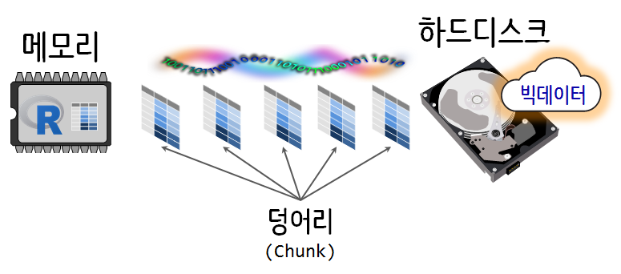
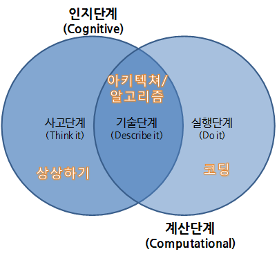
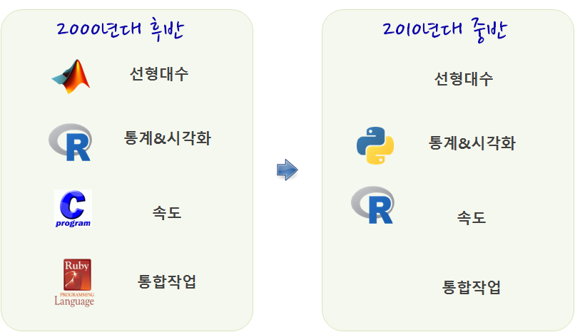
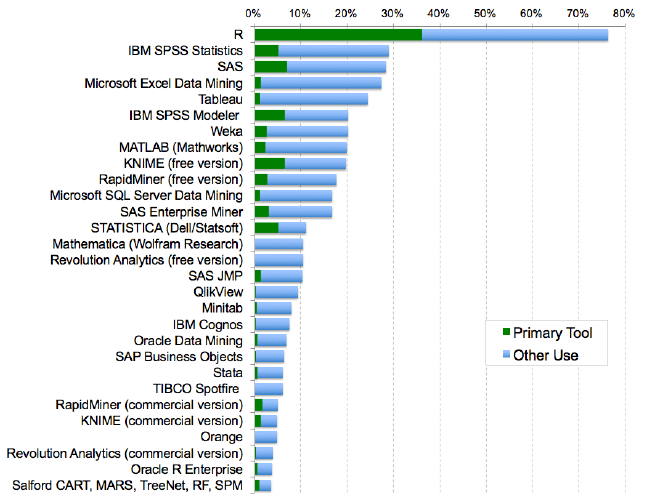
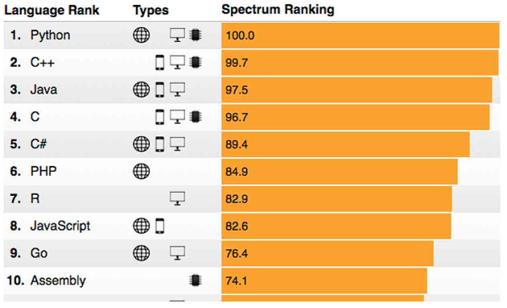
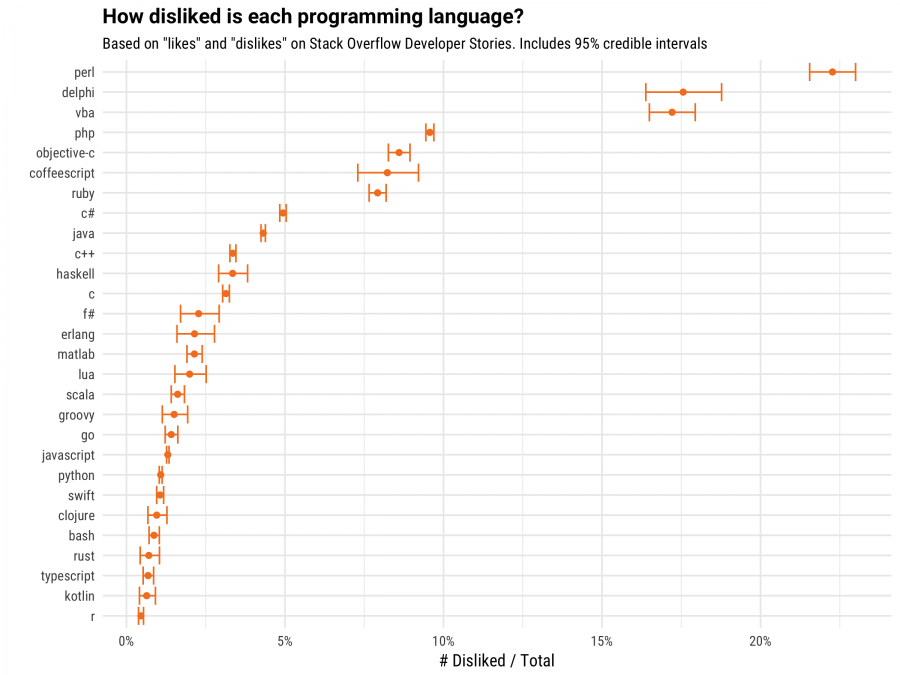

```{r setup, include=FALSE}
options(htmltools.dir.version = FALSE)

knitr::opts_chunk$set(echo = FALSE, warning=FALSE, message=FALSE,
                    comment="", digits = 3, tidy = FALSE, prompt = FALSE, fig.align = 'center')


```


# 빅데이터와 데이터 사이언스 {#data-science-bigdata}

현재 스몰데이터(small data)라고 부르는 것도 타임머신을 타고 과거로 거슬러 올라가면 빅데이터가 된다. 데이터가 적던 크던 크기에 관계없이, 과거에는 학계에서 주로 통계지식을 바탕으로 데이터를 가져와서 처리하고 분석하고 모형을 만들었다면, 현재는 데이터 사이언스(data science)를 통해 탐색적 데이터 분석 작업을 수행하고, 모형을 개발하고, 시각화 산출물을 만들고, 이를 알고리즘을 통해 데이터 제품과 서비스를 제작하게 된 것이 차이점이다. 

빅데이터(big data)를 저장하고 관리하는 것도 기술적으로 난이도가 높은 작업이기도 하고,
대용량 데이터를 저장하고 관리함으로써 지출되는 비용이 막대하여 비용을 지출하는 비용센터(cost center)로 접근하였다. 하지만, 다양한 데이터 분석방법이 제시되고 미래를 예측하는 예측모형과 자동화를 통한 제품과 서비스로 개발되어 수익을 창출시키는 수익센터(profit center)로 바꾼 성공사례가 늘어나면서, 과거 보험업과 같이 데이터를 기반으로 예측을 하는 사업이 일부 특수한 영역에 국한되었다면, 현재는 데이터를 생산하고 축적하고 있는 전 산업계로 확산되고 있으며, 이는 단순히 사업적인 측면만을 강조하던 점을 넘어 4차 산업혁명, 디지털 변환(Digital transformation)을 통해 구체화되고 있다.

빅데이터를 활용하여 쓸만한 제품과 서비스를 개발하려면, 빅데이터 문제를 좀더 상세히 나눠볼 필요가 있고, 이를 대략적으로 구분하면 다음과 같다.

- 빅데이터 문제 소규모 분석방법(Big Data-Small Analytics) : 요약/표본추출/부분집합 추출 (90%)
- 병렬처리가 가능한 문제: 작은 데이터 문제로 쪼개서 분할 정복 (9%)
- 빅데이터 문제 대규모 분석방법(Big Data-Large Scale Analytics): 더이상 어찌할 수 없는 큰 문제 데이터 (1%)

데이터 사이언스를 활용하여 빅데이터 모형개발과 분석을 진행할 때 가장 먼저 데이터 크기를 줄이거나, 고성능 하드웨어를 구입하거나 클라우드 임대하는 방법으로 약 90% 문제를 해결할 수 있다. 즉, 샘플링 기법을 적용하여 빅데이터 크기를 줄이는 방법과 빅데이터를 담을 수 있는 하드웨어 크기를 키우는 방법을 생각해 볼 수 있다. 먼저, 빅데이터 크기를 줄이는 방법으로 표본추출기법을 적용하여 데이터 전체를 편이 없이 잘 추출하여 대표성을 확보한다면, 이를 통해 도출된 모형도 물론 대표성을 갖게 된다. 당연히 고성능 하드웨어를 구입하여 빅데이터를 새로 도입한 하드웨어에 담아내어 이를 바탕으로 모형개발과 시각화 산출물을 제작해내는 것도 금전적인 여유가 있는 경우 추진을 고려해볼만 하다.

R과 파이썬을 비롯한 데이터 사이언스 특화 언어를 사용할 경우, 데이터 크기가 전체 메모리 공간의 최대 20%를 넘게 되면 급격한 성능저하를 간혹 경험하게 된다. 이유는 대략 분석하거나 모형을 개발하는 데이터 크기의 약 3배 정도 중간 산출물이 생성되어 저장공간을 차지하기 때문이다.
따라서, 데이터 크기가 커지게 되면 물리적인 메모리를 키우던가, 표본추출 등을 통해서 데이터 크기를 줄이던가, 가상 메모리를 기법을 도입하여 외부 저장공간을 확장 메모리로 활용하여 필요할 때마다 메모리가 수용할 수 있는 덩어리(chunk) 크기로 잘라서 가져와서 처리하는 방법을 고려해야 된다.

빅데이터 자체를 월별, 지역별, 성별, 연령대별로 나누어서 생각해보면 병렬처리 가능한 문제가 되어 다소 난이도가 있지만 데이터 사이언스를 통해 해결할 수 있는 문제로 바뀌게 된다.
빅데이터 문제가 태생적으로 병렬처리로 접근할 수 있는 경우 두가지 해법이 존재한다.
먼저, 대용량 하드웨어 활용이 불가능한 경우 다소 시간이 걸리지만, 
순차적으로 하드디스크에 데이터 객체를 저장하고 필요할 때만 메모리로 덩어리(chunk) 단위로 가져와서 처리하는 방식이다.
빅데이터를 덩어리(chunk)로 나누게 되면 자연스럽게 병렬처리가 가능하게 된다.
즉, 덩어리를 쪼개서(split), 처리하고(apply), 결합하는(combine), split-apply-combine 전략을 적용하여 빅데이터를 외부 저장장치(하드디스크 등)에 넣어 효율적으로 분석하고 모형을 개발할 수 있다. 
물론, 대용량 하드웨어를 상용 클라우드 서비스를 통해 이용할 수 있는 경우, 스파크 클러스터를 동원하여 동시에 병렬처리하는 것도 흔히 활용하는 기법이다. 순차적 병렬처리 기법과 비교하여 시간을 절약할 수 있지만, 추가 컴퓨팅 자원 사용에 대한 사용료도 지불하게 되어 장단점이 존재한다.



마지막으로 빅데이터 크기를 줄일 수 없거나 고성능 하드웨어로에 담을 수도 없고, 
병렬처리 가능한 형태로 빅데이터 문제를 바꿀 수 없는 경우가 진정한 빅데이터 문제다.
더 이상 어찌할 수 없는 문제 데이터는 일반인이 경험할 일은 거의 없는 1% 정도가 이에 해당된다.
즉, 빅데이터 문제를 소규모 분석방법으로 바꾸거나, 병렬처리가 가능한 형태 데이터로 접근하게 되면 대략 99% 빅데이터 문제를 데이터 사이언스를 통해 답을 낼 수 있다는 말도 된다.

## 구글 검색어 동향으로 본 데이터 사이언스 한미 비교 {#data-science-google-trends}

빅데이터 단어 자체에 데이터 사이언스 개념이 내재되어 있는데, 최근 빅데이터를 다루는 기술과 경험이 축적되면서 공산품화(commodity)가 급격히 진행되어,
기본적인 교육만 받으면 누구나 빅데이터도 자유로이 다룰 수 있게 되었다. 

구글 검색어 동향(Google Trends) 서비스를 통해서 미국과 한국의 데이터 사이언스 현주소를 살펴보는 것도 의미가 클 것으로 보인다.
[구글 검색어 동향(Google Trends)](https://trends.google.com/trends/) GUI를 활용해도 유사하지만, 한국과 미국 데이터 사이언스을 직접 비교하려면 코딩을 통해 데이터를 추출하고 이를 분석하여 시각화하는 것이 더 많은 인사이트를 제공한다.
데이터 사이언스 시대 필수 언어로 자리잡은 R과 파이썬 어떤 언어를 사용해도 되지만, 시각화에 상대적인 우위가 있다고 알려진 R언어를 사용해서 한국과 미국을 비교한다.
먼저, 구글 트렌드 데이터를 추출함에 있어 지역을 미국으로 한정하고 검색어를 "big data", "data science", "machine learning", "deep learning"으로 놓고 데이터를 추출하여 
데이터프레임 `us_df` 객체에 저장한다. 
동일한 방식으로 지역을 한국으로 한정하고 데이터 사이언스 검색어를 동일하게 "빅데이터", "데이터 사이언스", "기계 학습", "딥러닝"으로 놓고 `kr_df` 객체로 저장한다. 
시간은 "2010"년부터 최근까지 시간으로 삼는다.

```{r google-trends-with-keywords-plot, eval=FALSE}
library(tidyverse)
# 미국
us_df <- gtrends(c("big data", "data science", "machine learning", "deep learning"), geo = c("US"), time="2010-01-01 2018-10-09", hl = "en-US")

# 대한민국
Sys.setlocale("LC_ALL", "C")
kr_df <- gtrends(c("빅데이터", "데이터 사이언스", "기계 학습", "딥러닝"), geo = c("KR"), time="2010-01-01 2018-10-09", hl = "ko-KR")
Sys.setlocale("LC_ALL", "Korean")

# us_df %>% write_rds("data/us_df.rds")
# kr_df %>% write_rds("data/kr_df.rds")
```

구글 검색어 트렌드 데이터를 다운로드 받아 이를 `tidyverse` 생태계를 구성하는 시각화 팩키지 `ggplot`으로 시각화한다.
원본 데이터를 보는 것과 비교하여 시각화를 통해 보면 직관적으로 한국과 미국 비교가 한눈에 들어온다.
미국에서 2017년을 기준으로 "빅데이터"에 대한 검색어보다 "기계학습"과 "데이터 사이언스"에 대한 인기도가 급상승하는 것으로 나타나고 있다.
가능한 해석은 미국 사회는 데이터 축적을 넘어 데이터 사이언스, 기계학습, 딥러닝을 통해 가치를 창출하는 단계로 넘어간 것으로 파악된다.

```{r google-trends-comparison-us}
library(timelineS) # devtools::install_github("daheelee/timelineS")
library(tidyverse)
library(lubridate)
library(googleVis)
library(extrafont)
loadfonts()

Sys.setenv(TZ='Asia/Seoul')

us_df <- read_rds("data/us_df.rds")
kr_df <- read_rds("data/kr_df.rds")

us_df$interest_over_time %>% tbl_df %>% 
  mutate(hits = as.integer(hits)) %>% 
  ggplot(aes(x=date, y=hits, color=keyword)) +
    geom_line() +
    labs(x="", y="구글 인기도", color="구글 검색어", title="미국 데이터 사이언스 구글 추세") +
    theme_minimal(base_family = "NanumGothic") +
    theme(legend.position = "top")

```

대한민국은 상대적으로 "빅데이터"와 "딥러닝"이 인기를 검색어에 속하지만, "기계학습"과 "데이터과학"은 거의 회자되지 않는 것으로 나타난다.
물론 "기계학습" 대신에 "머신러닝"이라는 용어가 혼용되어 동일한 개념이 두가지 검색어로 나타나 희석된 점도 그런 해석을 뒷받침하지만, 미국과 비교하여 아직 빅데이터를 통한 데이터 축적단계에 있으며 가치 창출을 이제 본격적으로 시작하는 초기 단계라는 해석이 우세하다고 볼 수 있다.

```{r google-trends-comparison-kr}
kr_df$interest_over_time %>% tbl_df %>% 
  mutate(hits = as.integer(hits)) %>% 
  ggplot(aes(x=date, y=hits, color=keyword)) +
    geom_line() +
    labs(x="", y="구글 인기도", color="구글 검색어", title="대한민국 데이터과 학명 구글 추세") +
    theme_minimal(base_family = "NanumGothic") +
    theme(legend.position = "top")
```

## 데이터 사이언스 (Data Science) [^xwMOOC-data-science] {#data-science}

[^xwMOOC-data-science]: [데이터 사이언스 - 데이터 사이언스과 R 언어](https://statkclee.github.io/data-science/ds-r-lang.html)

윌리엄 깁슨(William Gibson)의 명언 "미래는 이미 와 있다. 단지 널리 퍼져있지 않을 뿐이다. (The future is here, it’s just not evenly distributed yet.)"이 상기되는 이유는 아마도 
지금 누구나 언급하는 빅데이터, 데이터 사이언스, 기계학습, 인공지능 세상은 갑자기 창조된 것이 아니라, 지구상 누군가 이미 만들고 실험해서 실생활에 유용성이 검증되었기 때문일 것이다.
튜링상을 수상한 짐그레이(Jim Gray) 박사는 데이터 사이언스를 과학의 네번째 패러다임으로 정의하고,
정보기술과 데이터 범람(data deluge), 빅데이터 때문에 과학(경험, 이론, 계산, 그리고 이제 데이터)에 관한 모든 것이 바뀌고 있다고 주장했다.

위키백과에 따르면 **데이터 사이언스(data science)** [^wiki-data-science]란, 
데이터 마이닝(Data Mining)과 유사하게 정형, 비정형 형태를 포함한 다양한 데이터로부터 지식과 인사이트를 추출하는데 과학적 방법론, 프로세스, 알고리즘, 시스템을 동원하는 융합분야로, 데이터를 통해 실제 현상을 이해하고 분석하는데 통계학, 기계학습과 연관된 방법론을 통합하는 개념으로 정의했다.

[^wiki-data-science]: [Wikipedia, "Data Science"](https://en.wikipedia.org/wiki/Data_science)

데이터 사이언스는 데이터를 다루는 과학이다. 따라서 자연법칙을 다루는 자연과학과 맥이 닿아있다.
자연법칙을 측정하여 데이터프레임으로 나타내면 변수(Variable), 관측점(Observation), 값(Value)으로 표현된다.
변수는 측정한 정량 혹은 정성적 특성이 되고, 
값은 측정한 시점 혹은 지점의 변수의 상태이며, 관측점은 유사한 조건하에 측정한 여러 변수값 집합이 된다. 
자연법칙은 반복과 재현성(reproducibility)가 전부라고 해도 과언은 아니며, 동일한 관측점에 반영되어 작동하는 변수 메커니즘을 다룬다. 
따라서, 자연법칙은 데이터 **패턴(pattern)**을 통해 나타나게 된다. 
자연법칙을 찾아내기 적합한 형태로 데이터 자료구조를 표현하면, 웬지 익숙한 데이터프레임(Dataframe)과 데자뷰되는 것은 절대 우연은 아니다.


변수, 관측점, 값으로 구성된 데이터를 가지고는 있지만, 현실 세계를 표현하는 자연법칙은 모르는 경우, 모형을 데이터터에 적합시켜 가장 오차가 적은 패턴을 찾아서 자연법칙을 모사하는 것이 어쩌면 컴퓨팅 비용이 무어의 법칙에 따라 급격히 낮아지고 있는 현재 가장 합리적인 접근법이 될 것이다.
또한, 현실 세계를 이해하는데 도움을 줄 수 있는 자연법칙을 찾았다면 데이터를 통해서 확증하는 것도 검증차원에서 바람직할 것이다.

데이터 사이언스는 전혀 새로운 것도 아니고, 새로 창조된 것도 아니다. 
데이터에서 패턴과 규칙을 찾게 되는 과정이 어렵고 난이도가 있고, 금전적인 투자도 선행되어야 하고, 경험도 많이 필요하지만 
일단, 어렇게 찾아진 패턴과 규칙을 알고리즘으로 구현하여 제품과 서비스로 개발하게 되면 그 가치와 영향력은 상상을 초월하게 된다. 

## 데이터 사이언스업무 세분화 [^airbnb-data-science] {#data-science-specialization}

[^airbnb-data-science]: [Elena Grewal(July 25, 2018), "One Data Science Job Doesn’t Fit All"](https://www.linkedin.com/pulse/one-data-science-job-doesnt-fit-all-elena-grewal/)

앞서 한미 구글 트렌드 분석을 통해서 적어도 미국에서는 빅데이터에서 데이터 사이언스(Data Science)로 관심이 넘어가고 있지만, 데이터 사이언스 자체를 놓고보면 시간이 흐름에 따라 동일한 단어를 사용하고 있지만 의미하는 바가 달라지고 있다. 데이터 사이언스 용어 자체로만 보면 데이터 사이언스는 2012년을 변곡점으로 해서 급격하게 관심도가 높아지고 있다. [^data-science-google-trends]

[^data-science-google-trends]: [Google Trends](https://trends.google.com/trends/explore?date=all&geo=US&q=data%20science)

초창기 데이터 과학자는 데이터 생성과정부터 데이터에 대한 수집, 분석, 모형개발, 추론, 제품/서비스 개발 및 운영 등 거의 모든 작업을 혼자서 수행하였다면, 
최근 2~3년 동안 데이터 사이언스 업무 분화와 더불어 전문화가 가속화되어 일어나고 있다.


에어비앤비(Air B&B)에서 데이터 사이언스을 이끌고 있는 Elena Grewal 박사는 에어비앤비 데이터 사이언스 초장기부터 최근까지의 경험을 바탕으로 크게 세가지 영역으로 데이터 사이언스 업무를 나누고, 각각의 업무와 역할을 다음과 같이 개념적으로 세분화했다.

- **분석(Analytics) 데이터 과학자**는 좋은 질문을 던질 수 있고, 
탐색적 데이터 분석을 통해서 문제와 해법을 명확히 하는 재주가 있고, 대쉬보드와 시각화를 통해 데이터 분석을 자동화하고, 추천 결과물을 통해 비즈니스를 변화시킨다. 
- **알고리즘(algorithm) 데이터 과학자**는 기계학습에 특기가 있는 사람에 적합하고 제품/서비스, 프로세스에 데이터를 알고리즘을 통해 녹여내서 비즈니스 가치를 창출한다. 
- **추론(inference) 데이터 과학자**는 통계를 사용해서 의사결정을 향상시키고, 업무의 영향도를 측정하는데 주로 통계학, 경제학, 사화과학 전공지식을 적극 활용한다.

## 컴퓨팅 사고력(Computational Thinking) [^statistics] {#data-science-education-definition}

[^statistics]: [김충락 부산대 통계학과 교수 한국통계학회장, "통계를 ‘권력의 시녀’로 만들려는 유혹"](https://news.joins.com/article/22939324)

데이터 사이언스를 떠받치는 중요한 기둥은 수학적 사고가 바탕이된 통계학과 전산학이다.
통계학은 영어로 ‘Statistics’로 국가(State)를 통치하는 데 필요한 학문이라는 어원을 갖고 있으며 다음 세 단계로 정의된다.

1. 자료를 수집 (sampling), 
1. 자료를 분석 (analysis), 
1. 수집된 데이터를 분석하여 일반화된 결론을 끌어냄 (generalization)

과학성과 입증이나 공공부문정책을 뒷받침하는 과정에서도 데이터 자체 및 통계에 조금이라도 왜곡이나 조작이 존재하면 안 된다. 마치 컴퓨터로 데이터를 처리하게 될때 "쓰레기가 들어가면 쓰레기가 나온다(Garbage in, garbage out)"라고 사실과 일맥상통한다. 따라서, "자료 그 자체에 충실하라(Let the data speak for themselves)" 말처럼 **데이터의 중립성**과 **독립성**이 담보되어야만
이를 바탕으로 제작되는 모형과 시각화 산출물이 의미를 갖게 된다. 

귀납적 사고의 집합체인 통계학은 컴퓨터 과학과 밀접한 관계를 갖고 독자적인 학문으로 지속적으로 발전해 나갈 것으로 예상되고 있으며 과거 전산학으로 불린 분야는 컴퓨팅 사고력(Computational Thinking)으로 새롭게 태어나고 있다.

최근 인공지능 기술의 발전에 따른 실업에 대한 공포가 그 어느 때보다 커지고 있다. 
그 이면에는 과거 사람이 잘하는 영역과 기계(컴퓨터)가 잘하는 영역이 확연히 구분되어 나름 일자리에 대해서는 공존의 시간을 가졌다. 
사람은 이미지 인식등 추상적인 사고에 강점을 가져 반복되는 작업에는 실수를 연발하는 등 약점을 갖는 반면에 기계는 반대로 영혼이 없는 사람처럼 아무 생각없이 반복되는 작업을 묵묵히 성실히 24시간 쉬지않고 작업을 진행하는데는 장점을 가진 반면에 이미지 인식 등 추상적인 작업(예를 들면 바둑)은 전혀 인간의 적수가 되지 못했다. 하지만, 최근 인공지능 기술의 비약적인 발전으로 바둑을 비롯한 고도의 사고가 필요한 영역과 다국어 번역, 이미지 분류 등 사람이 절대적인 우위를 가진 영역이 속절없이 기계가 우세한 영역으로 뒤바뀌고 있다. 과거 사람이 기계에 대해 우위를 가졌던 영역의 일자리가 없어지면서 새롭게 늘어나고 있는 영역, 사람이 새로운 직업으로 일할 수 있는 분야가 한국에서는 딥러닝, 인공지능으로 알려진 데이터 사이언스 분야다.

최근 가장 영향력있는 데이터 사이언스 분야 스타인 하들리 위캠(Hadley Wickham)은 데이터 사이언스를 인지단계(Cognitive)와 계산단계(Computational)로 구분하고, 
인지단계에서는 문제를 파악하고, 문제를 기술하고, 접근법을 정리하고 나서, 계산단계에서 소프트웨어 아키텍처와 알고리즘을 설계하고 실제로 코딩하여 구현하는 과정을 제시했다.
특정분야의 전문지식을 배경으로 왜(Why)하는가 라는 질문을 통해 스스로 동기를 부여하고, 
이를 실제 소프트웨어 코드로 구현하고, 피드백을 받는 일련의 과정을 단속적이며 서로 독립적인 과정이 아니라는 점에서 **추상화(abstraction)**와 **자동화(automation)**를 근간으로 하고 있는 컴퓨터적 사고와 밀접한 연관을 갖고 있음을 확인할 수 있다.



데이터 사이언스도 다른 소프트웨어 개발과 동일하게 컴퓨터 시간(Computer time)과 개발자 시간(Human time)을 최적화하는 과정으로 볼 수 있다. 
최근에 가장 희귀하고 귀중한 자원은 컴퓨터가 아니라 개발자 시간 즉, 사람이다. 
앞으로 기계와의 경쟁에서 기계가 차지하는 일자리를 벌충하고 남는 유의미한 크기를 갖는 직업군이 
**데이터 과학자(Data Scientist)** 직군이 될 것이라는 점은 의심의 여지가 없이 명확하다.

# `tidyverse` 데이터 사이언스 [^tidyverse-menifesto]  {#data-science-process}

## 데이터 사이언스 언어 R [^r-history] {#rhistory}

### 두 언어 문제 [^Ousterhout-dichotomy] [^solving-two-language-problem] {#two-language-problem}

[^Ousterhout-dichotomy]: [Ousterhout dichotomy](https://en.wikipedia.org/wiki/Ousterhout%27s_dichotomy)

[^solving-two-language-problem]: [ODSC East 2016 - Stefan Karpinski - "Solving the Two Language Problem"](https://www.youtube.com/watch?v=B9moDuSYzGo)

데이터 사이언스를 대표하는 R이나 파이썬 모두 컴퓨터 프로그래밍 언어라서 태생적으로 거의 모든 컴퓨터 프로그래밍 언어가 갖고 있는 두 언어 문제에서 역시 자유로울 수는 없다. 
얼마전까지만 해도 데이터 과학자는 선형대수, 통계&시각화, 속도, 통합작업과 관련하여 다양한 프로그래밍 언어와 도구를 익혀야만 했지만,
2015년을 전후하여 데이터 과학 언어 R과 파이썬으로 중지가 모아지고 있고, 최근에서는 
R과 파이썬을 모두 사용하는 데이터 과학자자 수가 급격히 늘어가고 있다.


| 시스템 언어  | Ousterhout 이분법  | 스크립트 언어  |
|-------------|-------------|-------------|
|   정적       |     --      |     동적     |
|   컴파일      |     --      |    인터프리터 |
| 사용자정의 자료형|     --      |  표준 자료형 |
|   빠른 속도   |     --      |   늦은 속도   |
|   어려움       |     --      |   쉬움     |

개발자를 위한 편리함을 위해 R, 파이썬, Matlab 등 스크립팅 언어를 사용하고, C/C++, 포트란 등 시스템 언어는 속도와 성능이 필요한 부분에 사용된다.
시스템 언어와 스크립트 언어의 두가지 문제점을 해결하고, 
두가지 다른 언어의 장점을 취하고 이를 보완하려는 노력은 계속되고 있으며 R을 예로 들면, 팩키지 개발을 할 때 R 스크립트로 모든 기능을 선행하여 기능을 구현하고 
유용성이 인정되어 사용자가 많아지면, 
[Rcpp](https://cran.r-project.org/web/packages/Rcpp/index.html) 팩키지를 사용하여 C/C++로 후행하여 속도와 성능이 필요한 부분에 재개발하는 경우가 흔하다.



### R 언어 {#r-language}

[^r-history]: [Revolutions (2017), An Updated History of R](http://blog.revolutionanalytics.com/2017/10/updated-history-of-r.html)

데이터 사이언스 영역에서 `tidyverse`가 탄생한 배경을 이해하려면, 
데이터 사이언스에서 파이썬과 함께 중요한 언어인 R에 대한 이해가 선행되어야 하는데, 다행히도
[Revolutions](http://blog.revolutionanalytics.com/2017/10/updated-history-of-r.html) 블로그에 R 역사에 대해 시간순으로 핵심적인 내용을 담아서 잘 정리해 놨다.

1992년 처음 뉴질랜드 오클랜드에서 Robert Gentleman, Ross Ihaka 교수가 개발을 시작한 후에 
GPL 라이선스를 장착하여 소스코드를 공개한 뒤에 R 코어 그룹이 만들어지고, 팩키지 배포 CRAN이 순차적으로 공개되고 나서, [R 웹사이트](https://www.r-project.org/)가 만들어지고, 2000년에 이르러 비로소 R 1.0.0 으로 버전업되어 배포되고, R 저널, UseR! 컨퍼런스, 
R 재단, R 컨소시엄이 전세계 수많은 재능있고 열정있는 수많은 사람들의 손에 의해서 만들어졌다. 

한국에서도 [R Meetup](https://tidyverse-korea.github.io/r-meetup-x-presser/)을 2017년부터 시작해서 총 10회를 마쳤고, PRESSer X R Meetup 시즌 2를 2018년 11월부터 운영하고 있으며 2019년부터 데이터 사이언스 Meetup으로 확대해 나갈 예정이다.
R 역사 연대기를 보면 한국인 기여는 미미하지만, 최근들어 데이터 사이언스 대중화에 힘입어 많은 한국인이 데이터 사이언스 언어로 R 언어를 접할 기회가 늘어나면 사용자가 국내에서도 폭발적으로 늘어나고 있다.


``` {r rhistory, fig.width=12}

# 0. 환경설정 --------------
rhistory_df <- tribble(
    ~event, ~event_date, ~event_eng,
    "R 개발시작", "1992-07-01", "R development begins as a research project in Auckland, NZ by Robert Gentleman and Ross Ihaka",
    "R 배포", "1993-07-01", "First binary versions of R published at Statlib",
    "GPL 소스코드 \n 배포", "1995-07-01", "R first distributed as open-source software, under GPL2 license",
    "R 그룹 생성", "1997-07-01", "R core group formed",
    "CRAN 시작", "1997-07-01", "CRAN founded (by Kurt Jornik and Fritz Leisch)",
    "R 웹사이트", "1999-07-01", "The R website, r-project.org, founded",
    "R 개발자 \n 모임", "1999-07-01", "First in-person meeting of R Core team, at inaugural Directions in Statistical Computing conference, Vienna",
    "R 1.0.0 배포", "2000-02-29", "R 1.0.0 released (February 29)",
    "John Chambers \n ACM 수상", "2000-07-01", "John Chambers, recipient of the 1998 ACM Software Systems Award for the S language, joins R Core",
    "R 소식지 창단", "2001-07-01", "R News founded (later to become the R Journal)",
    "R 재단 창설", "2003-07-01", "R Foundation founded",
    "UseR! 컨퍼런스 시작", "2004-07-01", "First UseR! conference (in Vienna)",
    "R 2.0.0 배포", "2004-07-01", "R 2.0.0 released",
    "첫 R 저널 배포", "2009-07-01", "First edition of the R Journal",
    "R 3.0.0 배포", "2013-07-01", "R 3.0.0 released",
    "R 컨소시엄 창설", "2015-07-01", "R Consortium founded, with R Foundation participation",
    "신규 R 로고 채택", "2016-07-01", "New R logo adopted",
    "한국 R Meetup", "2017-08-23", "한국 R Meetup 시작",
    "한국 R Meetup 시즌2", "2018-11-22", "한국 R Meetup 시즌2"
)

# 1. R 역사 연대기 표 --------------

# DT::datatable(rhistory_df)

# 2. R 역사 연대기 시각화 --------------

rhistory_df <- rhistory_df %>% 
    mutate(event_date = ymd(event_date))

timelineS(rhistory_df, main = "R 연대기", buffer.days = 3600,
          label.direction = "up", label.length = c(0.2,0.8,0.4,1.2), label.position = 3,
          labels = rhistory_df[[1]])
```

> **통계팩키지 SAS/SPSS/Stata 주요 구성요소 비교** [^r4sas-spss]
> 
> 데이터 분석을 위해 대중에게 널리 알려진 통계팩키지로는 SAS, SPSS, Stata, Minitab 등을 꼽을 수 있고, 대부분 상업용으로 고가로 판매되고 있다. 
> 거의 모든 통계팩키지는 다음과 같이 공통된 5가지 구성요소를 포함하고 있다.
> 
> * 데이터 입력과 조작 언어
> * 통계와 그래픽 명령어
> * 출력물 관리 시스템
> * 매크로 언어
> * 행렬 언어(SAS IML/SPSS Matrix/Stata Mata) 
> 
> 이와 비교하여 R은 5가지 구성요소가 **언어 + 팩키지 + 환경** 으로 구성된다는 점에서 차이가 크다.
> R은 현존하는 가장 강력한 통계 컴퓨팅 언어로, 그래픽과 자료분석을 위해 언어 + 팩키지 + 환경이 하나로 묶여있고, 오픈 소스로 모든 코드가 공개되어 있어 자유로이 이용이 가능하고, 라이선스 걱정없이 무료로 사용이 가능한 것은 큰 장점이다.
> 역사적으로도 John Chambers가 주축이 되어 벨연구소에서 개발된 유닉스와 역사를 함께하는 `S` 언어를 Ross Ihaka 와 Robert Gentleman이 1995년 대중에 공개한 이래로 30년간 전세계 수많은 전문가들로부터 혹독한 검정의 세월을 거친 R과 비교하여, 수십에서 수백명이 개발에 투여되어 개발된 상용 통계팩키지와 철학이나 규모면에서 확실히 대비된다.
> 
> [^r4sas-spss]: [Muenchen, Robert A. R for SAS and SPSS users. Springer Science & Business Media, 2011.](http://www.springer.com/us/book/9780387094182)
> 

### 왜 R 언어인가? [^r-rank] [^r-r4stats] {#why-r}

[^r-rank]: [Interactive-The Top Programming Languages](https://spectrum.ieee.org/at-work/innovation/the-2018-top-programming-languages)

[^r-r4stats]: [The Popularity of Data Analysis Software](http://r4stats.com/articles/popularity/)

[Rexer Analytics](http://www.rexeranalytics.com/)가 2015년 응답자 1,220명을 대상으로 실시한 설문조사결과 R이 데이터 분석 소프트웨어 분야에서 압도적인 1위 위치를 점유하고 있음을 확인할 수 있다. 또한, 최근 IEEE The 2018 Top Programming Languages 조사에서 다른 범용 언어와는 달리 데이터 사이언스에 특화된 언어임에도 불구하고 유일하게 R이 7위를 달리고 있는 점이 달라진 위상을 반영하고 있다.

<div class = "row">
  <div class = "col-md-6">



  </div>
  <div class = "col-md-6">



  </div>
</div>


자바 C/C++ 파이썬과 같은 다른 범용 언어를 제외하고 R이 데이터 사이언스를 제외하고 1등을 하는 분야는 없지만, 2017년 10월 기준 [스택오버플로우-What are the Most Disliked Programming Languages?](https://stackoverflow.blog/2017/10/31/disliked-programming-languages/) 블로그를 참조하면 가장 싫어하지 않는 언어 1위에 등극했습니다. 이런 지표가 가능했던 것은 스택오버플로우에서 데이터 사이언스자로 활약하고 있는 데이비드 로빈슨의 역할이 큰 것은 부정할 수 없는 사실이다.




### 데이터 사이언스 언어 R [^linkedin-r-python] {#data-science-education-r}

[^linkedin-r-python]: [Alfonso R. Reyes, Chief Data Scientist at AEM Enersol (September 11, 2018), "For what things R programming language is better than Python?", LinkedIn](https://www.linkedin.com/pulse/what-things-r-programming-language-better-than-python-reyes/)

데이터 사이언스를 대표하는 두 언어는 R과 파이썬이다.
파이썬과 대비하여 R 언어의 우수성을 정리한 블로그가 심심치 않게 볼 수 있다.
Alfonso R. Reyes를 비롯하여 R과 파이썬을 모두 경험한 다수 개발자들이 공통적으로 언급하는 사실은 데이터 사이언스라는 업무에는 태생적으로 R이 적합하다는 것이다.

Alfonso R. Reyes는 10년이상 파이썬 응용프로그램을 작성했지만, 지금은 R을 사용하고 있으며, 
저자도 2015년 현재 아마존에서 판매되고 있는 "정보교육을 위한 파이썬"을 번역집필할 정도로 파이썬을 사랑하고 오랜기간 사용해왔지만, 데이터 사이언스분야에 있어 R언어의 재현가능한 연구(reproducible research)를 가능하게하는 탁월한 기능과 생산성은 파이썬보다 
훨씬 낫다고 볼 수 있다. Alfonso R. Reyes는 R을 사용한지 2년이 지난 시점에서 파이썬보다 R의 우수성에 대해서 다음과 같이 10가지로 요약하고 있다.

간략히 요약하면, R은 데이터 사이언스와 기계학습 프로젝트에 이례적인 도구라고 볼 수 있다.
R로 개발할 때 생산성 향상이 훨씬 더 크게 느껴진다. 
하지만, R을 익숙하게 다루는데는 시간이 다소 소요되기 때문에 시간에 대한 투자도 당연히 고려되어야 한다. 특히, 파이썬이 근접할 수 없는 분야로 프로토타입을 개발할 때 재현성에 대한 기능은 상당한 강력하다. 하지만, 파이썬은 범용 프로그래밍 언어로 데이터 사이언스 선택지로서 입지를 다져가고 있는 것도 사실이다.

1. R은 과학, 통계학, 수학, 공학에 집중한다. 따라서 과학과 공학에 R로 접근하는 것이 상대적으로 장점이 많다.
1. 커뮤니티를 비롯한 지원과 협업에 대해서는 세계적 규모를 자랑한다. 어디를 가나 StackOverflow, 포럼, 트위터, 링크트인, 팟캐스트 등을 쉽게 접할 수 있고, R 커뮤니티 자체가 매우 이타적이라 모두 기꺼이 도움을 주고 받고 해서 R 실력을 빠른 시간 내에 향상시킬 수 있다.
1. 재현성(reproducibility)이 황우석 사태 이후 큰 주목을 받고 있다. 재현성을 구현하는데 팩키지가 이미 다수 개발되어 있고 진화를 거듭하고 있다. 작업한 결과물은 팀뿐만 아니라, 외부에서도 재현되어야 하는데, 데이터 사이언스의 궁극의 목적으로 재현성을 최극단까지 도달할 수 있도록 R 커뮤니티가 노력을 경주하고 있다.
1. 로마시절에 라틴어가 만인의 언어이고, 현재 영어가 전세계 공용어이듯이, R마크다운은 R에서 공용 의사소통언어로 자리 잡았다. R마크다운으로 보고서, 슬라이드, 학위논문, 논문, 책을 집필할 수 있다. R마크다운을 쥬피터 노트북과 비교하면 생산성이 1000:1 정도 될 것이다.
하지만, 반대로 R을 학습하는데 상당한 시간을 투여해야 되는 것도 사실이다.
1. 정말 빠른 배포. RStudio 회사 직원이 어떻게 하는지 모르겠지만, 어쨌든 제품을 단 1,2년만에 뚝딱 만들어 냈다. Shiny를 말하고 싶은데, 파이썬으로 몇주 몇달 걸리는 것과 비교하여 단지, 몇분, 몇시간이면 뚝딱 웹앱을 배포할 수 있다. 다른 말로, 파이썬으로 개발한 것은 실무적으로 공유하기 힘들다(non-shareable). 
1. 가장 단순하면서도 최상의 통합개발환경(IDE)가 발명되었다. RStudio는 매우 단순하지만, 동시에 개발에 있어서 확장이 가능한 개발환경을 제공하고 있다.
처음에 믿을 수가 없겠지만, 작은 창 4개를 가지고 어마어마한 작업을 수행할 수 있다. 단순하지만 더 단순할 수 없도록 만들었다.
1. 팩키지 품질관리. CRAN(the Comprehensive R Archive Network)에 팩키지를 올리려면 상당한 품질 기준을 만족해야 된다. 문서가 없는 팩키지는 승인되지 않는데, 이런 점이 현재 R을 만들었다. 현시점 기준 15,000개가 넘는 팩키지가 있는데 갯수가 중요한 것이 아니라, R을 강하고 확장가능하게 만든 것은 문서의 품질이라고 본다.
1. 확장성(extendable). 팩키지 품질관리로 통해서 품질 좋은 팩키지가 만들어져서 이후 만들어지는 팩키지는 이런 토대위에 제작되어 더 좋은 팩키지로 거듭나고 있다. 누가 가장 혜택을 볼 수 있을까? 바로 사용자.
1. 고품질 그래프. `matplotlib`에 관해 무엇을 언급하든, Base 그래프, 그래프 문법 `ggplot2`, `lattice` 그래프에는 근접하지 못한다. Alfonso R. Reyes는 `matplotlib`을 오랜동안 사용했지만, 비표준적인 그래프를 만들려면 뭐든지 맨땅에서부터 작성해야 했다. 
반대로 R은 `ggplot2`를 비롯한 방대한 기능을 아직도 모두 소진해본적은 없는듯 싶다.
물론, 그래프에 대해 지켜야할 몇가지 기본 규칙이 부수적으로 따라온다: 다중 y축을 사용하지 말고, 원그래프는 피하고, 3D 그래프를 과사용하지 말고, 특별한 이유가 없다면 맨 처음부터 그래프 작성을 시작한다.
1. 함수(function) 중심. 파이썬과 R을 기본적으로 다르게 만드는 것 중 하나다.
클래스는 파아썬에서 남용에 가깝게 사용되곤 한다. 때로는 특별한 이유도 없다.
클래스와 객체형 프로그래밍을 배우려고 한다면, 파이썬을 추천한다. 세상에서 가장 배우기 쉬운 것 중 하나다. 이런 관점에 달리, R 세상은 확연히 다르다; 함수가 R세상에서는 첫째 시민(first class citizen)이다. 다른 언어와 달리 R에서 클래스는 함수 아래서 동작한다. S3와 S4는 자바와 파이썬 클래스와는 근본적으로 다르게 동작한다; 가장 가까운 친적이 R6가 될 듯 싶다.

## `tidyverse` {#data-science-process-tidyverse}

[^tidyverse-menifesto]: [The tidy tools manifesto](https://cran.r-project.org/web/packages/tidyverse/)

데이터 사이언스는 어떻게 보면 과거 보험회사에서 처음 시작했다고 해도 과언은 아니다. 사망에 따른 데이터를 모아 사망률 통계표를 만들고 이를 바탕으로 위험에 가격을 매겨 상품을 만들어 오래전부터 사업화하여 우리 곁에 다가왔다는 면에서 지금 많이 회자되는 데이터 사이언스와 별반 차이가 없다. 

[CRISP-DM(Cross-industry standard process for data mining)](https://en.wikipedia.org/wiki/Cross-industry_standard_process_for_data_mining)은 
데이터에서 유용한 무언가를 찾아내기 위해서 많은 시도를 모범사례(Best Practcice) 형태로 모아 정리한 유명한 데이터 마이닝 작업흐름 모형이었다. [^crisp-dm-kor] 
현재 인기를 얻고 있는 기계학습(Machine Learning)이나 인공지능(AI) 제품과 서비스 개발 과정 작업흐름과 비교해봐도 별반 차이점이 있어 보이지 않는다.

[^crisp-dm-kor]: [데이터 마이닝 방법론/프로세스 CRISP-DM](http://itlab.tistory.com/122)

- Business Understanding: 비즈니스 문제 인식 및 해결을 위한 데이터 마이닝 프로세스 명료화
- Data understanding: 데이터 탐색 및 이해
- Data prepation: 데이터를 통한 문제 인식 및 해결
- Modelding: 데이터 마이닝 기법 적용
- Evaluation: 비즈니스 상황에 따른 데이터 마이닝 결과의 해설
- Deployment: 데이터 마이닝 결과의 전개 및 유지


데이터 마이닝에 특화된 CRISP-DM을 `tidyverse` 작업흐름과 비교해 보면 큰 차이점은 데이터 사이언스 본질적인 가치에 집중하고 있다는 점을 들 수 있다.
그 이유는 아마도 CRISP-DM 시절 이후 개발된 많은 부분이 자동화되거나 데이터 공학(data engineering), 웹 공학(web engineering), 나아가 클라우드 IaaS/PasS 영역으로 흡수되어 데이터 과학자가 신경쓸 필요가 없어진 것이 가장 큰 이유인 듯 싶다.

최근 인기를 얻고 있는 기계학습(Machine Learning)이나 인공지능(AI)과는 별개로 몇년 전부터 
RStudio의 하들리 위캠(Hadley Wickham) 박사는 `tidyverse`을 통해 데이터 사이언스를 새롭게 정의하는 시도를 하였고 많은 호응을 얻고 있다.
`tidyverse`는 수많은 기여자들의 도움을 받아 하들리 위캠이 오랜동안 나름대로의 방식으로 체계화시킨 것을 확대 발전 시킨 것으로 데이터 사이언스를 체계적으로 집대성하였다는 평가를 받고 있다. 특히, 데이터 과학자 및 데이터 실무자에게 큰 도움을 주었으며 어떻게 보면 데이터 사이언스 오픈소스 운동의 커다란 동력으로 받아들여지고 있다.

R 언어 기반의 만개가 넘는 팩키지가 개발되어 활용되다는 점은 긍정적지만, 각자의 설계원칙에 맞춰 제각기 개발되고 손을 바꿔 다른 사람들이 이어 받아 유지보수되면서 초기 세워진 설계원칙과 철학이 많이 무너진 것도 사실이다. 

이에 `tidyverse`는 그동안 R 팩키지를 개발하면서 축척된 경험과 노하우를 기반으로 R 설계 원칙을 재정립했다는 평가를 받고 있다.


`tidyverse`의 핵심적인 내용은 다양한 형태의 데이터를 가져와서
최종 산출물을 사람과 기계와 커뮤니케이션할 수 있는 형태로 제작하는 과정을 추상화한 것으로 이해할 수 있다. 시각화(Visualization)는 데이터에 대한 통찰력(insight)과 탄성, 놀라움을 줄 수 있지만, 확장성(Scalability) 측면에서는 한계가 명확하다. 이유는 사람이 데이터 분석 루프에 포함되기 때문이다. 반대로 모형(Model)은 자동화와 확장성에는 장점이 있지만, 주어진 모형틀안에서만 이뤄지기 때문에 통찰력, 놀라움, 탄성을 주지는 못하는 아쉬움이 있다. 

엉망진창인 R 도구상자(`messyverse`)와 비교를 하기도 하지만, `tidyverse`는 팩키지라기 보다는 유닉스 철학처럼 데이터 사이언스에 있어 하나의 철학적 지침으로 접근하는 것이 일반적이다. 깔끔한 R 도구상자(`tidyverse`)는 깔끔한(tidy) API에 다음과 같은 4가지 원칙을 제시하고 있다.

- 기존 자료구조를 재사용: Reuse existing data structures.
- 파이프 연산자로 간단한 함수를 조합: Compose simple functions with the pipe.
- 함수형 프로그래밍을 적극 사용: Embrace functional programming.
- 기계가 아닌 인간을 위한 설계: Design for humans.

시각화와 모형을 새로 개발하는데 별도 자료구조(data structure)를 다시 창조하는 대신에 가능하면 기존 자료구조를 재사용하는 것을 원칙으로 삼고 있다. `ggplot2`, `dplyr`, `tidyr`을 포함한 대다수 R 팩키지는 칼럼에 변수, 행에 관측점을 갖는 직사각형 형태 데이터셋을 가정하고 있다.  그리고, 일부 팩키지는 특정한 변수 자료형에 집중한다. `stringr`은 문자열, `lubridate`는 날짜/시간,`forcats`는 요인 자료형에 집중하고 있지만 모두 기존 자료구조 재사용을 염두에 두고 있는 것도 사실이다.

파이프 연산자(예를 들어, `%>%`)로 간단한 함수를 조합하여 시스템 전체의 힘을 극대화시킨다.
복잡한 문제를 해결하는 강력한 전략은 레고 블록처럼 다수의 간단한 조각으로 나누고 이를 조합하는 것이다. 단, 각 조각은 격리되어 쉽게 파악되고, 다른 조각과 조합할 수 있는 표준위에서 성립되어야 된다. `tidyverse` 밑바탕에는 이런 전략이 파이프 연산자를 통해 구현되어 있다. 
`%>%` 연산자를 통해 많은 팩키지에 두루 걸쳐 동작되도록 결합시키려면 함수를 작성할 때 다음 원칙을 준수하고 작성하면 된다.

- 함수를 가능하면 단순하게 작성한다. 일반적으로 각 함수는 한가지 작업을 매우 잘해야 되고, 한 문장으로 함수 존재목적을 기술할 수 있어야 된다.
- 변형(transformation)과 부작용(side-effect)을 뒤섞지 마라. 함수가 객체를 반환하거나, 부작용을 일으키거나 둘 중 하나만 동작하게 만든다.
- 함수명은 동사로 작성해야 된다. 하지만, 예외로 허용되는데 함수 다수가 동일한 동사를 사용하는 경우를 들 수 있다. 예를 들어 `modify`, `add`, `compute` 등을 들 수 있다.
이런 경우 반복되는 동사가 중복되지 않도록 명사에 집중한다. `ggplot2`를 좋은 예로 들 수 있는데, 기존 플롯에 좌표, 점, 범례 등에 거의 모든 함수가 추가하기 때문이다. 

R은 데이터를 위해 개발된 함수형 언어를 근본에 두고 있지만, 객체지향언어(OOP)나 다른 언어 패러다임과 싸우려고 하지 말고 적극적으로 받아들여라. 이것이 의미하는 바는 다음과 같다.

- 상태불변 객체: 작성된 코드에 대한 추론이 쉬움.
- S3, S4 에서 제공하는 제네릭 함수: 상태변형 가능한 상태가 필요하다면, 파이프 내부에서 구현한다. 
- `for` 루프를 추상화한 도구: `apply` 함수 가족과 `purrr` 맵(map) 함수

데이터 사이언스에서 병목점으로 문제가 발생되는 곳은 공통적으로 컴퓨터 실행시간(computing time)이 아니라 사람의 생각(thinking time)의 시간이다. 
따라서, 함수명을 작성할 때 생각이 잘 연상되는 이름으로 작명하고 시간을 적절히 안분하고, 
명시적이며 긴 명칭을 변수명, 함수명, 객체명에 사용하고, 짧은 명칭은 가장 중요한 이름으로 아껴서 사용한다. RStudio 소스 편집기의 자동완성기능을 사용하는 경우 접두어가 접미어보다 중요하다. 
`stringr`, `xml2`, `rvest` 팩키지를 살펴보면 접두어에 일관된 명칭을 부여한 장점을 알 수 있다.

# 데이터 사이언스 남은 과제들 {#data-science-fact}

`tidyverse`에서 다루는 영역은 크게 자료구조를 포함하여 데이터 가져오는 영역, 데이터를 이해하는 영역, 그리고 시각화를 통해 사람과 커뮤니케이션하고 예측모형을 통해 기계가 활용하는 영역으로 나눌 수 있다. 빅데이터 기술과 기계학습, 인공지능이 결합하여 그동안 난제로 여겨졌던 다양한 문제에 대해서 해답을 제시함으로써 이들 기술이 신형 은총알(silver bullet)로 부각되고 있지만, 
언제나 그렇듯이 산이 높으면 골짜기가 깊고, 햇빛이 밝으면 그림자가 더 짙다는 속담처럼, 데이터 사이언스의 불편한 진실을 통해 남은 과제가 무엇인지 살펴보고 `tidyverse`를 통해 접근하려고 하는 것이 어떤 것인지도 간략히 짚어보자.

## 데이터 사이언스의 불편한 진실 [^data-science-fun-fact] {#data-science-fact-hurt}

[^data-science-fun-fact]: [Kamil Bartocha (lastminute.com), "The Inconvenient Truth About Data Science"](https://www.kdnuggets.com/2015/05/data-science-inconvenient-truth.html)

[KDnuggets](https://www.kdnuggets.com/) 웹사이트에 올라오 데이터 사이언스에 관한 불편한 진실을 김재광 교수님께서 번역하여 페이스북에 공유해 주셨습니다. 
가슴이 아프지만, 실무를 해보신 분은 누구나 공감이 될 것이다.
테크기업 혹은 전통산업에 데이터 사이언스을 접목시키고자 신입 혹은 경력직 사원에 대한 채용이 늘고 있다.
채용과정에서는 딥러닝, 인공지능, 기계학습에 대한 내용에 상당부분 할애되는 경우가 다반사다.
하지만, 신규 직원에 대한 조기 퇴사율이 높은 이유를 설명하는데, 다음에 나온 데이터 사이언스에 대한 불편한 진실이 도움이 될 듯 싶다.
기계학습과 인공지능 직무의 전문가를 채용한 조직은 실리콘 밸리 유명기업을 조속한 시간내에 따라잡고 경우에 따라서는 일부 영역에서는 이들을 능가할 것이라는 기대를 은연중에 하고 있다.
하지만, 데이터과학, 기계학습/딥려닝, 인공지능 모두 데이터를 원재료로 하기 때문에 
앞서 충분한 데이터 정제과정과 탐색적 데이터 분석이 생략된 채로 고급 분석과 모형을 적용하여 성과를 내고자 하는 경우,
성능이 나오지 않는 것은 물론이고 제작된 제품과 서비스의 신뢰성과 안정성도 떨어져 조직내 기대수준을 당연히 맞출 수가 없다.

1. 데이터는 절대 깨끗하지 않다 - Data is never clean.
1. 당신은 분석의 대부분의 시간을 전처리 단계에서 보내게 될 것이다 - You will spend most of your time cleaning and preparing data.
1. 95% 일에는 딥러닝(Deep Learning)을 필요로 하지 않는다 - 95% of tasks do not require deep learning.
1. 실제 분석의 90%는 일반화 선형모형(GLM)으로 해결된다 - In 90% of cases generalized linear regression will do the trick.
1. 빅데이터는 단지 도구일 뿐이다 - Big Data is just a tool.
1. 당신은 베이지안 접근을 포용해야 한다 - You should embrace the Bayesian approach.
1. 사용자 입장에서는 네가 어떤 방법을 사용했는가는 중요하지 않다 - No one cares how you did it.
1. 학계와 산업계는 서로 다른 세계이다 - Academia and business are two different worlds.
1. 프리젠테이션이 핵심이다: 파워포인트 마스터가 되라 - Presentation is key - be a master of Power Point.
1. 모든 모델은 틀렸다, 하지만 몇몇은 유용하다 - All models are false, but some are useful.
1. 완전 자동화된 데이터 사이언스같은 것은 없다. 인간이 개입되어야 할 부분이 있다 - There is no fully automated Data Science. You need to get your hands dirty.

## 심슨의 역설 {#data-science-fact-simpson-paradox}

앞서 원재료 데이터의 중요성에 대해서 살펴봤다. 
컴퓨터를 사용해서 데이터를 정제하고 처리하였다고 믿을 수 있는 유용한 정보를 사람에게 전달해 주게 될까?
이런 질문에 영국의 통계학자 에드워드 심슨이 정리한 역설(Simpson paradox)은 데이터 사이언스 시대를 살아가는 우리에게 시사하는 바가 크다고 할 수 있다.
[심슨의 역설](https://statkclee.github.io/r-algorithm/r-history-of-probability.html#simpson-paradox-1951)은 확률의 역사에서도 중요한 주제 중의 하나로 자리를 잡고 있다.

일상에서 A/B 테스트와 같이 실험을 통해 데이터를 얻는 경우는 극히 적고, 
데이터 사이언스자가 주로 다루는 데이터는 실험 데이터 보다는 관측 데이터가 일반적이다.
심슨의 역설은 전반적인 추세로 볼 때 일반적인 경향성이 존재하는 것처럼 보이지만, 
그룹으로 나눠서 개별적으로 보게 되면 경향성이 사라지거나 해석이 반대로 되는 경우를 지칭한다.
원인은 데이터 분석과 모형 개발과정에서 중요한 변수(lurking variable)가 빠져서 이런 역설이 발생한다.
데이터 분석에서 중요한 변수가 빠져 엉뚱하거나 잘못된 결정이 내려지는 것을 방지하기 위해서 
시간을 가지고 차분히 복기하는 과정도 필요하고 `tidyverse`의 강력한 기능중의 하나인 시각화를 적극 활용하여 
선제적인 조치를 취해야 된다.

### 심슨의 역설 사례 [^xwMOOC-simpson] {#simpson-paradox-case-study}

[^xwMOOC-simpson]: [xwMOOC(2018-09-20), "데이터 사이언스 – 기초 통계: 심슨의 역설(Simpson Paradox)"](https://statkclee.github.io/statistics/stat-simpson.html)

심슨의 역설 사례를 책페이지수와 책가격의 관계를 살펴보자.
데이터는 책 유형(하드커버, 페이퍼백)은 두가지 범주가 있고,
페이지수와 책가격이 달러, 총 변수 3개로 구성된 데이터프레임이다. 
이를 시각적으로 표현하면 관계가 음의 상관관계를 갖는 것을 알 수 있다.

```{r simpson-data}
library(tidyverse)
simp_df <- tribble(
    ~book_type, ~num_pages, ~book_price,
    "hardcover", 150, 27.43, 
    "hardcover", 225, 48.76, 
    "hardcover", 342, 50.25, 
    "hardcover", 185, 32.01, 
    "paperback", 475, 10.00, 
    "paperback", 834, 15.73, 
    "paperback", 1020, 20.00, 
    "paperback", 790, 17.89)

simp_df %>% 
    ggplot(aes(x=num_pages, y=book_price)) +
      geom_point(size=3) +
      geom_smooth(method = "lm", se=FALSE)

```

시각적으로 음의 상관관계가 존재하는 것을 확인한 것과 함께 기술 통계량을 사용해서  
`num_pages`, `book_price` 두변수 사이의 상관계수를 도출한다.
그리고 나서, 책 유형별로 나눠 상관관계를 도출해 낸다.
먼저 책 유형에 관계없이 `num_pages`, `book_price` 상관관계는 `-0.5949366`으로 나름 강한 음의 상관계수가 관측된다.

```{r simpson-data-cor}
simp_df %>% 
    summarise(book_cor = cor(num_pages, book_price)) %>% 
    pull()
```

이번에는 책 유형에 따른 상관계수는 어떤지 계산해 보자.
이 경우, 하드커버는 `0.848`, 페이퍼백은 `0.956`로 강한 양의 상관관계가 존재함이 확인된다.

```{r simpson-data-cor-group}
simp_df %>% 
    group_by(book_type) %>% 
    summarise(book_cor = cor(num_pages, book_price))
```

앞서 확인한 결과를 책 유형별로 나눠 상관계수를 시각화해보면, 앞서 책 유형이 반영되지 않았을 경우와 비교하여 
전혀 다른 결론에 도달하게 됨을 확인할 수 있다.

```{r simpson-data-cor-viz}
simp_df %>% 
    ggplot(aes(x=num_pages, y=book_price, color=book_type)) +
      geom_point(size=3) +
      geom_smooth(method = "lm", se=FALSE) +
      theme_minimal(base_family = "NanumGothic") +
      labs(x="책페이지 수", y="책가격($)", title="심슨의 역설 사례", color="책유형" )+
      theme(legend.position = "top")
```

그밖에도 심슨의 역설은 데이터를 기반으로 의사결정을 하거나 예측을 하는 경우 생각보다 자주 발견되곤 한다.
[동아사이언스](http://dl.dongascience.com/search?keyword=%EC%8B%AC%EC%8A%A8%EC%9D%98+%EC%97%AD%EC%84%A4)에서 
2008년, 2013년 3회 심슨의 역설에 대한 기사를 실었는데 "명문대 남녀 합격생의 반전" [^park-simpson], "오류를 잡아라! 확률 법정" [^court-simpson] 의 기사도 눈에 띈다.

[^park-simpson]: [박경미 교수의 수학캠핑 - 확률 패러독스, "명문대 남녀 합격생의 반전"](http://dl.dongascience.com/magazine/view/S201307N052)
[^court-simpson]: [최영준(2013), "오류를 잡아라! 확률 법정", 수학동아](http://dl.dongascience.com/magazine/view/M201302N008)

심슨의 역설관련 가장 유명한 사례를 꼽는다면 단연, 1973년 UC 버클리 대학 입학데이터[^simpson-berkeley]로 입학에 성차별이 존재하는지에 관한 데이터다.
기술통계량과 막대 그래프를 통해 데이터 분석을 수행하면 남성 합격률이 여성보다 높은 것으로 나타나 성차별이 존재하는 것으로 파악되지만,
학과별로 놓고 보면 여성 합격률이 더 높거나 남성과 유사한 반전이 일어난 사례다.

[^simpson-berkeley]: [Johnny Hong(January 30, 2016), "A (very) brief introduction to ggplot2"](http://jcyhong.github.io/ggplot_demo.html)

이외에도 모 게임에서 큰 규모의 업데이트를 한 후 게임 고객 동향을 분석한 사례도 있다.
이 게임은 전체 게임 고객을 약 십 여가지 유형으로 분류하고 있는데, 
크게 보면 게임 활동이 왕성하고 충성도가 높은 ‘진성’ 유형, 게임 활동이 그리 활발하지 않은 ‘라이트’ 유형, 자동 사냥 유저로 의심되는 ‘봇’ 유형 등으로 구분된다.
기술통계량과 막대 그래프를 시계열로 늘어놓게 되면, 
일별 접속자수(DAU)가 크게 늘었지만 유저당 결재금액(ARPU)가 하락하여 뭔가 특단의 조치가 필요한 것으로 파악되지만, 
이를 고객 집단을 반영하여 분석을 하게 되면 진성유저는 큰 차이가 없고, 
오히려 크게 늘어난 유저가 봇이거나 비결제 유저(Non-PU)라 봇을 비용으로 간주하여 제거하거나 
Non-PU를 결제 유저(PU)로 바꾸거나 결제 유저의 결재금액을 높이는 방향으로 사업적인 조치를 취하는 것이 바람직스러워 보인다는 결론에 도달한 사례도 있다.


## 설명가능한 기계학습 {#data-science-fact-explainable-machine-learning}

앞서 원재료 데이터의 중요성과 이를 분석하여 의사결정을 내리는 과정에서 "심슨의 역설"을 통해서 충분한 데이터 분석과 시각화의 중요성을 살펴봤다.
마지막으로 데이터를 원재료로 소비하여 예측 알고리즘을 제작하는 기계학습/딥러닝을 살펴보자.

디터 제체 메르세데스-벤츠 자동차그룹 회장이 2012년 **“자동차는 이제 기름이 아니라 소프트웨어로 달린다.”**라고 선언한 것과 
결을 같이하여 골드만삭스의 로이드 블랭크페인 회장은 2015년 **"골드만삭스는 IT회사"**라고 선언했다.
실제로 골드만삭스 전체 임직원 중 4분의 1 가량이 컴퓨터 엔지니어 구성된 것으로 알려져 있다. 
이제 금융회사에 취직하려면 경영학이나 경제학을 전공할 수 있는 상경대학보다는 
전산학과나 데이터 사이언스을 공부할 수 있는 이공계로 진학하는게 더 유리한 세상이 되었다. 

전통 제조업을 대표하는 자동차회사, 서비스업의 총아 금융회사에서 소프트웨어와 데이터 사이언스 전문인력을 많이 필요로 하는 이유를 살펴보자.
자동차 및 금융회사의 변화는 기계학습/인공지능 알고리즘을 활용하여 중요한 의사결정을 내리고,
반복적 업무를 자동화하여 **거래비용**을 줄이고, **정보유통**을 활발히 함으로써 
양질의 **제품/서비스 정보**를 고객에게 제공하는 것이 경쟁이 치열해 지면서 보편화 되고 있기 때문이다. 
특히, **다이내믹프라이싱(DynamicPricing)**을 활용하여 가격민감도가 서로 다른 고객들에게 차별화된 가격을 제시함으로써 알고리즘 기반으로 
실시간 가격차별화를 통해 ~~단일가격을 책정~~했을 때 대비하여 
더 큰 이익을 창출할 수 있고, 사용자 행동패턴, 사용자간 관계, 
상품유사도를 바탕으로 고객의 취향과 선호를 예측, 이에 적합한 상품을 추천하는 알고리즘이 초격차를 견인하고 있다.

이런 이면에 경쟁사업자들 간에 알고리즘을 이용하여 
가격, 공급량 등을 조정하거나 관련 정보를 공유함으로써 시장 경쟁강도를 약화시키고 
산업의 혁신을 저하시키는 **알고리즘 담합(algorithm collusion)**이 횡행하고 있다.
최근 온라인에서 포스터를 판매하는 미국기업 포스터레볼루션(PosterRevolution)의 창업자 데이빗 톱킨스(David Topkins)가 주도하여 
동종업계와 공모하여 병행알고리즘 형태로 가격담합을 추진해 온 것을 발각하여 2015년 미국법무부는 톱킨스에게 **2만 달러** 벌금을 부과했다.

이외에도 알고리즘 설계 및 개발과정에서 **인간의 개입에 따른 오류와 편향성**의 발생가능성이 존재하므로, 
정부와 기업, 학계에서 알고리즘 활용이 윤리적 방향성을 지녀야 된다는 점에 공감이 늘고 있다.
최근 **EU GDPR(개인정보보호규정)도입과 알고리즘 규제**에는 알고리즘이 내리는 자동화된 의사결정에 대해 설명을 요구할 수 있는 개인의 권리를 포함하고 있어, 
실무에서 많이 사용되는 **예측은 뛰어나지만 설명이 어려운** 블랙박스 예측모형과 추천 알고리즘에 대한 완전한 점검이 필요하다는 논의도 제기되고 있기도 하다. 

결국, 인공지능 알고리즘에 대한 검증도 데이터를 통해 이뤄질 것이고, 
이러한 도전에 대해 설명가능한 기계학습/인공지능 기술과 결합하여 현존하는 데이터 사이언스에 대한 인간의 지적 자산이 응축된 `tidyverse`가 영역을 넓혀 큰 역할을 담당하게 될 것이다.


# 마이크로소프트웨어 395호 데이터 탐험(Data Adventure){#maso-live}

[조병승 기자 | 2019년 1월 24일, "데이터 탐험(Data Adventure)", 마이크로소프트웨어 395호](https://www.imaso.co.kr/archives/4654)


```{r maso-live}
library(tidyverse)
library(slickR)

maso_img <- fs::dir_ls("fig/maso/")

maso_tbl <- 
  tibble(filename = maso_img)

slickR(obj = maso_tbl$filename)
```


