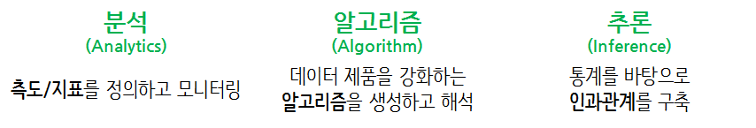

```{r setup, include=FALSE}
options(htmltools.dir.version = FALSE)

knitr::opts_chunk$set(echo = FALSE, warning=FALSE, message=FALSE,
                    comment="", digits = 3, tidy = FALSE, prompt = FALSE, fig.align = 'center')


```


# 데이터 과학과 빅데이터 {#data-science-bigdata}

빅데이터를 저장하고 관리하는 것도 큰 일이지만, 데이터 과학을 통해 탐색적 데이터 분석 작업을 수행하고, 모형을 개발하고, 시각화 산출물을 만드는 과정은 또 다른 경험과 기술이 요구된다. 빅데이터를 포함한 데이터 처리 방식을 데이터 과학 관점, 특히 분석처리 관점에서 보면 다음과 같이 구분된다.

- 빅데이터 문제 소규모 분석방법(Big Data-Small Analytics) : 요약/표본추출/부분집합 추출 (90%)
- 병렬처리가 가능한 문제: 작은 데이터 문제로 쪼개서 분할 정복 (9%)
- 빅데이터 문제 대규모 분석방법(Big Data-Large Scale Analytics): 더이상 어찌할 수 없는 큰 문제 데이터 (1%)

빅데이터를 데이터 과학을 활용하여 모형개발과 분석을 진행할 때 가장 먼저 데이터 크기를 줄이거나 고성능 하드웨어를 구입하거나 임대하는 방법으로 약 90% 문제를 해결할 수 있다. 표본추출의 경우 편이가 없고 전체 데이터셋을 충분히 반영한다면 이를 통해 도출된 모형도 받아들일 수 있기 때문에 충분히 권장되고, 당연히 고성능 하드웨어를 구입하여 빅데이터를 담아내고 이를 통해 모형개발과 시각화 산출물을 제작해내는 것도 가능하다.
R과 파이썬을 비롯한 데이터 과학 특화 언어를 사용할 경우, 데이터 크기가 전체 메모리 공간의 최대 20%를 넘게 되면 급격한 성능저하를 흔히 경험한다. 따라서, 데이터 크기가 커지게 되면 물리적인 메모리를 키우던가, 표본추출 등을 통해서 데이터 크기를 줄이던가, 스파크(Spark)를 활용하여 외부 확장 메모리를 활용하여 필요할 때마다 메모리가 수용할 수 있는 덩어리(chunk) 크기로 잘라서 가져와서 처리하는 방법을 고려해야만 한다. 

빅데이터 자체로 월별, 지역별, 성별, 연령대별 병렬처리가 가능한 문제가 흔히 데이터 과학에서 발견된다. 대용량 하드웨어 활용이 불가능한 경우 순차적으로 하드디스크에 객체 저장하고 필요한 경우 메모리에 덩어리(chunk) 단위로 가져오는 방법도 빅데이터를 처리하는 좋은 기술이다. 덩어리(chunk)로 나누게 되면 자연스럽게 병렬처리도 가능하다. 즉, 덩어리를 쪼개서(split), 처리하고(apply), 결합하는(combine), split-apply-combine 전략을 적용하여 빅데이터를 하드디스크에 넣어 효율적으로 분석하고 모형을 개발할 수 있다. 대용량 하드웨어가 사용 클라우드 서비스를 통해 접근이 가능한 경우 스파크 클러스터를 동원하여 동시에 병렬처리하는 것도 흔히 사용되고 있다. 절약된 시간을 얻게 되지만 추가 자원 사용에 대한 비용도 함께 지불된다.


빅데이터를 줄일 수 없거나 고성능 하드웨어로 처리할 수도 없고, 병렬처리 가능한 형태로 빅데이터를 바꿀 수가 없는 경우가 진정한 빅데이터 문제로 더 이상 어찌할 수 없는 큰 문제 데이터로 일반인이 경험할 일은 거의 없는 1% 문제가 이에 해당된다.

## 구글 추세로 본 데이터 과학 한미 비교 {#data-science-google-trends}

구글 추세로 본 미국과 한국의 데이터 과학 현주소를 살펴보자.
먼저, 구글 추세 데이터를 추출하는데 지역을 미국으로 한정하고 검색어를 "big data", "data science", "machine learning", "deep learning"으로 놓고 데이터를 추출하여 
`us_df`에 저장한다. 동일한 방식으로 지역을 한국으로 한정하고 데이터 과학 검색어를 동일하게 "빅데이터", "데이터 과학", "기계 학습", "딥러닝"으로 놓고 `kr_df`로 저장한다. 시간은 "2010"년부터 최근까지 시간으로 삼는다.

```{r google-trends-with-keywords-plot, eval=FALSE}
library(tidyverse)
# 미국
us_df <- gtrends(c("big data", "data science", "machine learning", "deep learning"), geo = c("US"), time="2010-01-01 2018-10-09", hl = "en-US")

# 대한민국
Sys.setlocale("LC_ALL", "C")
kr_df <- gtrends(c("빅데이터", "데이터 과학", "기계 학습", "딥러닝"), geo = c("KR"), time="2010-01-01 2018-10-09", hl = "ko-KR")
Sys.setlocale("LC_ALL", "Korean")

# us_df %>% write_rds("data/us_df.rds")
# kr_df %>% write_rds("data/kr_df.rds")
```

구글 추세 데이터를 다운로드 받아 이를 `tidyverse` 시각화 중요 팩키지 `ggplot`으로 시각화한다.
2017년을 기준으로 빅데이터에 대한 검색어보다 기계학습과 데이터과학에 대한 인기도가 급상승하는 것으로 나타나고 있다.
가능한 해석은 미국 사회는 데이터 축적을 넘어 데이터과학, 기계학습, 딥러닝을 통해 가치를 창출하는 단계로 넘어간 것으로 파악된다.

```{r google-trends-comparison-us}
library(timelineS) # devtools::install_github("daheelee/timelineS")
library(tidyverse)
library(lubridate)
library(googleVis)
library(extrafont)
loadfonts()

Sys.setenv(TZ='Asia/Seoul')

us_df <- read_rds("data/us_df.rds")
kr_df <- read_rds("data/kr_df.rds")

us_df$interest_over_time %>% tbl_df %>% 
  mutate(hits = as.integer(hits)) %>% 
  ggplot(aes(x=date, y=hits, color=keyword)) +
    geom_line() +
    labs(x="", y="구글 인기도", color="구글 검색어", title="미국 데이터 과학 구글 추세") +
    theme_minimal(base_family = "NanumGothic") +
    theme(legend.position = "top")

```

대한민국은 상대적으로 빅데이터와 딥러닝이 인기를 얻어가고 기계학습과 데이터과학은 거의 회자되지 않는 것으로 나타난다.

```{r google-trends-comparison-kr}
kr_df$interest_over_time %>% tbl_df %>% 
  mutate(hits = as.integer(hits)) %>% 
  ggplot(aes(x=date, y=hits, color=keyword)) +
    geom_line() +
    labs(x="", y="구글 인기도", color="구글 검색어", title="대한민국 데이터과 학명 구글 추세") +
    theme_minimal(base_family = "NanumGothic") +
    theme(legend.position = "top")
```

## 데이터 과학업무 세분화 [^airbnb-data-science] {#data-science-specialization}

[^airbnb-data-science]: [Elena Grewal(July 25, 2018), "One Data Science Job Doesn’t Fit All"](https://www.linkedin.com/pulse/one-data-science-job-doesnt-fit-all-elena-grewal/)

데이터 과학(Data Science)는 2012년을 변곡점으로 해서 급격하게 관심도가 높아지고 있다. [Google Trends](https://trends.google.com/trends/explore?date=all&geo=US&q=data%20science)
초창기 데이터 과학자가 데이터에 대한 수집, 분석, 모형개발, 추론, 제품/서비스 개발 및 운영을 모두 했다면 최근 2~3년 동안 업무의 분화가 가속화되어 일어나고 있다.



**분석(Analytics) 데이터 과학자**는 좋은 질문을 던질 수 있고, 탐색적 데이터 분석을 통해서 명확히 하는 재주가 있고, 대쉬보드와 시각화를 통해 데이터 분석을 자동화하고, 추천 결과물로 비즈니스를 변화시킨다. 
**알고리즘(algorithm) 데이터 과학자**는 기계학습에 특기가 있는 사람에 적합하고 제품/서비스, 프로세스에 데이터를 녹여내서 비즈니스 가치를 창출한다. 
**추론(inference) 데이터 과학자**는 통계를 사용해서 의사결정을 향상시키고, 업무의 영향도를 측정하는데 주로 통계학자, 경제학자, 사화과학자에 적합하다.

# 데이터 과학 (Data Science) [^xwMOOC-data-science] {#data-science}

[^xwMOOC-data-science]: [데이터 과학 - 데이터 과학과 R 언어](https://statkclee.github.io/data-science/ds-r-lang.html)

튜링상을 수상한 짐그레이(Jim Gray) 박사는 데이터 과학은 과학의 네번째 패러다임으로 정의하고 과학(경험, 이론, 계산, 그리고 이제 데이터)에 관한 모든 것이 바뀌고 있는데 이유는 정보기술과 데이터 범람(data deluge) 때문이라고 주장했다.

**데이터 과학(data science)** [^wiki-data-science] 이란, 
데이터 마이닝(Data Mining)과 유사하게 정형, 비정형 형태를 포함한 다양한 데이터로부터 지식과 인사이트를 추출하는데 과학적 방법론, 프로세스, 알고리즘, 시스템을 동원하는 융합분야로, 데이터를 통해 실제 현상을 이해하고 분석하는데 통계학, 기계학습과 연관된 방법론을 통합하는 개념으로 정의된다.

[^wiki-data-science]: [Wikipedia, "Data Science"](https://en.wikipedia.org/wiki/Data_science)

데이터 과학은 데이터를 다루는 과학이다. 따라서 자연법칙을 다루는 자연과학과 맥이 닿아있다.
자연법칙은 변수(Variable), 관측점(Observation), 값(Value)으로 구성된다. 
변수는 측정한 정량 혹은 정성적 특성이 되고, 
값은 측정한 시점에 변수의 상태이며, 관측점은 유사한 조건하에 측정한 여러 변수값 집합이 된다. 
자연법칙은 동일한 관측점 값에 적용되어 동작하는 변수를 다룬다. 
따라서, 자연법칙은 데이터 **패턴(pattern)**으로 나타나게 된다. 
데이터에서 자연법칙을 찾아내기 적합한 형태가 웬지 익숙한 데이터프레임(Dataframe)과 데자뷰되는 것은 우연은 아니다.


변수, 관측점, 값으로 구성된 데이터를 가지고는 있지만, 현실 세계를 움직이는 자연법칙을 모르는 경우, 
패턴을 찾아서 자연법칙을 모사할 수 있고, 
현실 세계에 대한 자연법칙을 찾았다면 데이터를 통해서 확증하는 것도 가능한 것도 사실이다. 
데이터 과학은 전혀 새로운 것도 아니고, 새로 창조된 것도 아니다. 
데이터에서 법칙과 규칙을 찾게 되면 과정이 고난하고 어렵고 금전적인 투자도 있어야하고 경험도 많이 필요하지만 
일단, 법칙과 규칙을 찾게 되면 그 가치는 상상을 초월하게 된다. 

데이터 과학은 떠받치는 중요한 기둥은 통계학과 컴퓨터 과학이다. 

## 통계학 [^statistics] {#data-science-education-definition}

[^statistics]: [김충락 부산대 통계학과 교수 한국통계학회장, "통계를 ‘권력의 시녀’로 만들려는 유혹"](https://news.joins.com/article/22939324)

데이터 과학을 지탱하는 튼튼한 기둥중의 하나는 통계학이다. 향후 통계학은 컴퓨터 과학과 밀접한 관계를 갖고 지속적으로 발전해 나갈 것으로 예상된다. 통계학은 영어로 ‘Statistics’인데 이는 국가(State)를 통치하는 데 필요한 학문이라는 어원을 갖고 있고, 
통계학은 크게 세 단계로 정의된다.

1. 자료를 수집 (sampling), 
1. 자료를 분석 (analysis), 
1. 이를 바탕으로 일반화된 결론을 끌어냄 (generalization)

“자료 그 자체에 충실하라(Let the data speak for  themselves)”는 말이 있다.
과학적 성과의 입증이나 정부의 정책을 뒷받침하는 과정에서 자료나 통계가 조금이라도 왜곡되거나 조작되면 안 된다. 
이를 흔히 우리는 **통계의 중립성**과 **독립성**이라 부르고 ,
컴퓨터로 처리하게 되면 "쓰레기가 들어가면 쓰레기가 나온다(Garbage in, garbage out)"라고 한다.

특정분야의 전문지식을 배경으로 왜(Why)하는가 하는 동기를 부여받고, 이를 실제 소프트웨어 코드를 통해서 구현하고, 피드백을 받는 일련의 과정은 단속적이며 서로 독립적으로 구분되는 과정이 아니라, 추상적 사고와 자동화를 근간으로 하고 있는 컴퓨터적 사고와 밀접한 관련이 있다.

최근 가장 영향력있는 데이터 과학 분야 스타인 Hadley Wickham은 데이터 과학을 인지단계(Cognitive)와 계산단계(Computational)로 구분하고, 인지단계에서 문제를 파악하고, 문제를 기술하고, 접근법을 정리하고 나서 계산단계에서 소프트웨어 아키텍처와 알고리즘을 설계하고 실제로 코딩하여 구현하는 과정을 제시하고 있다.


데이터 과학은 다른 소프트웨어 개발과 동일하게 컴퓨터 시간(Computer time)과 개발자 시간(Human time)을 최적화하는 과정으로 볼 수 있다. 최근에 가장 희귀하고 귀중한 자원은 컴퓨터가 아니라 개발자 시간 즉, 사람이다.

## `tidyverse` 데이터 과학 [^tidyverse-menifesto]  {#data-science-process}

[^tidyverse-menifesto]: [The tidy tools manifesto](https://cran.r-project.org/web/packages/tidyverse/)

[CRISP-DM(Cross-industry standard process for data mining)](https://en.wikipedia.org/wiki/Cross-industry_standard_process_for_data_mining)은 
데이터에서 유용한 무언가를 찾아내기 위해서 많은 시도가 있기에 베스트 프랙티스(Best Practcice)를 모아 정리한 과거 유명한 
데이터 마이닝 모형이었다. [^crisp-dm-kor] 지금에 와서 인기를 얻고 있는 기계학습(Machine Learning)이나 인공지능(AI) 제품과 서비스 
개발 과정과 별반 차이점은 없어 보인다.

[^crisp-dm-kor]: [데이터 마이닝 방법론/프로세스 CRISP-DM](http://itlab.tistory.com/122)

- Business Understanding: 비즈니스 문제 인식 및 해결을 위한 데이터 마이닝 프로세스 명료화
- Data understanding: 데이터 탐색 및 이해
- Data prepation: 데이터를 통한 문제 인식 및 해결
- Modelding: 데이터 마이닝 기법 적용
- Evaluation: 비즈니스 상황에 따른 데이터 마이닝 결과의 해설
- Deployment: 데이터 마이닝 결과의 전개 및 유지


최근 인기를 얻고 있는 기계학습(Machine Learning)이나 인공지능(AI)과는 별개로 몇년 전부터 
RStudio의 최고 데이터과학자 위캠 박사가 `tidyverse`을 통해 데이터 과학을 새롭게 정의하는 시도가 있었고 많은 호응을 얻고 있다.
`tidyverse`는 수많은 기여자들의 도움을 받아 Hadley Wickham이 오랜동안 나름대로의 방식으로 데이터 과학을 체계적으로 집대성하였다.
특히, 데이터 과학자 및 데이터 실무자에게 큰 도움을 주고 있다. 어떻게 보면 오픈소스 운동의 커다란 동력으로 이해할 수도 있다.

R 언어 기반의 만개가 넘는 팩키지가 개발되어 활용되고 있으나, 각자의 설계원칙에 맞춰 제각기 개발되고 손을 바꿔 다른 사람들이 
오랜동안 이어 받아 진행되어 초기 세워진 설계원칙이 많이 무너진 것도 사실이다. 이에 `tidyverse`는 데이터과학에 
그동안 R 팩키지를 개발하면서 축척된 경험과 노하우를 기반으로 R 설계 원칙을 정립하고자 한다.

엉망진창인 R 도구상자(`messyverse`)와 비교하여 깔끔한 R 도구상자(`tidyverse`)는 깔끔한(tidy) API에 다음과 같은 4가지 원칙을 제시한다.

- 기존 자료구조를 재사용: Reuse existing data structures.
- 파이프 연산자로 간단한 함수를 조합: Compose simple functions with the pipe.
- 함수형 프로그래밍을 적극 사용: Embrace functional programming.
- 기계가 아닌 인간을 위한 설계: Design for humans.

시각화(Visualization)는 데이터에 대한 통찰력(insight)과 탄성, 놀라움을 줄 수 있지만, 확장성(Scalability)은 떨어진다. 
왜냐하면, 사람이 데이터 분석 루프에 포함되기 때문에 확장 및 자동화에 한계가 있다. 
반대로 모형(Model)은 자동화와 확장성에는 장점이 있지만, 주어진 모형틀안에서 이루어지기 때문에 통찰력, 놀라움, 탄성을 주지는 못하는 아쉬움이 있다. 

가능하면 기존 자료구조를 재사용한다. `ggplot2`, `dplyr`, `tidyr`을 포함한 대다수 R 팩키지는 칼럼에 변수, 행에 관측점을 갖는 
직사각형 형태 데이터셋을 가정한다.  그리고, 일부 팩키지는 특정한 변수 자료형에 집중한다. `stringr`은 문자열, `lubridate`는 날짜/시간,
`forcats`는 요인 자료형에 집중한다.

파이프 연산자로 간단한 함수를 조합하여 시스템 전체의 힘을 극대화한다. 복잡한 문제를 해결하는 강력한 전략은 단순한 많은 조각으로 나누고 이를 조합하는 것이다. 단, 각 조각은 격리되어 쉽게 파악되고, 다른 조각과 조합할 수 있는 표준이 성립되어야 된다.
R에 파이프 연산자를 사용하여 본 전략이 구현되어 있다. `%>%` 연산자는 많은 팩키지에 두루 걸쳐 동작되는 일반적인 결합 방식으로 이를 위해 함수를 작성할 때 다음 원칙을 갖고 작성한다.

- 함수를 가능하면 단순하게 작성한다. 일반적으로 각 함수는 한가지 작업을 매우 잘해야 되고, 한 문장으로 함수 존재목적을 기술할 수 있어야 된다.
- 변형(transformation)과 부작용(side-effect)을 뒤섞지 마라. 함수가 객체를 반환하거나, 부작용을 일으키거나 둘 중 하나만 동작하게 만든다.
- 함수명은 동사가 되어야 한다. 하지만, 예외로 대다수 함수가 동일한 동사를 사용한다. 예를 들어 `modify`, `add`, `compute` 등을 들 수 있다.
이런 경우 반복되는 동사가 중복되지 않도록 명사에 집중한다. `ggplot2`가 좋은 예가 되는데 기존 플롯에 좌표, 점, 범례등을 거의 모든 함수가 추가하기 때문이다. 

R은 함수형 언어라 객체지향언어나 다른 언어 패러다임과 싸우려고 하지 말고 받아들여라. 이것이 의미하는 바는 다음과 같다.

- 상태불변 객체: 작성된 코드에 대한 추론이 쉬움.
- S3, S4 에서 제공하는 제네릭 함수: 상태변형 가능한 상태가 필요하다면, 파이프 내부에서 구현. 
- `for` 루프를 추상화한 도구: `apply` 함수 가족과 `purrr` 맵(map) 함수

데이터과학에서 병목점으로 문제가 발생되는 곳은 공통적으로 컴퓨터 실행시간(computing time)이 아니라 사람의 생각(thinking time)의 시간이다. 따라서, 함수명을 작성할 때 생각이 잘 연상되는 이름을 작명하는데 시간을 적절히 안분하고, 명시적이고 긴 명칭을 변수명, 함수명, 객체명에 사용하고, 짧은 명칭은 가장 중요한 이름으로 활용한다. RStudio 소스 편집기의 자동완성기능을 사용하는 경우 접두어가 접미어보다 중요하고,`stringr`, `xml2`, `rvest` 팩키지를 살펴보면 접두어에 일관된 명칭을 부여한 장점을 알수 있다.


# 데이터 과학 언어 R [^r-history] {#rhistory}

[^r-history]: [Revolutions (2017), An Updated History of R](http://blog.revolutionanalytics.com/2017/10/updated-history-of-r.html)

데이터 과학에서 `tidyverse`가 탄생한 배경을 이해했다면, 데이터 과학에서 파이썬과 함께 중요한 언어인 R에 대한 이해가 선행되어야 비로서 데이터 과학을 손에 잡게 된다. [Revolutions](http://blog.revolutionanalytics.com/2017/10/updated-history-of-r.html)에서 정리한 최근 R 역사는 1992년 처음 뉴질랜드 오클랜드에서 Robert Gentleman, Ross Ihaka 교수가 개발을 시작한 후에 
GPL 라이선스를 장착하여 소스코드를 공개한 후에 R 코어 그룹이 만들어지고, 팩키지 배포 CRAN이 순차적으로 공개되고 나서,
[R 웹사이트](https://www.r-project.org/)가 만들어지고, 처음으로 2000년에 R 1.0.0 으로 배포되고 R 저널, UseR! 컨퍼런스, 
R 재단, R 컨소시엄이 전세계 수많은 재능있고 열정있는 수많은 사람에 의해서 만들어졌습니다. 
그리고 한국에서도 [R Meetup](https://tidyverse-korea.github.io/r-meetup-x-presser/)을 2017년부터 시작해서 총 10회를 마쳤고,
PRESSer X R Meetup 시즌 2를 2018년 11월부터 진행하고 있다.
R 역사 연대기 표에 한국인의 기여는 미미하지만, 최근들어 데이터 과학 대중화에 힘입어 많은 한국인이 R 언어를 접하게 되면서
사용자가 폭발적으로 늘어나고 있다.


``` {r rhistory, fig.width=12}

# 0. 환경설정 --------------
rhistory_df <- tribble(
    ~event, ~event_date, ~event_eng,
    "R 개발시작", "1992-07-01", "R development begins as a research project in Auckland, NZ by Robert Gentleman and Ross Ihaka",
    "R 배포", "1993-07-01", "First binary versions of R published at Statlib",
    "GPL 소스코드 \n 배포", "1995-07-01", "R first distributed as open-source software, under GPL2 license",
    "R 그룹 생성", "1997-07-01", "R core group formed",
    "CRAN 시작", "1997-07-01", "CRAN founded (by Kurt Jornik and Fritz Leisch)",
    "R 웹사이트", "1999-07-01", "The R website, r-project.org, founded",
    "R 개발자 \n 모임", "1999-07-01", "First in-person meeting of R Core team, at inaugural Directions in Statistical Computing conference, Vienna",
    "R 1.0.0 배포", "2000-02-29", "R 1.0.0 released (February 29)",
    "John Chambers \n ACM 수상", "2000-07-01", "John Chambers, recipient of the 1998 ACM Software Systems Award for the S language, joins R Core",
    "R 소식지 창단", "2001-07-01", "R News founded (later to become the R Journal)",
    "R 재단 창설", "2003-07-01", "R Foundation founded",
    "UseR! 컨퍼런스 시작", "2004-07-01", "First UseR! conference (in Vienna)",
    "R 2.0.0 배포", "2004-07-01", "R 2.0.0 released",
    "첫 R 저널 배포", "2009-07-01", "First edition of the R Journal",
    "R 3.0.0 배포", "2013-07-01", "R 3.0.0 released",
    "R 컨소시엄 창설", "2015-07-01", "R Consortium founded, with R Foundation participation",
    "신규 R 로고 채택", "2016-07-01", "New R logo adopted",
    "한국 R Meetup", "2017-08-23", "한국 R Meetup 시작",
    "한국 R Meetup 시즌2", "2018-11-22", "한국 R Meetup 시즌2"
)

# 1. R 역사 연대기 표 --------------

DT::datatable(rhistory_df)

# 2. R 역사 연대기 시각화 --------------

rhistory_df <- rhistory_df %>% 
    mutate(event_date = ymd(event_date))

timelineS(rhistory_df, main = "R 연대기", buffer.days = 3600,
          label.direction = "up", label.length = c(0.2,0.8,0.4,1.2), label.position = 3,
          labels = rhistory_df[[1]])
```

> **통계팩키지 SAS/SPSS/Stata 주요 구성요소 비교** [^r4sas-spss]
> 
> R은 현존하는 가장 강력한 통계 컴퓨팅 언어로, 그래픽과 자료분석을 위해 언어 + 팩키지 + 환경이 하나로 묶여있다.
> 특히, 컴퓨터 주기억장치 한계가 존재하지만, 오픈 소스로 모든 코드가 공개되어 있어 자유로이 이용이 가능하다. R은 John Chambers가 주축이 되어 벨연구소에서 
> 개발된 유닉스와 역사를 함께하는 S을 Ross Ihaka 와 Robert Gentleman이 1996년 구현하여 대중에게 공개하였다. 
> 
> [^r4sas-spss]: [Muenchen, Robert A. R for SAS and SPSS users. Springer Science & Business Media, 2011.](http://www.springer.com/us/book/9780387094182)
> 
> 자료분석을 위해 대중에게 널리 알려진 통계팩키지에는 SAS, SPSS, Stata, Minitab 등 상업용으로 많이 판매되고 있다. 
> 어떤 통계팩키지도 다음과 같은 공통된 5가지 구성요소를 포함하고 있다.
> 
> * 데이터 입력과 조작 언어
> * 통계와 그래픽 명령어
> * 출력물 관리 시스템
> * 매크로 언어
> * 행렬 언어(SAS IML/SPSS Matrix/Stata Mata) 
> 
> 이와 비교하여 R은 5가지 구성요소가 **언어 + 팩키지 + 환경** 으로 구성된다는 점에서 차이가 크다.

## 왜 R 언어인가? [^r-rank] [^r-r4stats] {#why-r}

[^r-rank]: [Interactive-The Top Programming Languages](https://spectrum.ieee.org/at-work/innovation/the-2018-top-programming-languages)

[^r-r4stats]: [The Popularity of Data Analysis Software](http://r4stats.com/articles/popularity/)

[Rexer Analytics](http://www.rexeranalytics.com/)가 2015년 응답자 1,220명을 대상으로 실시한 결과 R이 데이터 분석 소프트웨어 분야에서 압도적인 1위 위치를 점유하고 있음을 확인할 수 있다.
또한, 최근 IEEE The 2018 Top Programming Languages 조사에서 다른 범용 언어와는 달리 데이터 과학에 특화된 언어로 R이 7위를 달리고 있는 점이 달라진 위상을 반영하고 있다.


<div class = "row">
  <div class = "col-md-6">


  </div>
  <div class = "col-md-6">


  </div>
</div>


데이터 과학을 제외하고 R이 1등을 하는 분야는 없지만, 
2017년 10월 기준 [스택오버플로우-What are the Most Disliked Programming Languages?](https://stackoverflow.blog/2017/10/31/disliked-programming-languages/) 블로그를 
참조하면 가장 싫어하지 않는 언어 1위에 등극했습니다.


## 두 언어 문제 [^Ousterhout-dichotomy] [^solving-two-language-problem] {#two-language-problem}

[^Ousterhout-dichotomy]: [Ousterhout dichotomy](https://en.wikipedia.org/wiki/Ousterhout%27s_dichotomy)

[^solving-two-language-problem]: [ODSC East 2016 - Stefan Karpinski - "Solving the Two Language Problem"](https://www.youtube.com/watch?v=B9moDuSYzGo)

과거 데이터 과학자는 선형대수, 통계&시각화, 속도, 통합작업과 관련하여 다양한 언어와 도구를 익혀야 했지만,
2010년 중반을 넘어서는 R과 파이썬을 함께 사용하는 것으로 중지가 모아지고 있다.


| 시스템 언어  | Ousterhout 이분법  | 스크립트 언어  |
|-------------|-------------|-------------|
|   정적       |     --      |     동적     |
|   컴파일      |     --      |    인터프리터 |
| 사용자정의 자료형|     --      |  표준 자료형 |
|   빠른 속도   |     --      |   늦은 속도   |
|   어려움       |     --      |   쉬움     |

데이터 과학에 R과 파이썬으로 중지가 모아지는 이유는 여럿있지만, 우선 데이터 과학도 다른 분야와 마찬가지로 두 언어 문제가 존재한다.
개발자를 위한 편리함을 위해 R, 파이썬, Matlab 등 스크립팅 언어를 사용하고, C/C++, 포트란 시스템 언어가 속도와 성능이 필요한 부분에 사용된다.
시스템 언어와 스크립트 언어의 두가지 문제점을 해결하고, 
두가지 다른 언어의 장점을 취하고 이를 보완하려는 노력은 계속되고 있으며 R에서 팩키지 개발에서 R 스크립트로 모든 기능을 선행하여 구현하고 
[Rcpp](https://cran.r-project.org/web/packages/Rcpp/index.html) 팩키지를 사용하여 C/C++로 후행하여 속도와 성능이 필요한 부분에 재개발하는 경우도 있다.


## R의 파이썬 대비 우수성 [^linkedin-r-python] {#data-science-education-r}

[^linkedin-r-python]: [Alfonso R. Reyes, Chief Data Scientist at AEM Enersol (September 11, 2018), "For what things R programming language is better than Python?", LinkedIn](https://www.linkedin.com/pulse/what-things-r-programming-language-better-than-python-reyes/)

저자는 10년이상 파이썬 응용프로그램을 작성했지만, 지금은 R을 사용하고 있다.
R을 사용하진 2년이 지난 시점에서 파이썬 보다 R의 우수성에 대해서 10가지로 요약하고 있다.

간략히 요약하면, R은 데이터 과학과 기계학습 프로젝트에 이례적인 도구라고 볼 수 있다.
R로 개발할 때 생산성은 훨씬 더 크게 느껴진다. 하지만, R을 익숙하게 다루는데는 시간이 다소 소요되기 때문에
시간에 대한 투자도 당근 고려되어야 한다. 특히, 파이썬이 근접할 수 없는 분야는 
프로토타입을 개발할 때 재현성을 비롯한 상당한 매력과 장점이 있다. 파이썬은 다용도 언어로 데이터 과학 선택지로서 
입지를 다져가고 있다.

1. R은 과학, 통계학, 수학, 공학에 집중한다. 따라서 과학과 공학에 R로 접근하는 것이 엄청 필요하다.
1. 지원에 대해서는 세계적이다. 어디를 가나 StackOverflow, 포럼, 트위터, 링크트인, 팟캐스트 등을 쉽게 접할 수 있고,
R 커뮤니티 자체가 매우 이타적이라 모두 기꺼이 도움을 주고 받고 해서 R 실력이 더 향상되도록 한다.
1. 재현성(reproducibility)이 황우석 사태 이후 큰 주목을 받고 있다. 재현성을 구현하는데 팩키지가 이미 다수 개발되어 있고 진화를 거듭하고 있다.
작업한 결과물은 팀뿐만 아니라, 외부에서도 재현되어야 하는데, 데이터 과학의 궁극의 목적으로 재현성을 최극단까지 도달할 수 있도록 R 커뮤니티가 노력을 경주하고 있다.
1. 로마시절에 라틴어가 만인의 언어이고, 현재 영어가 전세계 공용어이듯이, R마크다운은 R에서 공용 의사소통언어로 자리 잡았다.
R마크다운으로 보고서, 슬라이드, 학위논문, 논문, 책을 집필할 수 있다. R마크다운을 쥬피터 노트북과 비교하면 생산성이 1000:1 정도 될 것이다.
하지만, 반대로 R을 학습하는데 상당한 시간을 투여해야 되는 것도 사실이다.
1. 정말 빠른 배포. RStudio 회사 직원이 어떻게 하는지 모르겠지만, 어쨌든 제품을 단 1,2년만에 뚝딱 만들어 냈다.
Shiny를 말하고 싶은데, 파이썬으로 몇주 몇달 걸리는 것과 비교하여 단지, 몇분, 몇시간이면 뚝딱 웹앱을 배포할 수 있다.
다른 말로, 파이썬으로 개발한 것은 실무적으로 공유하기 힘들다(non-shareable). 
1. 가장 단순하면서도 최상의 통합개발환경(IDE)가 발명되었다. RStudio는 매우 단순하지만, 동시에 개발에 확장이 가능한 개발환경을 제공하고 있다.
처음에 믿을 수가 없겠지만, 작은 창 4개를 가지고 어마어마한 작업을 수행할 수 있다. 단순하지만 더 단순할 수 없도록 만들었다.
1. 팩키지 품질관리. CRAN(the Comprehensive R Archive Network)에 팩키지를 올리려면 상당한 품질 기준을 만족해야 된다.
문서가 없는 팩키지는 승인되지 않는데, 이런 점이 현재 R을 만들었다. 현시점 기준 13,000개가 넘는 팩키지가 있는데 갯수가 중요한 것이 아니라,
R을 강하고 확장가능하게 만든 것은 문서의 품질이라고 본다.
1. 확장성(extendable). 팩키지 품질관리로 통해서 품질 좋은 팩키지가 만들어져서 이후 만들어지는 팩키지는 이런 토대위에 제작되어 더 좋은 팩키지로 거듭남.
누가 가장 혜택을 볼 수 있을까? 바로 사용자.
1. 고품질 그래프. `matplotlib`에 관해 무엇을 언급하든, Base 그래프, 그래프 문법 ggplot2 그래프에는 근접하지 못한다.
Alfonso R. Reyes는 matplotlib을 오랜동안 사용했지만, 비표준 그래프는 뭐든지 맨땅에서부터 작성해야 했다. 
반대로 R은 ggplot2를 비롯한 방대한 기능을 아직도 모두 소진해본적은 없는듯 싶다.
물론, 그래프에 대해 지켜야할 몇가지 기본 규칙이 부수적으로 따라온다: 다중 y축을 사용하지 말고, 원그래프는 피하고, 
3D 그래프를 과사용하지 말고, 특별한 이유가 없다면 맨 처음부터 그래프 작성을 시작한다.
1. 함수(function) 중심. 파이썬과 R을 기본적으로 다르게 만드는 것 중 하나다.
클래스는 파아썬에서 남용에 가깝게 사용되곤 한다. 때로는 특별한 이유도 없다.
클래스와 객체형 프로그래밍을 배우려고 한다면, 파이썬을 추천한다. 세상에서 가장 배우기 쉬운 것 중 하나다.
이런 관점에 반대하여 R 세상은 다르다; 함수가 R세상에서는 첫째 시민(first class citizen)이다. 
다른 언어와 달리 R에서 클래스는 함수 아래서 동작한다. S3와 S4는 자바와 파이썬 클래스와는 근본적으로 다르게 동작한다; 가장 가까운 친적이 R6가 될 듯 싶다.


# 데이터 과학 남은 과제들 [^data-science-fun-fact] {#data-science-fact}

## 데이터 과학의 불편한 진실 [^data-science-fun-fact] {#data-science-fact-hurt}

[^data-science-fun-fact]: [Kamil Bartocha (lastminute.com), "The Inconvenient Truth About Data Science"](https://www.kdnuggets.com/2015/05/data-science-inconvenient-truth.html)


[KDnuggets](https://www.kdnuggets.com/) 웹사이트에 올라오 데이터과학에 관한 불편한 진실을 김재광 교수님께서 번역하여 페이스북에 공유해 주셨습니다. 
가슴이 아프지만, 실무를 해보신 분은 누구나 공감하실 듯 싶습니다. 
하지만, 채용과정에서는 딥러닝, 인공지능, 기계학습에 대한 내용에 상당부분 할애하는 경우가 다반사입니다. 
그런 이유인지 몰라도 신입직원에 대한 조기 퇴사율이 높은 이유를 설명하는데 도움이 될 듯 싶습니다.

1. Data is never clean.(데이터는 절대 깨끗하지 않다)
1. You will spend most of your time cleaning and preparing data.(당신은 분석의 대부분의 시간을 전처리 단계에서 보내게 될 것이다)
1. 95% of tasks do not require deep learning (95% 일은 Deep Learning을 필요로 하지 않는다)
1. In 90% of cases generalized linear regression will do the trick. (실제 분석의 90%는 GLM으로 해결된다 )
1. Big Data is just a tool (빅 데이터는 단지 도구일 뿐이다)
1. You should embrace the Bayesian approach (당신은 베이지안 접근을 포용해야 한다)
1. No one cares how you did it. (사용자 입장에서는 네가 어떤 방법을 사용했는가는 중요하지 않다.) 
1. Academia and business are two different worlds. (학계와 산업계는 서로 다른 세계이다)
1. Presentation is key - be a master of Power Point (프리젠테이션이 핵심이다: PowerPoint 의 마스터가 되라)
1. All models are false, but some are useful. (모든 모델은 틀렸다, 하지만 몇몇은 유용하다)
1. There is no fully automated Data Science. You need to get your hands dirty (완전 자동화된 데이터 과학같은 것은 없다. 인간이 개입되어야 할 부분이 있다)


## 심슨의 역설 {#data-science-fact-simpson-paradox}


## 설명가능한 기계학습 {#data-science-fact-explainable-machine-learning}
