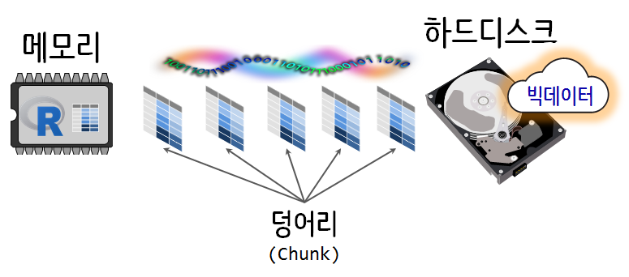
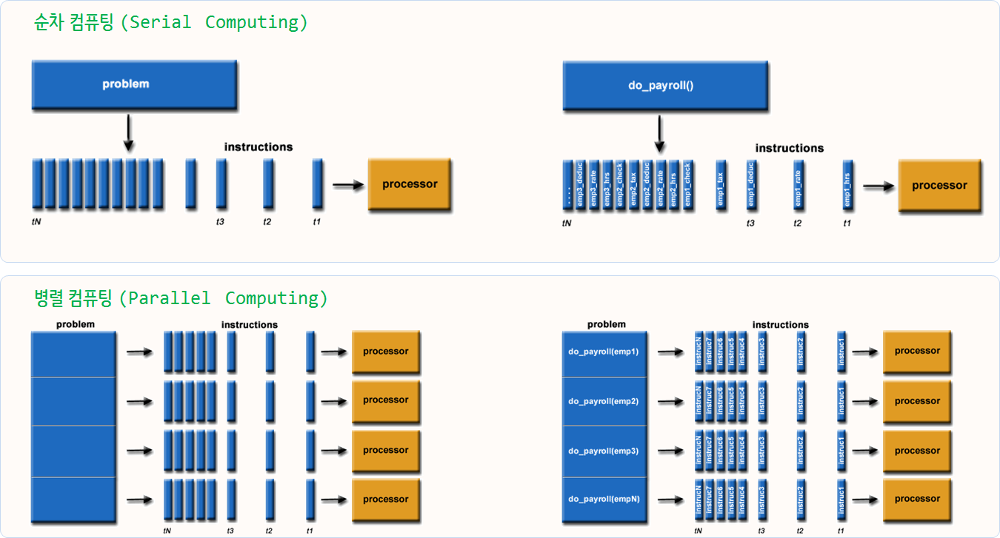
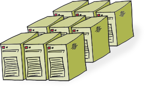
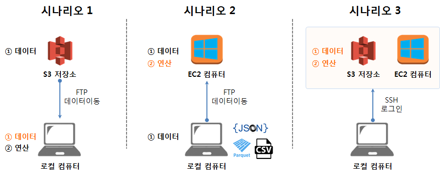
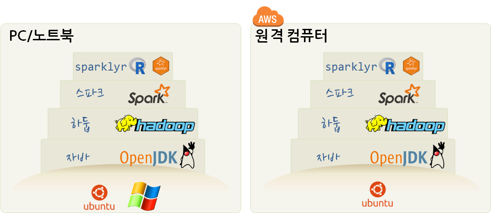
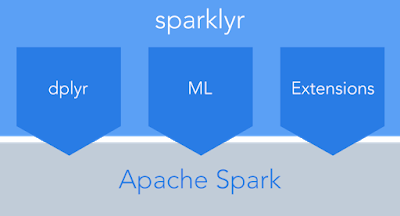

```{r setup, include=FALSE}
options(htmltools.dir.version = FALSE)

knitr::opts_chunk$set(echo = FALSE, warning=FALSE, message=FALSE,
                    comment="", digits = 3, tidy = FALSE, prompt = TRUE, fig.align = 'center')
```


class: inverse, middle, center

## 빅데이터 &rarr; 데이터 사이언스

---
### 구글 Trends 데이터 사이언스 한미 비교 - 미국

```{r google-trends-comparison-us, echo=FALSE, fig.width=12, fig.height=8}
library(tidyverse)
library(lubridate)
library(googleVis)
library(extrafont)
loadfonts()

Sys.setenv(TZ='Asia/Seoul')

us_df <- read_rds("data/us_df.rds")
kr_df <- read_rds("data/kr_df.rds")

us_df$interest_over_time %>% tbl_df %>% 
  mutate(hits = as.integer(hits)) %>% 
  ggplot(aes(x=date, y=hits, color=keyword)) +
    geom_line() +
    labs(x="", y="구글 인기도", color="구글 검색어") +
    theme_minimal(base_family = "NanumGothic") +
    theme(legend.position = "top",
          legend.title=element_text(size=17), 
          legend.text=element_text(size=15))

```


---
### 구글 Trends 데이터 사이언스 한미 비교 - 한국


```{r google-trends-comparison-kr, fig.width=12, fig.height=8}
kr_df$interest_over_time %>% tbl_df %>% 
  mutate(hits = as.integer(hits)) %>% 
  ggplot(aes(x=date, y=hits, color=keyword)) +
    geom_line() +
    labs(x="", y="구글 인기도", color="구글 검색어") +
    theme_minimal(base_family = "NanumGothic") +
    theme(legend.position = "top",
          legend.title=element_text(size=17), 
          legend.text=element_text(size=15))
```

---
class: inverse, middle, center

## 데이터 사이언스

---
### 데이터 사이언스란?

데이터 사이언스는 데이터를 다루는 과학이다. 따라서 자연법칙을 다루는 자연과학과 맥이 닿아있다.
자연법칙을 측정하여 데이터프레임(`DataFrame`)으로 나타내면 **변수(Variable)**, **관측점(Observation)**, **값(Value)**으로 표현된다.


---
### 데이터 사이언스 업무


- **분석(Analytics) 데이터 과학자**는 좋은 질문을 던질 수 있고, 
탐색적 데이터 분석을 통해서 문제와 해법을 명확히 하는 재주가 있고, 대쉬보드와 시각화를 통해 데이터 분석을 자동화하고, 추천 결과물을 통해 비즈니스를 변화시킨다. 
- **알고리즘(algorithm) 데이터 과학자**는 기계학습에 특기가 있는 사람에 적합하고 제품/서비스, 프로세스에 데이터를 알고리즘을 통해 녹여내서 비즈니스 가치를 창출한다. 
- **추론(inference) 데이터 과학자**는 통계를 사용해서 의사결정을 향상시키고, 업무의 영향도를 측정하는데 주로 통계학, 경제학, 사화과학 전공지식을 적극 활용한다.

.footnote[
  [Elena Grewal(July 25, 2018), "One Data Science Job Doesn’t Fit All"](https://www.linkedin.com/pulse/one-data-science-job-doesnt-fit-all-elena-grewal/)
]

---
class: inverse, middle, center

## R 미트업 <br>

---
### 2018년 2월 R 미트업



.footnote[
- [이광춘, 2018.02.21(수)	빅데이터는 디스크에 쓰고 R 메모리라고 읽는다](https://statkclee.github.io/bigdata/bigdata-bigmemeory.html)
]

---
class: inverse, middle, center

## HPC <br>

---
### HPC(High Performance Computing)

.center[
  
]

방의 4면에 도배를 하거나 페인트를 칠하는 것을 예로 들어볼 수 있다.

.footnote[
- [고성능 컴퓨팅(HPC), 고성능 컴퓨팅 기초](http://statkclee.github.io/hpc/hpc-basic.html)
]

---
### 유전체학 (Genomics) 

.center[
  
]

.footnote[
- [클라우드 컴퓨팅 소개 - 유전체학(Genomics)](https://statkclee.github.io/cloud-genomics-kr/)
]

---
### 소프트웨어 카펜트리 &rarr; HPC 카펜트리 

- [Introduction to High-Performance Computing](https://hpc-carpentry.github.io/hpc-intro/)
<br>
- [Introduction to using the shell in a High-Performance Computing context](https://hpc-carpentry.github.io/hpc-shell/)
<br>
- [Analysis pipelines with Python](https://hpc-carpentry.github.io/hpc-python/)

.footnote[
- [HPC Carpentry:Teaching basic skills for high-performance computing.](https://hpc-carpentry.github.io/)
]


---
class: inverse, middle, center

## 데이터 사이언스 서버

---
### 세가지 시나리오 - AWS



.footnote[
- [시나리오별 클라우드(AWS) 컴퓨팅 자원을 데이터 과학에 활용](https://statkclee.github.io/bigdata/ml-aws-from-pc.html)
]


---
class: inverse, middle, center

## 스파크 (Spark)

---
### 스파크(Spark) - `localhost`

.center[

]

.footnote[
- [로컬 컴퓨터 스파크 설치](https://statkclee.github.io/bigdata/ds-sparklyr.html)
]

---
### `MovieLens` 데이터 - `sparklyr` 

.center[

]

.footnote[
- [영화추천 사례](https://statkclee.github.io/parallel-r/recommendation-sparklyr.html)
]

