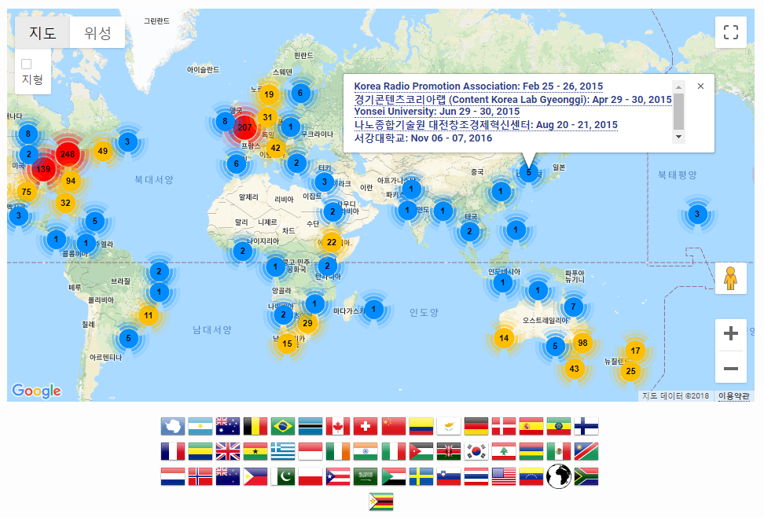

```{r setup, include=FALSE}
options(htmltools.dir.version = FALSE)

knitr::opts_chunk$set(echo = FALSE, warning=FALSE, message=FALSE,
                    comment="", digits = 3, tidy = FALSE, prompt = FALSE, fig.align = 'center')

```

class: inverse, middle, center

# 소프트웨어 카펜트리 

---
background-image: url("fig/hallym_university_20181027.jpg")
background-size: 570px

.footnote[
[소프트웨어 카펜트리 시즌2 : 한림대학교](https://statkclee.github.io/2018-10-27-hallym/)
]

---
background-image: url("fig/sogang-data-carpentry-2016.jpg")
background-size: 570px

.footnote[
  [서강소식 (2016), "데이터 카펜트리 워크숍 개최"](https://www.sg-alumni.org/page/bbs/board.php?bo_table=b03&wr_id=34&sst=wr_hit&sod=desc&sop=and&page=93)
]


---
class: inverse, middle, center

.center[
  [소프트웨어 카펜트리 소개: Introducing Software Carpentry January 2015](http://swcarpentry.github.io/slideshows/introducing-software-carpentry/index.html#slide-0)
]


---
### 엔지니어 vs. 목수

.center[
    
]


---
### 소프트웨어 카펜트리 활동

.center[
    
]

.footnote[
- [Software Carpentry - About Us](https://software-carpentry.org/about/)
- [Software Carpentry - Instructor](https://carpentries.org/instructors/)
- [Software Carpentry - Past Workshops](https://software-carpentry.org/workshops/past/)
]

---
### 카펜트리(Carpentries)


.center[
    
]


.footnote[

- [Software Carpentry](https://software-carpentry.org/)
- [Data Carpentry](https://datacarpentry.org/)
- [Library Carpentry](https://librarycarpentry.org/)

]

---
### 문제(Problem) 정의

- ~~과학자~~가 소프트웨어/데이터를 개발하고 사용하는데 점점더 많은 시간을 보낸다.

- <em>거의 대부분의 ~~과학자~~는 소프트웨어/데이터를 독학한다.</em>

- ~~과학자~~가 소프트웨어/데이터를 얼마나 <em>잘</em> 하고있는지 측정하기는 어렵다.

- 하지만, (실험심리학)일화적 증거를 통해서 "그다지" 잘 하고 있지 않다고 함.

---
### 소프트웨어 카펜트리 해답
	
- ~~과학자~~가 ~~과학자~~를 가르침.

-	실습을 통한 2일 학습

|  학습과정        |        |     학습목표      |
|------------------|-------|-------------------|
|유닉스 쉘(Shell)	 |&rarr; | 반복작업 자동화   |
| Git와 GitHub     |&rarr; | 작업 추적과 협업  |
| 파이썬 혹은 R	   |&rarr; | 모듈방식 코드 개발|
| SQL	             |&rarr; | 자료 관리         |

---
### 추진 결과 

- 생산성 10-20% 평균적으로 향상

- 생산성 10배 이상 향상된 것도 드물지 않음

- 기존 작업을 더 빠르게 처리

- 새로운 문제를 해결에 매진

- PC, 클라우드, 빅데이터에 대한 준비 ...

- 공개 과학(open science) 추진 시작


---
class: inverse, middle, center

# 왜 과학 컴퓨팅인가?


---
## 가치(Value) 원천

.center[
  
]

세계은행(World Bank)과 한국개발연구원(KDI)은 약 2년여 기간의 공동연구를 통해 1960-2005 년간 한국 경제발전 과정에 관한 보고서를 출간했다. 경제성장이 지속되기 위해서는 생산성 증가가 대단히 중요하고, 1960년 이후 한국경제의 성공은 광의의 지식축적에 기인한 것으로 1960-2005년 사이 한국의 실질 1인당GDP의 75%가 광의의 지식축적에 기인한 것으로 분석했다.


---
## 사고체계의 진화

.center[
  
]

- 데이터 과학자 
    - 수학적 사고(Mathematical Thinking)
    - 통계적 사고(Experimental Thinking) 
    - 컴퓨팅 사고(Computational Thinking)

.footnote[
    [Wing, Jeannette M. "Computational thinking." Communications of the ACM 49.3 (2006): 33-35.](https://www.cs.cmu.edu/~15110-s13/Wing06-ct.pdf)
]


---
## 4번째 패러다임

.center[
  
]

---
class: inverse, middle, center

# 한국 소프트웨어 카펜트리

---
## 첫번째 소프트웨어 카펜트리 워크샵

.center[
  
]

.footnote[
  [Software Carpentry Blog (2014), "Translating Software Carpentry into Korean"](https://software-carpentry.org/blog/2014/11/korean-translation.html)
]


---
## 카펜트리 워크샵

.center[
  
]

---
## 한국 소프트웨어 카펜트리

- 소프트웨어 카펜트리 벙커
    - [소프트웨어 카펜트리 버젼 5.3.](http://statkclee.github.io/swcarpentry-version-5-3-new/)
        - [Software Carpentry - Previous Material](https://software-carpentry.org/lessons/previous/)
    - [한국 소프트웨어 카펜트리 시즌2](https://statkclee.github.io/swcarpentry-kr/)
        - [유닉스 쉘](https://statkclee.github.io/shell-novice-kr/)
        - [Git/GitHub](https://statkclee.github.io/git-novice-kr/)
        - [R 프로그래밍](https://statkclee.github.io/r-novice-kr/)
        - [R 데이터 분석과 시각화](https://statkclee.github.io/r-gapminder-kr/)
- 소프트웨어 카펜트리 워크샵
    * [한림대학교: 2018-10-27](https://statkclee.github.io/2018-10-27-hallym/) 
    * [서강대학교: 2016-11-06](https://statkclee.github.io/2016-11-06-sogang/)
    * [나노종합기술원 대전창조경제혁신센터: 2015-08-20](http://statkclee.github.io/2015-08-20-daejeon/)
    * [연세대학교: 2015-06-29](http://statkclee.github.io/2015-06-29-yonsei/)
    * [경기콘텐츠코리아랩: 2015-04-29](http://statkclee.github.io/2015-04-29-pangyo/)
    * [한국전파진흥협회(RAPA): 2015-02-25](http://statkclee.github.io/2015-02-25-seoul/)

---
class: inverse, middle, center

# 데이터 사이언스

    
---
## 데이터 사이언스

.left[
- [마소 395호 - 데이터 사이언스, 타이디버스로 향하다](http://it.chosun.com/site/data/html_dir/2019/01/29/2019012900392.html)
- [연세대학교 - 데이터 과학 입문](https://statkclee.github.io/yonsei/)
- [데이터 사이언스 Meetup](https://tidyverse-korea.github.io/r-meetup-x-presser/)
- [`Tidyverse Korea` 페북 그룹](https://www.facebook.com/groups/tidyverse/)
- [LangCon2019 : 자연어처리하기 좋은 날입니다!](https://songys.github.io/2019LangCon/)
    - [유튜브 댓글 텍스트 분석(R) - 튜토리얼](https://statkclee.github.io/text/langcon-2019-tutorial.html)
]


