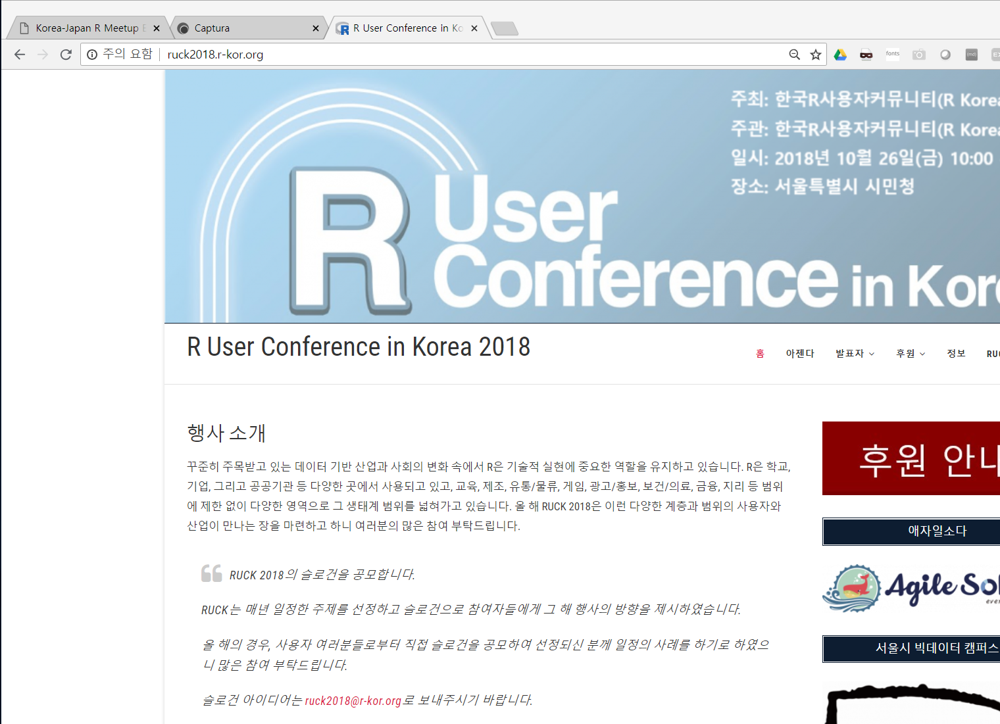
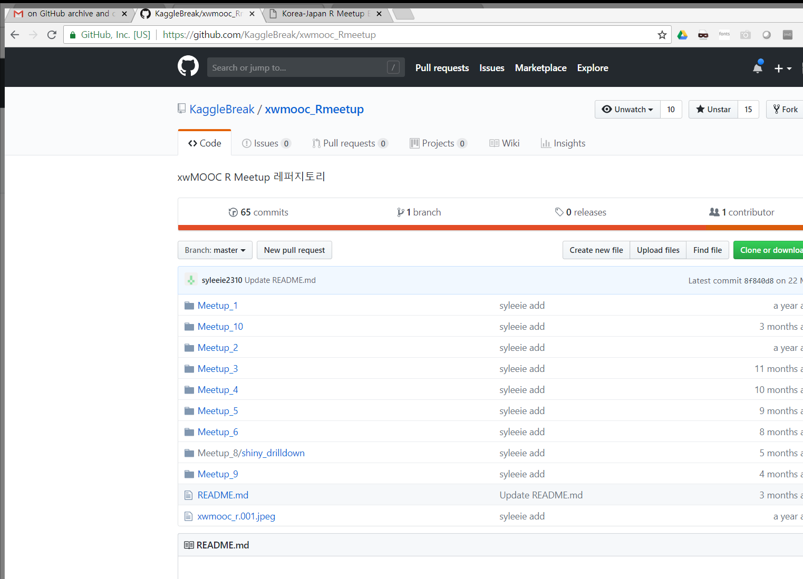

```{r setup, include=FALSE}
options(htmltools.dir.version = FALSE)
```


background-image: url("fig/fujimoto-email.png")
background-size: 800px

---
# Korea-Japan R Meetup Exchange Meeting

- Email Exchange

- Google Translation 

- Tidyverse Korea Facebook Group

- ...


---
# R User Conference in Korea

.center[
 
]

.footnote[
  [R User Conference in Korea 2018](http://ruck2018.r-kor.org/)
]

---
# R Community in Korea (Online)

- [통계분석연구회(Statistics Analysis Study)](https://www.facebook.com/groups/statsas/)
    - Move from DAUM Cafe to Facebook Group
    - SAS is the origin language.


- [R Korea - KRUG(Korean R User Group)](https://www.facebook.com/groups/KoreaRUsers/)


- [Tidyverse Korea](https://www.facebook.com/groups/1404219106509417/)


---
# R Meetup (Offline)

.center[
 
]

.footnote[
  [R Meetup](https://github.com/KaggleBreak/xwmooc_Rmeetup)
]

---
# Anything to be added

- (ex) Korea R Leader : [Choonghyun Ryu](https://github.com/choonghyunryu)


- Korea R Leader: 정우준

