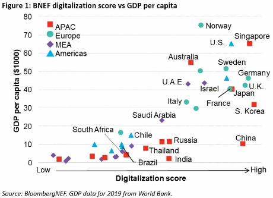

```{r setup, include=FALSE}
knitr::opts_chunk$set(echo = FALSE)
```

# 디지털 뉴딜

[BloombergNEF, "South Korea, Singapore, Germany Lead BNEF Ranking of Top Digitalization Markets", September 24, 2020](https://about.bnef.com/blog/south-korea-singapore-germany-lead-bnef-ranking-of-top-digitalization-markets/)


```{r new-deal-score, eval = FALSE}
webshot::webshot(url = "https://about.bnef.com/blog/south-korea-singapore-germany-lead-bnef-ranking-of-top-digitalization-markets/", selector = '#content > article > div.article__content > p:nth-child(13) > img', file="fig/bnef.png")
```




# 보고서

data/IMD_digital_2020.pdf

Global Competitiveness Report 2019, World Economic Forum
WEF_TheGlobalCompetitivenessReport2019.pdf


# 데이터셋

- IMF : https://github.com/mingjerli/IMFData
- IMFr: https://github.com/christophergandrud/imfr
- World Bank: https://cran.r-project.org/web/packages/WDI/


# forbes

Top 100 Digital Companies: https://www.forbes.com/top-digital-companies/list/#tab:rank
GLOBAL 2000 The World's Largest Public Companies: https://www.forbes.com/global2000/#673e3911335d

- List of largest Internet companies: https://en.wikipedia.org/wiki/List_of_largest_Internet_companies


https://www.kaggle.com/gopalrameshdahale/country-data
https://www.kaggle.com/samaxtech/cia-factbook-data

```{r feconfin, eval = FALSE}
# install.packages("fEcofin", repos = "http://r-forge.r-project.org/")
library(fEcofin)
ciaCountries()
ciaIndicators()
ciaByCountry()
ciaByCountry(code = "KR", from = FALSE, names = TRUE, details = TRUE)
ciaByIndicator(code = 2001, from = TRUE, details = TRUE)
```

