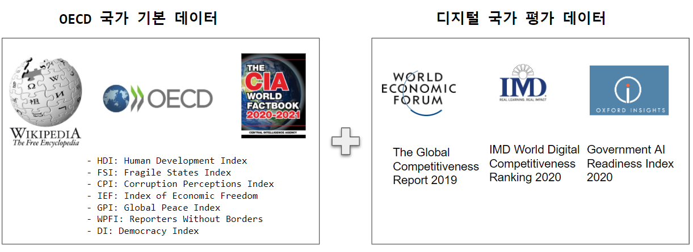
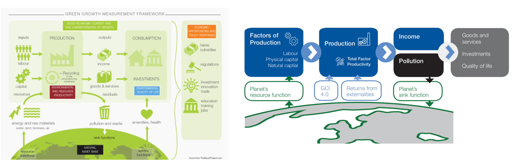
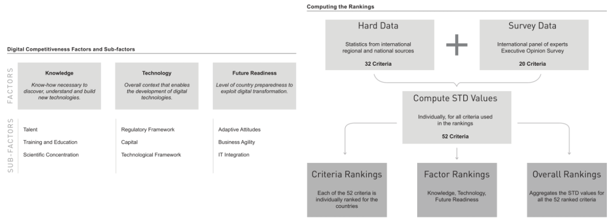
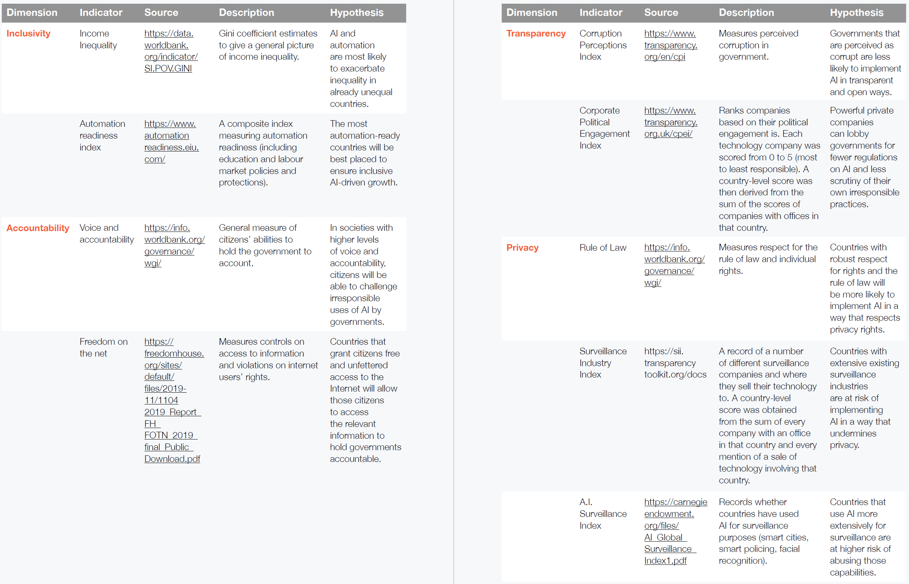

```{r setup, include=FALSE}
knitr::opts_chunk$set(echo = TRUE, message=FALSE, warning=FALSE,
                      comment="", digits = 3, tidy = FALSE, prompt = FALSE, fig.align = 'center')

```



# OECD 국가 {#oecd-list}

[Wikipedia OECD](https://en.wikipedia.org/wiki/OECD) 웹사이트에서 먼저 OECD 국가명을 추출한다.

```{r oecd-list}
library(tidyverse)
library(rvest)

oecd_countries <- read_html("https://en.wikipedia.org/wiki/OECD") %>% 
  html_nodes(xpath = '//*[@id="mw-content-text"]/div[1]/table[5]') %>% 
  html_table() %>% 
  .[[1]]

oecd_df <- oecd_countries %>% 
  as_tibble() %>% 
  janitor::clean_names() %>% 
  # mutate(id = row_number()) %>%
  select(content=country, start=membership_1, group = geographic_location) %>% 
  mutate(start = str_extract(start, "[0-9]{1,2}\\s[a-zA-Z]+\\s[0-9]{4}")) %>% 
  mutate(start = lubridate::dmy(start)) 

oecd_df
```

OECD 가입순서대로 대륙별로 타임라인을 잡아보자. `timeviz` 팩키지를 통해 시간순으로 OECD 가입국가를 살펴봄으로서 대략적인 추세를 확인할 수 있다. 특히 대륙별로 가입순서를 나눠 보는 것도 흥미로운 사항을 파악할 수 있을 것이다.

```{r oecd-timeviz}
library(timevis)

location <- oecd_df %>% 
  count(group) %>% 
  select(id = group) %>% 
  mutate(content = id)
  
timevis(oecd_df, groups = location, options = list(stack = FALSE)) %>% 
  setOptions(list(editable = TRUE)) %>%
  setSelection("South Korea") %>%
  fitWindow(list(animation = FALSE))
```


# OECD 국가 비교 {#compare-oecd-countries}

OECD 국가별 비교를 위해서 다양한 지표를 활용하여 평가가 이루지고 있다. 부폐관련 지표, 민주화 관련 지표, 국가 안정성 지표 등 다양한 지표를 통해 국가별 비교 작업을 수행할 수 있다. OECD 국가별 결측값이 일부 있어 이를 구글링을 통해 위키백과사전에 실린 오류를 수정하여 최대한 국가를 살리도록 한다.

- 이스라엘 FSI는 [Fragile States Index Country Dashboard](https://fragilestatesindex.org/country-data/)를 참고하여 75.1로 치환.
- 뉴질랜드 소득 불평등 지수는 [INEQUALITY AND POVERTY: A SUMMARY OF THE 2019 HOUSEHOLD INCOMES IN NEW ZEALAND REPORT](http://www.goodsociety.nz/inequality-and-poverty-a-summary-of-the-2019-household-incomes-in-new-zealand-report/)을 참조하여 33으로 치환
- 폴란드 소득 불평등 지수는 [index mundi Poland - GINI index (World Bank estimate)](https://www.indexmundi.com/facts/poland/indicator/SI.POV.GINI) 참조하여 31.8로 치환.
- 결측값 갖는 룩셈부르크 제외

```{r compare-oecd-countries}
oecd_fact <- read_html("https://en.wikipedia.org/wiki/OECD") %>% 
  html_nodes(xpath = '//*[@id="mw-content-text"]/div[1]/table[6]') %>% 
  html_table() %>% 
  .[[1]] %>% 
  as_tibble() %>% 
  janitor::clean_names()

oecd_fact_df <- oecd_fact %>% 
  set_names(c("country", "area", "population", "gdp", 
              "gdp_per_capita", "income_inequality", 
              "hdi", "fsi", "rli", "cpi", "ief", 
              "gpi", "wpfi", "di")) %>% 
  mutate(income_inequality = ifelse(income_inequality == "N/A", NA, income_inequality),
         fsi = ifelse(fsi == "N/A", NA, fsi),
         rli = ifelse(rli == "N/A", NA, rli),
         gpi = ifelse(gpi == "N/A", NA, gpi)) %>% 
  select(-rli) %>%  ## 결측값이 8개국
  mutate(income_inequality = ifelse(country == "New Zealand", 33, income_inequality),
         income_inequality = ifelse(country == "Poland", 31.8, income_inequality),
         fsi = ifelse(country == "Israel", 75.1, fsi)) %>% 
  filter(!str_detect(country, "Luxembourg|OECD|Country"))  %>% 
  mutate(across(.cols=area:di, parse_number))


## 변수 결측값
sapply(oecd_fact_df, function(y) sum(length(which(is.na(y))))) %>% 
  as.data.frame() %>% 
  rownames_to_column(var="country") %>% 
  as_tibble() %>% 
  set_names(c("country", "missings")) %>% 
  arrange(desc(missings))

## 관측점 국가별 결측값
rowSums(is.na(oecd_fact_df)) %>% 
  as_tibble() %>% 
  bind_cols(oecd_fact_df %>% select(country)) %>% 
  rename(missings = value) %>% 
  arrange(desc(missings))
```

정제된 데이터를 경제적인 측정지수 외에 다양한 지수를 바탕으로 일별해보자.

- HDI: Human Development Index
- FSI: Fragile States Index
- CPI: Corruption Perceptions Index
- IEF: Index of Economic Freedom
- GPI: Global Peace Index
- WPFI: Reporters Without Borders
- DI: Democracy Index

```{r country-data-clean}
oecd_fact_df %>% 
  arrange(desc(gdp)) %>% 
  DT::datatable() %>% 
  DT::formatRound(c("area", "population", "gdp", "gdp_per_capita"), digits = 0, interval = 3)
```


## 국가코드 {#country-code-for-merging}

위키백과사전에 담긴 OECD 국가정보와 World Economic Forum, IMD 국가 경쟁력 지표를 한데 묶는데 관계형 데이터베이스 모형에서 키값이 중요하기 때문에 `countrycode` 팩키지를 중간 다리로 삼아 최대한 정확히 국가명이 매칭되도록 준비한다.

```{r country-code-in-r}
library(countrycode)

oecd_fact_df <- oecd_fact_df %>% 
  mutate(flags = countrycode(country, origin = 'country.name', 'unicode.symbol'),
         iso3c = countrycode(country, origin = 'country.name', 'iso3c')) %>% 
  select(country, flags, iso3c, everything())

oecd_fact_df
```


# Digital Transformation {#digital-transformation}

디지털 전환(Digital Transformation) 대전환기에 WEF(World Economic Forum)에서 측정한 국가별 경쟁력 지표와 IMD 디지털 경쟁력(IMD Digital Competitiveness) 국가별 경쟁력 지표를 핵심 지표로 삼도록 한다.

## weforum Global Competitiveness [^pdf_data-table] {#digital-transformation-weforum-ranking}

[^pdf_data-table]: [stackoverflow, "Using the pdf_data function from the pdftools package efficiently"](https://stackoverflow.com/questions/60127375/using-the-pdf-data-function-from-the-pdftools-package-efficiently)

[World Economic Forum, "Global Competitiveness Index 4.0"](https://reports.weforum.org/global-competitiveness-report-2019/competitiveness-rankings/)에서 
 보고서를 받아 국가별 핵심 정보만 추출한다.


<style>
div.blue { background-color:#e6f0ff; border-radius: 5px; padding: 10px;}
</style>
<div class = "blue">

### 한국 참여자 {-#Korea-kdi}

- Korea, Republic of: **Korea Development Institute**
    - Joonghae Suh, Executive Director, Economic Information and Education Center
    - Youngho Jung, Head, Public Opinion Analysis Unit
    - Jiyeon Park, Senior Research Associate, Public Opinion Analysis Unit

</div>





```{r weforum-global-competitiveness}
library(pdftools)

wef <- pdftools::pdf_data("data/WEF_TheGlobalCompetitivenessReport2019.pdf")

wef_tbl <- wef[[15]] # The Global Competitiveness Index 4.0 2019 Rankings

## #1 ~ #47 국가
wef_tbl_01 <- wef_tbl %>% 
  filter(x > 82, x < 220, y > 140, y < 720)

wef_tbl_01 <- wef_tbl_01 %>% 
  mutate(x = round(x/5),     #reduce resolution to minimise inconsistent coordinates
         y = round(y/5)) %>% 
  arrange(y, x) %>%                        #sort in reading order
  mutate(group = cumsum(!lag(space, default = 0))) %>%  #identify text with spaces and paste
  group_by(group) %>% 
  summarise(x = first(x),
            y = first(y),
            text = paste(text, collapse = " ")) %>% 
  group_by(y) %>% 
  mutate(colno = row_number()) %>%         #add column numbers for table data 
  ungroup() %>% 
  select(text, colno, y) %>% 
  pivot_wider(names_from = colno, values_from = text) %>% #pivot into table format
  select(-y) %>% 
  mutate(rank = row_number()) %>% 
  set_names(c("country", "score", "rank_change", "score_change", "rank"))

## #48 ~ #94 국가
wef_tbl_02 <- wef_tbl %>% 
  filter(x > 246, x < 380, y > 138, y < 720)

wef_tbl_02 <- wef_tbl_02 %>% 
  mutate(x = round(x/5),     #reduce resolution to minimise inconsistent coordinates
         y = round(y/5)) %>% 
  arrange(y, x) %>%                        #sort in reading order
  mutate(group = cumsum(!lag(space, default = 0))) %>%  #identify text with spaces and paste
  group_by(group) %>% 
  summarise(x = first(x),
            y = first(y),
            text = paste(text, collapse = " ")) %>% 
  group_by(y) %>% 
  mutate(colno = row_number()) %>%         #add column numbers for table data 
  ungroup() %>% 
  select(text, colno, y) %>% 
  pivot_wider(names_from = colno, values_from = text) %>% #pivot into table format
  select(-y) %>% 
  mutate(rank = 47 + row_number()) %>% 
  set_names(c("country", "score", "rank_change", "score_change", "rank"))

wef_top_country <- wef_tbl_01 %>% 
  bind_rows(wef_tbl_02) %>% 
  mutate(score = parse_number(score)) %>% 
  select(wef_rank = rank, country, wef_score = score) %>% 
  mutate(iso3c = countrycode(country, origin = 'country.name', 'iso3c'))

wef_top_country
```


## IMD Digital Competitiveness {#digital-transformation-ranking}

마찬가지 방법으로 [The 2020 IMD World Digital Competitiveness Ranking](https://www.imd.org/wcc/world-competitiveness-center-rankings/world-digital-competitiveness-rankings-2020/) 웹사이트에서 
[The 2020 IMD World Digital Competitiveness Ranking](data/digital_2020.pdf) 보고서를 받아 필요한 데이터를 추출하도록 한다.



```{r imd-digital}
library(tabulizer)

# locate_areas("data/digital_2020.pdf", pages = 24, copy = TRUE)

## USA ~ Poland 국가
digital_01 <- extract_tables("data/digital_2020.pdf", pages = 24, guess = FALSE, method = "decide", output = "data.frame",
                          area = list(c(155.45691, 44.26341, 590.53436, 297.63800)), encoding = "LATIN-1") %>% 
  .[[1]] %>% 
  set_names(c("country_econ", "z1", "z2", "2019")) %>% 
  select(country_econ, z1, `2019`) %>% 
  mutate(country = str_extract(country_econ, "[a-zA-Z \\.]*"),
         digital_rank = str_extract(country_econ, "[0-9]{1,2}")) %>% 
  select(country, digital_rank)
  
## Spain ~ Venezuela 국가
digital_02 <- extract_tables("data/digital_2020.pdf", pages = 24, guess = FALSE, output = "data.frame",
                          area = list(c(155.4569, 300.6664, 574.3830, 554.0410 ))) %>% 
  .[[1]] %>%
  set_names(c("country_econ", "z1", "z2")) %>% 
  mutate(country = str_extract(country_econ, "[a-zA-Z \\.]*"),
         digital_rank = str_extract(country_econ, "[0-9]{1,2}")) %>% 
  select(country, digital_rank)

digital_df <- bind_rows(digital_01, digital_02) %>% 
  mutate(country = ifelse(str_detect(country, "Kong SAR"),"Hong Kong", country),
         country = ifelse(str_detect(country, "Sdwitzerland"),"Switzerland", country),
         country = ifelse(str_detect(country, "Nsetherlands"),"Netherlands", country),
         country = ifelse(str_detect(country, "K.orea Rep."),"Korea Rep.", country),
         country = ifelse(str_detect(country, "Ugndiotemd Kingdom"),"United Kingdom", country),
         country = ifelse(str_detect(country, "Nnedw Zealand"),"New Zealand", country),
         country = ifelse(str_detect(country, "Lrguxembourg"),"Luxembourg", country),
         country = ifelse(str_detect(country, "Saudi ArabSiaudi Arabia"),"Saudi Arabia", country),
         country = ifelse(str_detect(country, "hTianiawan"),"Taiwan", country),
         country = ifelse(str_detect(country, "South AfricSaouth Africa"),"South Africa", country)) %>% 
  mutate(iso3c = countrycode(country, origin = 'country.name', 'iso3c')) %>% 
  select(iso3c, digital_rank) %>% 
  mutate(digital_rank = parse_number(digital_rank)) %>% 
  as_tibble()

digital_df
```


# 옥스퍼드 AI 준비 보고서 {#oxford-ai-readiness}

Oxford Insights 웹사이트에서 [AI Readiness Index 2020](https://www.oxfordinsights.com/government-ai-readiness-index-2020) PDF 파일을 가져와서 국가별 순위를 추출한다.



```{r oxford-ai-readiness}
oxford <- pdftools::pdf_data("data/AI+Readiness+Report.pdf")

## Full Rankings: 1-24
oxford_01 <- oxford[[129]]

oxford_01_tbl <- oxford_01 %>% 
  filter(x > 137, x < 460, y > 178, y < 795)

oxford_01_tbl <- oxford_01_tbl %>% 
  mutate(x = round(x/5),     #reduce resolution to minimise inconsistent coordinates
         y = round(y/5)) %>% 
  arrange(y, x) %>%                        #sort in reading order
  mutate(group = cumsum(!lag(space, default = 0))) %>%  #identify text with spaces and paste
  group_by(group) %>% 
  summarise(x = first(x),
            y = first(y),
            text = paste(text, collapse = " ")) %>% 
  group_by(y) %>% 
  mutate(colno = row_number()) %>%         #add column numbers for table data 
  ungroup() %>% 
  select(text, colno, y) %>% 
  pivot_wider(names_from = colno, values_from = text) %>% #pivot into table format
  select(-y) %>% 
  set_names(c("rank", "country", "score"))

## Full Rankings: 25-51
## Full Rankings: 52-78, ... "160-172"

get_page_rank <- function(page) {
  oxford_page <- oxford[[page]]

  oxford_page_tbl <- oxford_page %>% 
    filter(x > 137, x < 460, y > 99, y < 795)
  
  oxford_page_tbl <- oxford_page_tbl %>% 
    mutate(x = round(x/3),     #reduce resolution to minimise inconsistent coordinates
           y = round(y/3)) %>% 
    arrange(y, x) %>%                        #sort in reading order
    mutate(group = cumsum(!lag(space, default = 0))) %>%  #identify text with spaces and paste
    group_by(group) %>% 
    summarise(x = first(x),
              y = first(y),
              text = paste(text, collapse = " ")) %>% 
    group_by(y) %>% 
    mutate(colno = row_number()) %>%         #add column numbers for table data 
    ungroup() %>% 
    select(text, colno, y) %>% 
    pivot_wider(names_from = colno, values_from = text) %>% #pivot into table format
    select(-y) %>% 
    set_names(c("rank", "country", "score"))
  
  return(oxford_page_tbl)
}

oxford_02_tbl <- get_page_rank(130)
oxford_03_tbl <- get_page_rank(131)
oxford_04_tbl <- get_page_rank(132)
oxford_05_tbl <- get_page_rank(133)
oxford_06_tbl <- get_page_rank(134)
oxford_07_tbl <- get_page_rank(135)

oxford_ranking <- bind_rows(oxford_01_tbl, oxford_02_tbl) %>% 
  bind_rows(oxford_03_tbl) %>% 
  bind_rows(oxford_04_tbl) %>% 
  bind_rows(oxford_05_tbl) %>% 
  bind_rows(oxford_06_tbl) %>% 
  bind_rows(oxford_07_tbl)

oxford_ranking_df <- oxford_ranking %>% 
  mutate(across(.col = c(rank, score), parse_number)) %>% 
  select(ai_rank = rank, country) %>% 
  mutate(iso3c = countrycode(country, origin = "country.name", 'iso3c'))

oxford_ranking_df
```

# 데이터 경제 [^hbr-data-economy] {#data-economy}

[^hbr-data-economy]: [Bhaskar Chakravorti , Ajay Bhalla and Ravi Shankar Chaturvedi (January 24, 2019), "Which Countries Are Leading the Data Economy?" Harvard Business Review.](https://hbr.org/2019/01/which-countries-are-leading-the-data-economy)

Harvard Business Review에서 데이터 총생산 (GDP, Gross Data Product)를 제시하는데 다음 4가지 기준을 제시하고 있다.

- Volume: Absolute amount of broadband consumed by a country, as a proxy for the raw data generated.
    - 원데이터 생산량을 추정하는 대안으로 한 국가에서 소비되는 광대역통신 절대량
- Usage: Number of users active on the internet, as a proxy for the breadth of usage behaviors, needs and contexts.
    - 인터넷에서 실제 활동중인 사용자수.
- Accessibility: Institutional openness to data flows as a way to assess whether the data generated in a country permits wider usability and accessibility by multiple AI researchers, innovators, and applications.
    - 데이터 흐름의 제도적 개방성
- Complexity: Volume of broadband consumption per capita, as a proxy for the sophistication and complexity of digital activity.
    - 인당 광대역 소비량


```{r hrb-data-economy}
hbr_url <- "https://hbr.org/2019/01/which-countries-are-leading-the-data-economy"

data_economy <- hbr_url %>% 
  read_html() %>% 
  html_nodes(xpath ='//*[@id="main"]/div[4]/article-content/div/div[2]/div/div[3]/p[16]') %>% 
  html_text()

data_economy_df <- data_economy %>% 
  str_split(., pattern = "\\d{1,2}\\.\\s") %>% 
  .[[1]] %>% 
  as_tibble() %>% 
  rename(country = value) %>% 
  filter(country != "") %>% 
  mutate(country = str_trim(country)) %>% 
  mutate(data_rank = row_number()) %>% 
  mutate(iso3c = countrycode(country, origin = "country.name", 'iso3c')) %>% 
  select(data_rank, country, iso3c)

data_economy_df
```


# OECD 통합 데이터 {#consolidated-dataframe}

마지막 단계로 위키백과사전 OECD 국가별 중요 지표와 디지털 경쟁력을 담고 있는 World Economic Forum(WEF) 글로벌 경쟁력, IMD 디지털 경쟁력 지표를 결합시켜 후속 작업을 위한 데이터로 준비한다.

```{r consolidated-dataframe}
library(fuzzyjoin)

oecd_full_df <- oecd_fact_df %>%
  inner_join(wef_top_country %>% select(-country), by="iso3c") %>% 
  left_join(digital_df, by = "iso3c") %>% 
  select(-wef_score) %>% 
  left_join(oxford_ranking_df %>% select(-country), by="iso3c") %>% 
  left_join(data_economy_df %>% select(-country),  by="iso3c")

oecd_full_df 
```

작업한 데이터를 국가별로 정리하여 로컬 파일로 저장시킨다.

```{r export-oecd-full-data}
oecd_full_df %>% 
  write_rds("data/oecd_full_df.rds")
```


```{r}
oecd_full_df  %>% 
  filter(is.na(data_rank))
```

