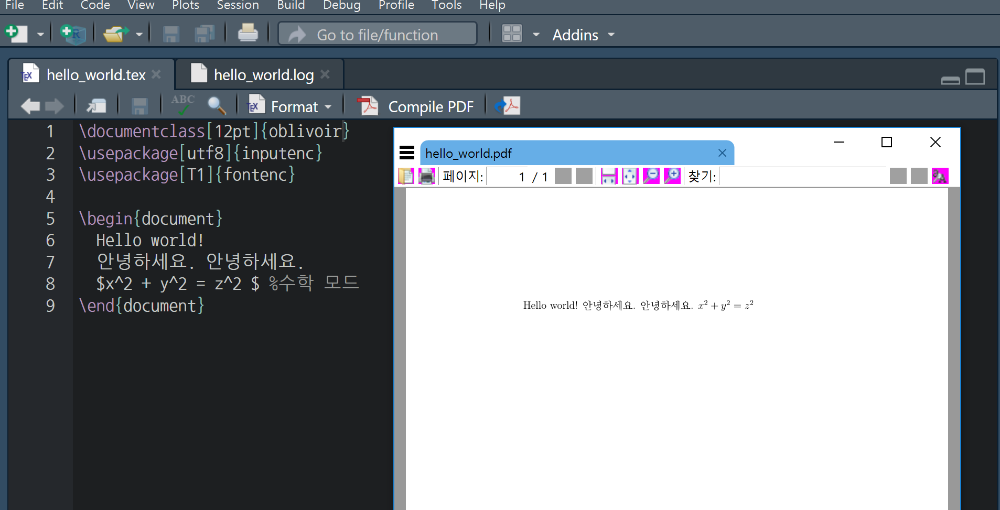
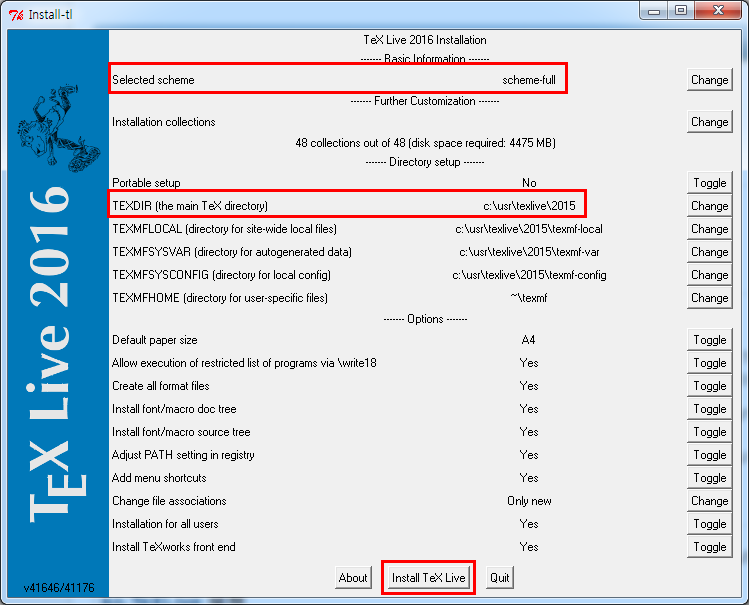

# 윈도우 10 환경 [^windows-10-install] {#windows-10-install}

[^windows-10-install]: [KTUG (2018-04-30), "설치하기Windows/tlinstall"](http://wiki.ktug.org/wiki/wiki.php/%EC%84%A4%EC%B9%98%ED%95%98%EA%B8%B0Windows/tlinstall)

[KTUG (2018-04-30), "설치하기Windows/tlinstall"](http://wiki.ktug.org/wiki/wiki.php/%EC%84%A4%EC%B9%98%ED%95%98%EA%B8%B0Windows/tlinstall)을 참고하여 설치 작업을 수행한다.

<iframe width="300" height="180" src="https://www.youtube.com/embed/V1Q6vEuoAQ0" frameborder="0" allow="accelerometer; autoplay; encrypted-media; gyroscope; picture-in-picture" allowfullscreen></iframe>


1. 사전준비
    - MiKTeX이나 TeXLive 이전 버전이 설치되어 있다면 프로그램 추가/삭제에서 지운다. 윈도우즈 사용자 이름을 영문자와 숫자만으로 한다.
1. TeXLive 2018 설치
    - http://mirror.navercorp.com/CTAN/systems/texlive/tlnet/install-tl.zip 다운로드 
    - 압축을 풀고 intall-tl-YYYYMMDD라는 폴더로 들어간다.
    - command 명령창을 연다: `&#8862; + R` 을 누른후 `cmd`를 입력하고 enter를 누르면 DOS 시절과 같은 terminal 창이 뜬다.
    - `install-tl-advanced.bat` 를 입력하고 실행한다. `install-tl.bat`이나 `install-tl-windows.bat`가 아니라 `-advanced`를 실행하는 것을 권장한다. 설치되는 디렉토리를 기본값에서 바꾸어 설치할 필요가 있을 수도 있다.
        - 네이버: `install-tl-advanced.bat --repository http://mirror.navercorp.com/CTAN/systems/texlive/tlnet/`
        - KAIST: `install-tl-advanced.bat --repository http://ftp.kaist.ac.kr/tex-archive/systems/texlive/tlnet/`
        - KTUG: `install-tl-advanced.bat --repository http://ftp.ktug.org/tex-archive/systems/texlive/tlnet/`
    - Directory Setup 부분의 TEXDIR가 `c:\texlive\2018`로 되어 있는 것을 `c:\usr\texlive\2018`로 고친다. 먼저 윈도우 탐색기를 열고 `c:\usr\texlive\2018` 디렉토리를 생성시킨 후 진행한다.
    - Selected scheme이 scheme-full로 되어 있다. 원하는 것을 선택한다. 시간이 오래 걸리더라도 scheme-full 설치하는 것이 사후관리를 위해서나 정신건강을 위해서나 좋다.
    - `Install TeXLive` 버튼을 누르고 기다린다. (시간이 많이 걸린다 30분이상)
1. 환경변수 설정
    - [내컴퓨터 - 속성] 또는 [제어판\시스템 및 보안\시스템] 에서 왼쪽의 '고급 시스템 설정' 으로 들어갑니다. 혹은 Windows 설정에서 "설정 찾기" 검색창에 '고급 시스템 설정'을 입력합니다.
    - 시스템 속성 창입니다. '환경 변수' 클릭
    - 시스템 변수의 '새로 만들기' 를 클릭하여 시스템 변수를 추가하거나, 사용자 변수에 추가합니다.
        -`C:\usr\texlive\2018\bin\win32`을 추가
1. [ko.TeX Live](http://wiki.ktug.org/wiki/wiki.php/koTeXLive) 설정
    - ko.TeX Live는 KTUG 표준한글텍환경 프로젝트팀이 KTS의 지원을 받아 제작하여 배포한 윈도우즈용 인스톨러였다.
    - TeX Live command-line(cmd 프로그램)을 열어서 다음 명령을 차례로 실행한다. (`>` 표시는 프롬프트이므로 직접 써넣는 것이 아님.)

```{r kotex-live-install, eval=FALSE}
> tlmgr repository add http://ftp.ktug.org/KTUG/texlive/tlnet ktug
> tlmgr pinning add ktug *
> tlmgr install ktugbin
> tlmgr install texworks-config
> tlmgr install nanumttf hcr-lvt
```

## Hello World {#latex-hello-world}

구글링해서 "latex hello world" 검색해서 `hello_world.tex` 파일로 저장시킨다.

```{r latex-hello, eval=FALSE}
# 파일명 hello_world.tex

\documentclass[12pt]{oblivoir}
\usepackage[utf8]{inputenc}
\usepackage[T1]{fontenc}

\begin{document}
  Hello world!
  안녕하세요. 안녕하세요. 
  $x^2 + y^2 = z^2 $ %수학 모드
\end{document}
```

그리고 나서, 이를 RStudio에서 컴파일하게 되면 다음과 같이 한글도 정상 출력되어 PDF 파일이 생성되는 것이 확인된다.




# 윈도우 7 환경 $LaTeX$ 설치 {#windows-7}

윈도우 환경에서 $LaTeX$ 을 설치하는 것이 경우에 따라서는 꼬일 수가 있다. [KTUG Wiki](http://wiki.ktug.org/wiki/wiki.php/설치하기Windows/tlinstall)를 참조하여 설치한다.


<style>
div.blue { background-color:#e6f0ff; border-radius: 5px; padding: 10px;}
</style>
<div class = "blue">

**사전 준비**

* MikTeX 혹은 TeXLive 이전 버젼이 설치된 경우 프로그램 추가/삭제에서 지운다.
* 윈도우즈 사용자 이름을 영문과 숫자로만 한정한다.

</div>


## TeXLive 2015 설치  {#windows-7-texlive}

1. [http://ftp.ktug.org/tex-archive/systems/texlive/tlnet/install-tl.zip](http://ftp.ktug.org/tex-archive/systems/texlive/tlnet/install-tl.zip) 사이트에서 다운로드 한다.
1. 다운로드한 압축파일을 풀고 예를 들어 `install-tl-20160711`와 같은 폴더로 들어간다. 
1. `install-tl-advanced.bat` 파일을 실행한다.
    * **GUI** 가 뜨지 않는 경우: 시스템 변수 `Path`에 `C:\Windows\system32;` 를 추가 
    * `Directory Setup`에 `TEXDIR`이 `c:\texlive\2015` &rarr; `c:\usr\texlive\2015`으로 수정한다. 만약, 디렉토리 수정이 되지 않는 경우 원인이 `c:\usr` 디렉토리가 존재하지 않기 때문에 발생된다. 따라서 `usr` 폴더를 `c:\` 루트 디렉토리 밑에 생성시킨다.
    * `Selected scheme` 이 `scheme-full`로 되어 있는지 확인한다. 
1. **Install TeXLive** 버튼을 누르고 한참 기다린다.
    * `scheme-full`을 선택했기 때문에 시간이 조금 더 걸리지만, 장기적으로 정신건강에는 최고로 좋다.




윈도우 쉘을 열고 `pdflatex --version` 명령어를 쳐서 다음과 같이 출력되면 정상이다.

```{r windows-7-check, eval=FALSE}
$ pdflatex --version

pdfTeX 3.14159265-2.6-1.40.17 (TeX Live 2016/W32TeX)
kpathsea version 6.2.2
Copyright 2016 Han The Thanh (pdfTeX) et al.
There is NO warranty.  Redistribution of this software is
covered by the terms of both the pdfTeX copyright and
the Lesser GNU General Public License.
For more information about these matters, see the file
named COPYING and the pdfTeX source.
Primary author of pdfTeX: Han The Thanh (pdfTeX) et al.
Compiled with libpng 1.6.21; using libpng 1.6.21
Compiled with zlib 1.2.8; using zlib 1.2.8
Compiled with xpdf version 3.04
```
