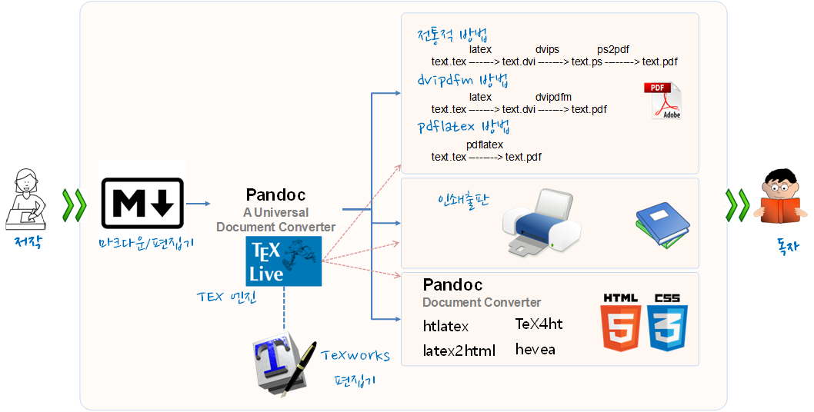
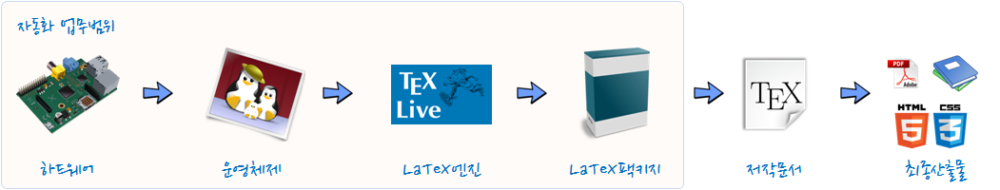
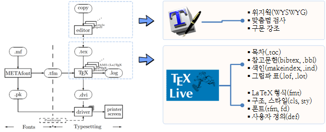

> ### 학습 목표 {.objectives}
>
>  * 한글 LaTeX에 대한 소개
>  * 한글 LaTeX를 실리콘(하드웨어) 위에 바로 설치하기
>  * 한글 LaTeX를 이용한 문서 프로그래밍 (영문, 한글)
>  * 통계적 사고(Think Stats2) 교재를 통한 실전 연습

### 1. 한글 LaTeX 문서작업 개괄

200자 원고지 4장은 통상 A4 용지 한장에 해당한다. 만약 A4 용지 10장 보고서나 논문을 작성한다고 하면, 종이 200자 원고지 40장에 연필이나 볼펜을 가지고 작성하게 된다. 최종본을 얻기까지 빨간색으로 선생님이나 주변의 첨삭지도를 받아 최종본을 만들기까지 여러번의 반복과정을 거치게 된다. 

최종 원고가 200자 원고지 40장에 담겨 탈고를 마치게 되면, 독자에게 다가갈 준비를 한다. 그림을 넣거나 아름다운 글씨체를 적용해 보고 종이 재질을 바꿔보기도 하고 영혼이 담긴 원고를 독자가 보기 좋고, 이해하기 쉽고, 때로는 감동과 재미를 줄 수 있도록 출판 단계에서 많은 사람들의 노력이 들어간다.

탈고를 마친 원고에 글씨체를 비롯한 디자인 작업이 완료되면 출판장비를 갖춘 출판소에서 인쇄장비를 거쳐 종이책 혹은 보고서가 완성되고, 이렇게 대량으로 출력되면 각 서점으로 배송되어 독자가 서점에서 구독을 하게 된다.

저자의 생각을 글로 표현하면 현재도 대부분 편집 및 디자인, 출판, 배송, 서점 등 각 단계에 사람이 관여하고 필요에 따라서는 컴퓨터가 작업을 지원하는데 사용되어 최종 독자에게 전달된다.

그림 1. 저작물을 생산, 유통, 고객 소비까지 이르는 공급망

#### 1.1. LaTeX과 Pandoc 기반 문서작업 자동화

책과 보고서 제작하는 과정은 워드 프로세스를 기본으로 두고, 숫자 계산이 필요하면 엑셀, 이미지가 필요하면 그래픽 전문 소프트웨어, 정보 검색도 웹브라우져를 사용한다. 글자, 단어, 문장, 문단, 장/절/항으로 생각의 단위를 서문, 본문, 결어 및 참고문헌, 주석, 그림, 그래프, 도표 등도 함께 체계적으로 작성해 나간다. 

다양한 소프트웨어를 통해서 원고를 탈고하게 되면 서식, 문장 문단 모양, 색인, 참조문헌 등 보기 좋고 가독성 높은 형태로 외양을 입히는 과정을 거치게 되는데 이 과정도 소프트웨어가 핵심적인 역할을 하게 된다. 책과 보고서에 대한 디자인 작업이 완료되면 다양한 형태로 배포하기 위한 프로그래밍 과정을 거쳐 PDF, 전자책(ePUB), 웹(HTML), 출판책 형태로 독자에게 전달된다.

글을 써서 이를 독자에게 전달되는 과정은 과거에 전문작가, 디자인 전문가, 출판전문가, 서점운영자 등 수많은 전문가가 연관되어 있고 타자기, 디자인 기계, 인쇄기 등 수많은 기계가 필요했으며 이를 사업적으로 기술적으로 연결할 수 있는 다양한 통신 방법이 필요했다. 비전문가가 밖에서 보면 복잡하고 어려워 보이지만, 컴퓨팅 사고의 시각으로 보면 단순할 수 있다.

그림 2. 저작자와 고객을 중간과정 자동화를 통한 저작물 직접 유통

#### 1.2. 한글 문서작업 자동화를 위한 툴체인 구축

한글 문서작업 자동화를 위해서 실리콘(하드웨어)부터 여러 층으로 소프트웨어를 설치하는 과정을 거치게 된다.

1. 실리콘(하드웨어): 실제세계에 비트와 바이트의 상태로 정보가 기록되고 보관되는 장소로, 인텔계열의 x86 아키테처, ARM 계열 코텍스, NVidia GPU같은 정보가 중요할 수 있다.
1. 운영체제: 리눅스, 윈도우, 맥 같이 응용프로그램과 하드웨어 사이에 위치하여 자원관리, 일정관리, 외부 기기 연결 등 다양한 작업을 대행해준다.
1. LaTeX 엔진: 컴퓨터는 기본적으로 범용이지만, 특정 작업 예를 들어 문서작업에 특화된 프로그램 설치가 필요하다. 가장 많이 사용되는 오픈소스 소프트웨어 엔진이 문서작업의 경우 LaTeX과 Pandoc이다.
1. LaTeX 팩키지: 공통적으로 많이 사용되는 문서작업의 경우 LaTeX 엔진에서 지원을 해주지만, 사용자의 다양한 요구사항에 맞춰, 그리고 시대 변화에 맞춰 다양한 팩키지가 제공되고 있다. 예를 들어 문서를 만들어서 HTML로 배포하고자 할 경우 `hevea` 팩키지를 가져와서 사용하면 HTML 문서를 최종 산출물로 사용할 수 있다.
1. 저작문서: 저자는 이제 저작물을 만들 모든 준비가 맞추어졌다. 

> #### 왜 1,2,3,4번까지 과정을 거치는 것이 필요할까? {.callout}
> 
> 만약 아래 한글이나 MS워드로 문서작업을 할 경우 1,2,3,4 전체 과정이 `setup.exe` 혹은 `install.exe` 파일을 두번클릭하면 해결이 된다. 
> 하지만, 운영체제가 달라 아래한글이나 MS워드를 설치를 못한다면 어떨까?
> 혹은, 버젼관리를 추가로 한다면 어떨까?
> `.epub`, `.html`, `.pdf` 등 다양한 배포는 문제가 없을까?
> 그리고, 충분한 예산이 확보되어 있는가?

그림 3. LaTeX 툴체인 배포 자동화

### 2. LaTeX 개요

미국 스탠포트 대학 Donald Knuth 교수가 1977년에 만든 문서조판 프로그램을 TeX("텍"이라고 읽음)이라고 하고, Leslie Lamport 교수가 만든 TeX 매크로 팩키지를 LaTeX("레이텍"이라고 읽음)이라고 한다.

`pdftex`과 `e-TeX `이 합쳐져서 사실상(de factor) [표준 TeX](http://wiki.ktug.org/wiki/wiki.php/TeX)이 되었고, [XeTeX](http://wiki.ktug.org/wiki/wiki.php/XeTeX)과 LuaTeX이 기존TeX을 대체하면서 발전하고 특히, 한글 폰트 때문에 [XeTeX](http://wiki.ktug.org/wiki/wiki.php/XeTeX)["지텍"이라고 읽음]을 한글처리를 위해서 많이 사용하고 있다.[^1]

LaTeX의 동작원리는 Salomon이 도식화한 것에 영감을 받아, Kees van der Laan [^2]이 1994년 정리한 논문에 잘 정리되어 있다. 기본적으로 고품질 전자출판을 위해서 폰트와 더블어 TeX이 필요하고 이를 하나로 묶어서 고품질 출력물을 얻게된다. 저자가 편집기(editor)로 작업한 `.tex` 파일이 폰트(Fonts) 작업과정과 조판(Typesetting)과정이 하나로 합쳐져 출력물이 산출된다. TeX 기본 엔진을 지원하는 다양한 TeX 팩키지, *AMS-(La)TeX*, *LaTeX*, *manmac*가 눈에 띈다. 

문서에 들어가는 다양한 구성요소, *목차*, *색인*, *참고문헌*, *그림과 표* 등은 모듈화되어 관리되고, 폰트나 구조 스타일과 관련된 것도 별도로 구분되어 관리되고 있으며, [TeXWorks](https://www.tug.org/texworks/)같이 위지윅을 지원하는 은 편집기는 구문강조 및 맞춤범 검사등 고품질 LaTeX 저작물 작성을 위해 저작자를 지원하고 있다.

기본적인 LaTeX 작동방식 및 주요 모듈에 대해 살펴본 후에 효과적인 LaTeX 문서을 위한 구성요소를 세부적으로 살펴보자.

1. **배포판:** 과거 다양한 배포판이 윈도, 리눅스, 맥에 사용되었으나 현재는 [TeX Live](https://www.tug.org/texlive/) 가 유일의 LaTeX 작업환경이 되었다. 물론 [MikTeX](http://miktex.org/)이 독자적으로 유지되고 있으나 별차이가 없다. 
1. **폰트:** 과거 폰트 메트릭(tfm), 메타폰트(MetaFont)를 사용하였으나, Type 1 을 걸쳐 트루타입과 오픈타입을 사용하도록 확대되었다. 
1. **그래픽:** TeX/LaTeX은 기본적으로 그림은 TeX/LaTeX의 영역이 아닌 것으로 간주하고 있다. `dvips`를 사용하여 과거 EPS그림을 주로 사용했으나, 현재는 `.jpg`, `.png`, `.pdf`도 잘 처리한다.  
1. **문자와 입력:** 컴퓨터가 미국에서 개발되어 발전되어 주로 ASCII 코드가 주를 이뤘으나 2바이트 문자권인 한중일도 컴퓨터에서 자유로이 문자를 표현하고 입력할 수 있는 방식으로 UTF-8을 권장하고 있다. 특히, `\usepackage[utf8x]{inputenc}` 사용이 필요한 경우가 많이 있다. 
1. **색인과 참고문헌:** `makeindex`와 `bibtex`가 색인과 참고문헌 처리를 위한 표준이지만, 유니코드를 좀더 잘 처리하고자 `xindy`와 `biber`도 주목받고 있다.
1. **수식:** 수학표현관련 미국수학회에서 발전시킨 **amsmath**가 표준이다.
1. **출력:** 과거 `.dvi`가 기본이였으나, 현재는 `.pdf`가 기본이고, 웹을 위한 다양한 `.html` 출력 생성도 지원한다. 즉, 과거에는 책 형태가 최종문서 산출물의 기본이였지만, 현재는 그리고 앞으로는 웹이 과거 책 형태의 위치를 차지하여 기본이 되고 책은 보조적인 역할로 남을 것으로 보인다.

#### 2.1. LaTeX 테스트 사례 준비

LaTeX 테스트 사례를 먼저 준비하여 한글 LaTeX 문서 작업을 본격 시작하기 전에 준비를 한다.

**1. 영문 `.tex` 문서가 정상적으로 `.pdf` 파일을 생성하는지 시험한다.**
    - `pdflatex hello-world.tex` 명령어를 실행하면 `hello-world.pdf` 파일을 생성한다. 물론 `hello-world.aux` , `hello-world.log` 파일로 함께 만들어낸다.

~~~ {.shell}
% hello-world.tex 견본 파일
\documentclass{article}
\begin{document}

Welcome to LaTeX Hello World!
% 한글을 사랑합니다.

\end{document}
~~~
    - 영문은 정상적으로 출력되나 한글은 그렇지 못하다.

**2. 한글 LaTeX 작업을 위해서 사용자 모드로 관련 팩키지를 설치한다.**

~~~ {.shell}
% 한글견본 출처: 김도현, 2004년 동국대 법대, LaTeX으로의 초대 교재에서 발췌.
\documentclass{article}
\usepackage{dhucs}
\begin{document}
\title{첫번째 \LaTeX}
\author{아무개}
\maketitle
\section{들어가며}
나의 첫 \LaTeX\ 파일입니다.%
\footnote{이걸 어떻게 처리할까?}
\section{나오며}
시작하자마자 끝내려니 쑥스럽네요.
\end{document}
~~~

**3. LaTeX에서 HTML로 변환하는 `hevea.sty` 파일 설치한다.**
    - `통계적 사고(Think Stat2)`에 존재하는 `hevea`와 `evince`를 설치한다. `hevea`는 LaTeX을 HTML로 변환하고 `evince`는 다양한 문서를 볼 수 있는 응용프로그램이다.

###3. 우분투/데비안 계열 리눅스 LaTeX 설치

#### 3.1. texlive 전체 엔진 설치
LaTeX 전체 엔진 및 전체 팩키지를 설치한다. `sudo apt-get -y install texlive-full`, 
`sudo apt-get -y install  texlive-xetex, texlive-luatex, texlive-lang-cjk` 명령어를 통해서 한글을 처리하도록 관련 팩키지를 설치한다.

~~~ {.shell}
$ sudo apt-get -y install texlive-full
$ sudo apt-get -y install  texlive-xetex, texlive-luatex, texlive-lang-cjk
$ sudo apt-get install xzdec
$ tlmgr --usermode init-usertree
$ tlmgr repository add http://ftp.ktug.org/KTUG/texlive/tlnet ktug
$ sudo tlmgr pinning add ktug "*"
~~~
[KTUG 위키 설치하기Linux/usermode](http://wiki.ktug.org/wiki/wiki.php/설치하기Linux/usermode)

#### 3.2. 통계적 사고(Think Stats2) 의존성 설치

~~~ {.shell}
sudo apt-get -y install hevea
sudo apt-get -y install evince
~~~

~~~ {.error}
 LaTeX Error: File `hevea.sty' not found.
~~~

**`hevea.sty` 설치 오류 문제해결**

`sudo apt-get -y install hevea` 명령어로 `hevea`가 설치가 되지 않는 경우 직접 `hevea` 압축파일을 다운로드 받아 **[README](http://hevea.inria.fr/distri/README)** 파일을 열어 순서대로 설치를 하면된다. 이 과정에서 `OCaml` 컴파일러가 필요한데 [OPAM](https://opam.ocaml.org/doc/Install.html) 소스기반 팩키지 관리자를 사용하면 편리하다. 그 다음에 [README](http://hevea.inria.fr/distri/README) 파일에 나와있는 순서에 맞춰 설치를 계속 진행하면 된다. `make`를 하면 환경을 잡고 `make install`하면 `hevea`를 설치하게 된다.

~~~ {.shell}
$ wget http://hevea.inria.fr/distri/hevea-2.25.tar.gz
$ tar xvf hevea-2.25.tar.gz 
$ cd hevea-2.25/
$ sudo apt-get install opam
$ make
$ sudo make install
~~~

#### 3.3. 통계적 사고 LaTeX 편집 파일에서 최종산출물 생성하기

`Makefile`일 위치한 `ThinkStats2/book` 디렉토리로 이동하여 `make all`을 실행하면 `.pdf` 파일을 얻게되고, `make hevea`를 실행하면 `html` 디렉토리 밑에 웹페이지 형식 파일을이 자동생성된다.

~~~ {.shell}
[~/ ] $ git clone https://github.com/statkclee/ThinkStats2.git
[~/ ] $ cd ThinkStats2/book
[~/ThinkStats2/book ] $ make all
[~/ThinkStats2/book ] $ make hevea
~~~

참고로, 한글텍사용자모임과 한글텍학회 주관 워크샵이 2006년부터 매년 가을에 공주대학교에서 열리고 있다. [^3]

[^1]: [Modern LaTeX](http://wiki.ktug.org/wiki/wiki.php/ModernLaTeX)
[^2]: [What is TeX and Metafont all about?](http://www.ntg.nl/maps/11/18.pdf)
[^3]: [공주대학교 LaTeX 워크샵](http://wiki.ktug.org/wiki/wiki.php/LaTeXWorkshop)
