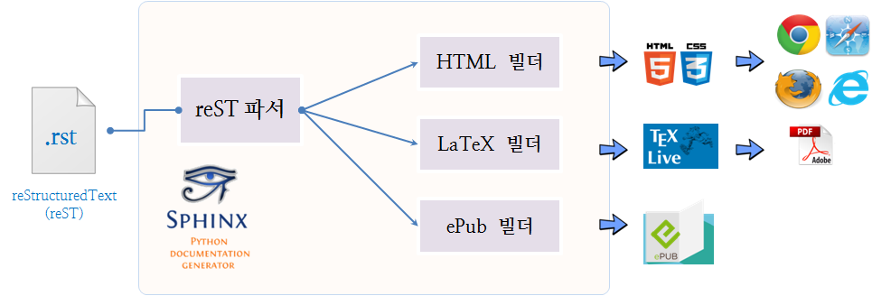

> ### 학습 목표 {.objectives}
>
>  * 파이썬 스핑크스에 대해 살펴본다.
>  * 파이썬 스핑크스를 설치한다.
>  * 파이썬 스핑크스로 제작된 러플/리보그 교재를 개발한다.

### 1. 파이썬 스핑크스(Python Sphinx)

파이썬 스핑크스는 문서 생성기다. reStructuredText(reST) 텍스트 문서를 편집기로 생성해서 reST 파서로 보내서 HTML, PDF, ePub을 생성할 수 있다. [Georg Brandl](https://en.wikipedia.org/wiki/Sphinx_(documentation_generator))이 2007년 이전에 사용된 파이썬과 LaTeX 조합을 통한 파이썬 문서 유지보수 작업이 고생스럽다고 여겨, 유지보수가 쉽도록 [스핑크스(Sphinx)](http://sphinx-doc.org/)를 개발했고, 이후 스핑크스를 기반으로 파이썬 문서 작업이 대세를 이루고 있다.[^1]

즉, 싱글 소싱(Single Source)을 통한 단일 문서를 만들고 나면, 이를 통해 HTML, PDF, ePub 출력이 자동으로 이뤄지게 되고, API 참조문서와 HTML 스타일 양식과 조합도 훨씬 유연하게 되었다. 스핑크스를 사용하고 있는 파이썬 도구와 라이브러리는 다음과 같다: Python, Sphinx, Flask, Jinja2, Django, Pyramid, SQLAlchemy, Numpy, SciPy, scikit-learn, pandas, fabric, ansible, ....

[^1]: [Sphinx autodoc: automated API documentation](http://www.pycon.kr/2015/program/33)

### 2. 파이썬 스핑크스 설치

파이썬 스핑크스를 설치는 방법은 `PIP`를 사용해야 하니, `sudo apt-get install python-pip`을 사용해서 먼저 팩키지 관리자를 설치하고 나서, `sudo pip install sphinx`를 실행한다.

~~~ {.shell}
$ sudo apt-get install -y python-pip
$ sudo pip install sphinx
~~~

#### 2.1. `sources.list` 파일을 불러오기 오류 처리

`/etc/apt/sources.list` 파일의 정보가 원활하지 않아서 문제가 될 경우 기본설정된 주소 대신에 `ftp.daum.net`으로 변경한다. 일일이 찾아서 바꾸기 귀찮으니, `vi` 편집기의 치환기능을 사용하여 실행한다. `ESC`+`:`을 동시에 누루고 복사하여 넣고 엔터를 친다.

~~~ {.shell}
sudo vi /etc/apt/sources.list
~~~

> #### `vi` 저장소 갱신 문자열 {.callout}
>
> :%s/kr.archive.ubuntu.com/ftp.daum.net/g  
> :%s/security.ubuntu.com/ftp.daum.net/g  
> :%s/extras.ubuntu.com/ftp.daum.net/g  

#### 2.2. 부랑자 Vagrantfile 스크립트

'sudo apt-get -y install git' 명령어로 'git'을 설치하고, 파이썬 팩키지 관리자 `sudo apt-get install -y python-pip`를 설치하고 나서, `sudo pip install sphinx`를 설치한다.

~~~ {.shell}
# -*- mode: ruby -*-
# vi: set ft=ruby :

$install_reeborg = <<INSTALL
sudo apt-get update
#install git
sudo apt-get -y install git

#install Sphinx
sudo apt-get install -y python-pip
sudo pip install sphinx
INSTALL

Vagrant.configure(2) do |config|
  config.vm.box = "ubuntu/trusty32"

  config.vm.provider :virtualbox do |v|
    v.memory = 1024
    v.cpus = 1
  end

  ## 파이썬   
  config.vm.provision :shell, inline: $install_reeborg
  config.vm.synced_folder ".", "/home/vagrant/"

end
~~~