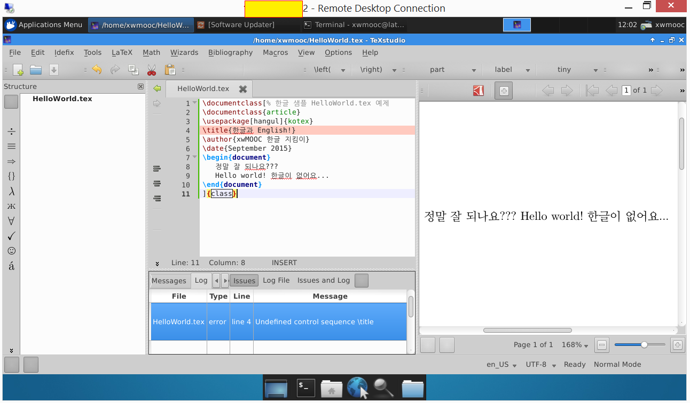

> ### 학습 목표 {.objectives}
>
>  *  한글 LaTeX 편집기를 설치한다.

### 1. LaTeX 설치

`texlive-full`만 설치하면 시간이 오래걸리고 용량을 많이 차지해서 그렇지만 기타 부수적인 설정을 할 필요는 없다. 다만 이미지 관련된 작업과 변환작업이 일부 있을 수 있어 `ghostscript`와 `imagemagick`을 추가로 설치한다.
한글을 LaTeX에서 구현하기 위해서는 texlive-xetex, texlive-luatex, texlive-lang-cjk 가 필요하다. 좀더 자세한 사항은 [KTUG 위키](http://wiki.ktug.org/wiki/wiki.php/설치하기Linux/usermode)를 참조한다.

~~~ {.shell}
# LaTeX 설치
$ sudo apt-get install -y --no-install-recommends \
		texlive-full \
		ghostscript \
		imagemagick \
		texlive-xetex \
		texlive-luatex \
		texlive-lang-cjk
~~~

### 2. 한글 LaTeX 편집기([texworks](https://www.tug.org/texworks/)) [^1]

LaTeX 문서를 개발을 도와주는 개발환경은 많이 있지만, 실행결과를 바로 확인해 줄 수 있는 `texworks`도 많이 사용되는 개발환경도구 중 하나다.

~~~ {.bash}
$ sudo apt-get install texworks
~~~

### 3. 한글 LaTeX 문서 생성

LaTeX 문서 컴파일은 다음 명령어를 통해서 실행한다. `pdflatex HelloWorld.tex` 명령어를 실행하면 pdf 파일이 생성된다.

~~~ {.input}
% 한글 샘플 HelloWorld.tex 예제 
\documentclass{article}
\usepackage[hangul]{kotex}
\title{한글과 English!}
\author{xwMOOC 한글 지킴이}
\date{September 2015}
\begin{document}
   정말 잘 되나요???
   Hello world! 한글이 없어요...
\end{document}
~~~

~~~
$ pdflatex HelloWorld.tex
~~~

> #### `LaTeX Error: 'biblatex.sty' not found` 오류 해결 {.callout}
> `texlive-full`을 사용하지 않고 필요한 것만 설치하는 경우 종종 다음과 같은 오류가 난다. 
> 이런 경우 당황하지 말고 해당하는 팩키지를 찾아 설치하면 된다.
> 
> ~~~
> $ sudo apt-get install texlive-bibtex-extra
> ~~~

참조: [http://tex.stackexchange.com/questions/122559/unicode-math-and-tex4ht-with-utf-8-input](http://tex.stackexchange.com/questions/122559/unicode-math-and-tex4ht-with-utf-8-input)

#### 3.1. 참고문헌 LaTeX 팩키지 설치

한글 LaTeX 개발에 참고문헌 기능을 사용할 경우 `texlive-bibtex-extra` 팩키지를 꼭 설치한다.

~~~ {.error}
! LaTeX Error: File `biblatex.sty' not found.
~~~

~~~ {.bash}
$ sudo apt-get install texlive-bibtex-extra 
~~~
 
#### 3.2. 한글 LaTeX 팩키지 설치

한글 LaTeX 팩키지 설치가 되어 있지 않다고 오류가 나면 `sudo apt-get install ko.tex` 명령어를 통해서 한글 LaTeX 팩키지를 설치하면 한글을 사용할 수 있다.

~~~ {.error}
! LaTeX Error: File `kotex.sty' not found.
~~~

~~~ {.bash}
$ sudo apt-get install ko.tex
~~~

[^1]: [우분투에서 한글 Tex 환경 설치와 에디터 소개](http://slayer95.tistory.com/28)
