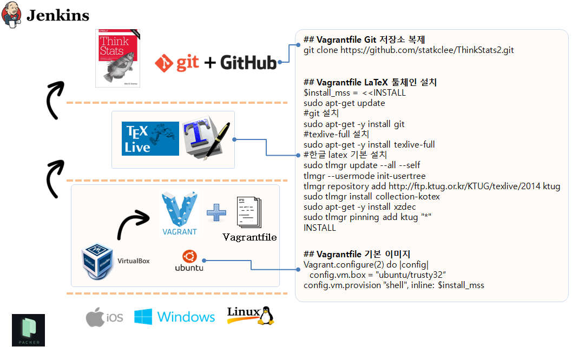

> ### 학습 목표 {.objectives}
>
>  *  한글 LaTeX 문서 작업환경 가상화
>  *  실리콘(하드웨어)에 운영체제를 설치한다.
>  *  운영체제 위에 LaTeX 엔진과 한글 LaTeX 툴체인을 설치한다.
>  *   Git 저장소에 한글 LaTeX 프로젝트를 복제한다.
>  *   LaTeX 문서작업을 하고 최종 산출물을 출력한다.

### 1. LaTeX 테스트 사례 준비

LaTeX 문서 테스트 사례를 먼저 준비하여 한글 LaTeX 문서 작업을 본격 시작하기 전에 준비를 한다.

1. 영문 LaTeX 문서 테스트 사례: 가장 기본이 되는 테스트 사례로 `hello world` 문서를 작성해서 정상적으로 pdf 파일을 산출하는지 점검한다.
1. 영문 LaTeX 문서 다양한 기능 점검 사례: 목차, 색인, 참고문헌 등 기본적인 문서의 기능을 잘 동작하는지 점검한다.
    - 목차(Table of Contents)
    - 그림과 표
    - 색인(makeindex)
    - 참고문헌(bibtex)
1. 한글 LaTeX 문서 테스트 사례: 한글 문서의 가장 기본이 되는 테스트 사례로 `hello world` 문서를 작성해서 정상적으로 한글이 pdf 파일에 찍히는지를 점검한다.
1. 한글 LaTeX 문서 다양한 기능 점검 사례: 목차, 색인, 참고문헌 등 기본적인 문서의 기능을 잘 동작하는지 점검한다. 특히, 유니코드(utf-8)적용에 따른 줄간격, 글자간격 등 차이가 생길 수 있는 부분을 집중적으로 점검한다.
    - 목차(Table of Contents)
    - 그림과 표
    - 색인(makeindex)
    - 참고문헌(bibtex)
1. HTML 산출물 점검: `.pdf`, `.ps`, `.dvi`는 동일한 계열이라 하나가 되면 나머지는 자동으로 될 수 있지만, `.tex` 파일을 **HTML**로 변환하는 것은 전혀 다른 문제로 단일 편집문서(LaTeX)에서 `.pdf`와 `.html`이 생성되도록 점검한다.
    - `hevea.sty`를 저자는 사용했지만 다른 HTML 변환도구도 살펴보기를 권장한다.
    - [Pandoc](http://pandoc.org/)도 많이 사용되는 강력한 HTML문서 변환도구로 간단한 명령어로 HTML 파일을 자동생성한다. 예를 들어, `pandoc -s book.tex --mathjax -o book.html`.
   
   
#### **1.1. 영문 `.tex` 문서가 정상적으로 `.pdf` 파일을 생성하는지 시험한다.**

`pdflatex hello-world.tex` 명령어를 실행하면 `hello-world.pdf` 파일을 생성한다. 물론 `hello-world.aux` , `hello-world.log` 파일로 함께 만들어낸다.

~~~ {.shell}
% hello-world.tex 견본 파일
\documentclass{article}
\begin{document}

Welcome to LaTeX Hello World!
% 한글을 사랑합니다.

\end{document}
~~~

영문은 정상적으로 출력되나 한글은 그렇지 못할 수 있다. 따라서 적절하게 설정이 되었는지 다음 LaTeX 예제를 통해서 확인을 할 필요가 있다.

#### **1.2. 한글 LaTeX 작업을 위해서 사용자 모드로 관련 팩키지를 설치한다.**

~~~ {.shell}
% 한글견본 출처: 김도현, 2004년 동국대 법대, LaTeX으로의 초대 교재에서 발췌.
\documentclass{article}
\usepackage{dhucs}
\begin{document}
\title{첫번째 \LaTeX}
\author{아무개}
\maketitle
\section{들어가며}
나의 첫 \LaTeX\ 파일입니다.%
\footnote{이걸 어떻게 처리할까?}
\section{나오며}
시작하자마자 끝내려니 쑥스럽네요.
\end{document}
~~~

###2. 한글 LaTeX 툴 체인 설치

한글 LaTeX 툴 체인을 가상환경에서 구축하기 위해서는 [Packer](https://www.packer.io/downloads.html)(패커), [VirtualBox](https://www.virtualbox.org/wiki/Downloads)(가상상자),  [Vagrant](https://www.vagrantup.com/downloads.html)(부랑자), [Git](https://git-for-windows.github.io/)(깃)과 필요에 따라서는 [Jenkins](https://jenkins-ci.org/)(젠키스)를 설치해야 된다.

만약 리눅스기반 운영체제를 사용한다면, [Docker](https://www.docker.com/)(도커)를 기반으로 해서 한글 LaTeX  툴체인을 구축하는 것도 가능하다.

> ### 한글 LaTeX 가상환경 구축 도구 {.getready}
>
>*[Packer](https://www.packer.io/downloads.html)  
>     - Control panel -> System -> Advanced System settings -> Environment Variables -> System variables : PATH  추가 
>*[VirtualBox](https://www.virtualbox.org/wiki/Downloads)  
>*[Vagrant](https://www.vagrantup.com/downloads.html)  
>*[Git](https://git-for-windows.github.io/)
>*[Jenkins](https://jenkins-ci.org/)

#### 2.2. 부랑자(Vagrant) 환경 설정

기본적으로 부랑자(Vagrant)는 가상상자(VirtualBox)를 가정하고 시작된다. 따라서 가상상자와 함께 부랑자를 함께 먼저 본인이 사용할 컴퓨터 운영체제에 맞춰 설치한다.

~~~ {.shell}
$ vagrant init
$ ls
Vagrantfile
$ vagrant up
$ vagrant ssh
~~~

1. `vagrant init`  명령어는 boilerplate 혹은 skeleton  으로 불리는 `Vagrantfile`을 생성한다.
1. `nano Vagrantfile` 파일에 한글 LaTeX 설치 쉘스크립트를 복사하여 붙여넣는다.
1. `vagrant up` 명령어를 실행하면 기본 운영체제 `최신 우분투 64비트`와 함께 `LaTeX`(TexLive) 엔진과 함께 한글 설정, 그리고 HTML 생성을 위한 `hevea`도 함께 설치한다. 만약 운영체제나 기타 다른 부분에서 사용자정의가 필요한 부분은 자유로이 편집해서 **한글 LaTeX 작업용 가상 컴퓨터**를 설치하면된다.
1. `vagrant ssh` 명령어를 통해서 한글  LaTeX이 설치된 가상컴퓨터에 접속한다.
1. `git clone https://github.com/statkclee/ThinkStats2.git` 명령어를 입력하면 작업 프로젝트 파일을 가상컴퓨터 내부로 가져온다.
1. `cd ThinkStats2\book & make all` 명령어를 실행하면 `.tex` 파일을 컴파일 해서 `.pdf` 파일을 자동 생성한다.

#### 2.2. 한글 LaTeX 가상 컴퓨터 설치 설명

##### 2.2.1. texlive 전체 엔진 설치

LaTeX 전체 엔진 및 전체 팩키지를 설치한다. `sudo apt-get -y install texlive-full`, 
`sudo apt-get -y install  texlive-xetex, texlive-luatex, texlive-lang-cjk` 명령어를 통해서 한글을 처리하도록 관련 팩키지를 설치한다.

~~~ {.shell}
$ sudo apt-get -y install texlive-full
$ sudo apt-get -y install  texlive-xetex, texlive-luatex, texlive-lang-cjk
$ sudo apt-get install xzdec
$ tlmgr --usermode init-usertree
$ tlmgr repository add http://ftp.ktug.org/KTUG/texlive/tlnet ktug
$ sudo tlmgr pinning add ktug "*"
~~~
[KTUG 위키 설치하기Linux/usermode](http://wiki.ktug.org/wiki/wiki.php/설치하기Linux/usermode)

##### 2.2.2. 통계적 사고(Think Stats2) 의존성 설치

~~~ {.shell}
sudo apt-get -y install hevea
sudo apt-get -y install evince
~~~

#### 2.3. 한글 LaTeX 출판을 위한 `Vagrantfile` 

아무것도 설치되지 않은 깨끗한 리눅스 새로운 가상 컴퓨터에 LaTeX 관련 팩키지를 설치하고 테스트하면서 마지막으로 살아남은 쉘명령어를 쉘스크립트 형태로 정리하고 이를  `Vagrantfile` 파일에 복사해서 적어 넣고 향후 반복해서 재사용한다. 이를 Git 같은 버젼제어시스템에 넣고 관리를 하게되면 특히 효과를 극대화할 수 있다.

~~~ {.output}
$install_mss = <<INSTALL
sudo apt-get update
#install git
sudo apt-get -y install git

#install C dependencies
sudo apt-get -y install libacl1-dev libgnutls-dev gcc make
#install packaging dependencies
sudo apt-get -i install build-essential fakeroot lintian devscripts debhelper ubuntu-dev-tools cowbuilder
#install LaTeX Full version
sudo apt-get -y install texlive-full
#install Korean LaTeX Dependencies
# sudo apt-get -y install collection-kotex
# sudo apt-get -y install  texlive-xetex, texlive-luatex, texlive-lang-cjk
# 
sudo tlmgr update --all --self
tlmgr --usermode init-usertree
# tlmgr repository add http://ftp.ktug.org/KTUG/texlive/tlnet ktug
tlmgr repository add http://ftp.ktug.or.kr/KTUG/texlive/2014 ktug
sudo tlmgr install collection-kotex
sudo apt-get -y install xzdec
sudo tlmgr pinning add ktug "*"
# Think Stat2 Dependencies - translated from LaTeX to hevea
sudo apt-get -y install hevea
sudo apt-get -y install evince
INSTALL

Vagrant.configure(2) do |config|
  config.vm.box = "ubuntu/trusty32"
  config.vm.provision "shell", inline: $install_mss
end
~~~

### 3. 실리콘(하드웨어) 위에 운영체제 설치 - 우분투 Packer 설치 [^1]

`packer`를 다운로드한 후에 압축을 풀고 경로를 지정해 주어 어디에서든지 `packer` 명령어를 사용할 수 있는 것이 핵심이다.

1. 임의 명칭 디렉토리 생성한다. `packer`도 좋다.
1. `packer` 디렉토리로 이동한다.
1. `wget` 명령어로 

~~~ {.shell}
$ mkdir packer
$ cd packer
$ wget https://releases.hashicorp.com/packer/0.8.6/packer_0.8.6_linux_amd64.zip
$ sudo unzip packer_0.8.6_linux_amd64.zip
$ nano ~/.bashrc
$ export PATH=$PATH:~/packer/
$ reboot # 혹은 source ~/.bashrc
~~~

#### 3.1. Packer를 사용한 VirtualBox 구축

실리콘 위에 바로 Packer 를 사용해서 가상 컴퓨터를 생성하고 그 위에 한글 LaTeX 및 Git을 사용해서 응용프로그램을 개발하고 Jenkins를 사용해서 이를 바로 배포할 수 있다.

1. `packer build -only=virtualbox-iso application-server.json` 실행 
1. `cd virtualbox` 실행
1. `vagrant box add ubuntu-14.04.2-server-amd64-appserver_virtualbox.box --name devops-appserver` 실행
1. `vagrant up` 실행
1. `vagrant ssh` 명령어로 VirtualBox 접속

[참고자료:Udacity Intro to DevOps교육과정](https://www.udacity.com/wiki/ud611)

[^1]: [우분투 Packer 설치](https://www.digitalocean.com/community/tutorials/how-to-install-and-get-started-with-packer-on-an-ubuntu-12-04-vps)
