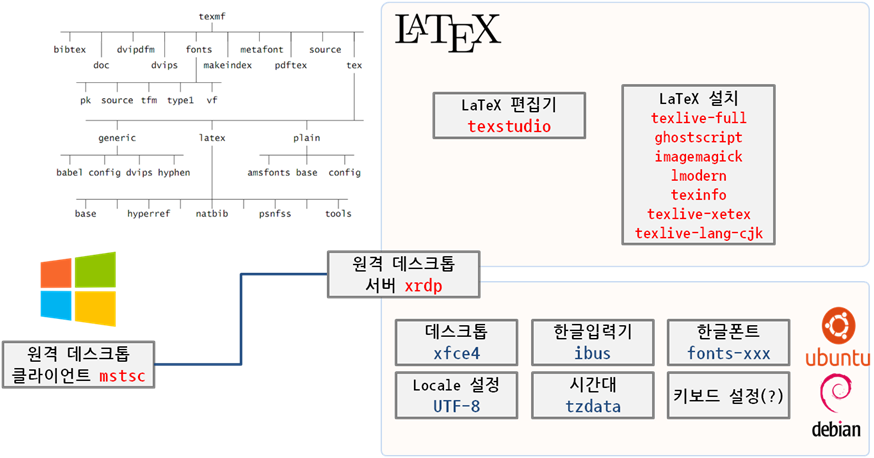
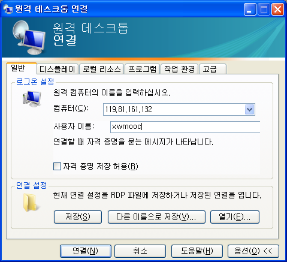

> ### 학습 목표 {.objectives}
>
>  *  원격 데스크톱 연결을 통해 클라우드에서 한글 LaTeX 작업 설정한다.
>  *  클라우드 환경에서 한글 LaTeX 설정을 위한 사전준비를 한다. 

### 1. 유닉스 계열 운영체제 한글 설치

먼저 클라우드에서 가상컴퓨터를 하나 생성하고 그 위에 유닉스 계열 운영체제를 설치한다.
데이비안 계열 우분투를 기준으로 설명한다.
한국인이 클라우드 환경에서 작업할 때 가장 먼저 걸리는 점이 한글이다.
대부분의 개발을 코드로 하는 경우 상관 없을 것이라 생각할 수 있지만, 사실 코드 상당수는 주석이다.
따라서 주석을 영어로 달지 않는다면 한글 설정이 꼭 필요하다. 

가장 먼저 `apt-get install -y language-pack-ko` 명령어로 한국어 언어팩을 설치한다. 
`ko_KR.UTF-8`을 생성하고 `/etc/profile` 파일 맨끝에 언어 설정을 내용을 저장한다.
라즈베리파이는 영국기준, 클라우드 가상컴퓨터는 기본 시간대가 미국동부표준시로 설정되어 있다.
`dpkg-reconfigure tzdata` 명령어를 CLI에서 입력하여 순차적으로 설정해도 되고, 
`ln -sf /usr/share/zoneinfo/Asia/Seoul /etc/localtime` 명령어로 링크를 걸어 설정해도 된다.

~~~ {.input}
# 언어 로케일 설정
apt-get update
apt-get -y upgrade
apt-get install -y language-pack-ko
locale-gen ko_KR.UTF-8

# /etc/profile 파일 하단에 추가 내용
echo "LANG=ko_KR.UTF-8
LANGUAGE=ko_KR.UTF-8
LC_ALL=ko_KR.UTF-8"  >> /etc/profile

# 로컬 시간대 변경 혹은  dpkg-reconfigure tzdata
ln -sf /usr/share/zoneinfo/Asia/Seoul /etc/localtime
~~~

### 2. 데스트톱 GUI 한글 설정

#### 2.1 한글 입력기

한글을 그래픽 사용자 인터페이스를 통해서 우분투에 입력하는 것은 다양한 방법이 있다.
먼저 CJK(China, Japan, Korea) 및 베트남을 포함하면 4개국 모두 한자 영향권에 있었기 때문에 한국, 중국, 일본 각자의 언어를 컴퓨터로 표현하기 위해서는 8비트 인코딩에서 사용할 수 있는 256자보다 훨씬 많기 때문에, 적어도 16비트 고정폭 문자 인코딩이나 가변폭 문자 인코딩이 필요하여 각자 한글, 한자, 일본어 입력기를 개발하였다.

> #### CJK(Chinese - Japanese - Korean, 중국·일본·한국) {.callout}
> CJK(Chinese - Japanese - Korean, 중국·일본·한국)는 한국어, 중국어, 일본어를 통틀어 이르는 말로, 소프트웨어 국제화, 언어 지역화 분야에서 쓰인다. 베트남어를 포함해서 CJKV라고 하기도 한다.
> CJK에 속하는 언어들은 모두 공통적으로 한자의 영향을 조금이나마 받았다는 특징이 있다.  
> 출처 : [위키피디아, CJK](http://ko.wikipedia.org/wiki/CJK)

**[한글 입력기](http://kwonnam.pe.kr/wiki/linux/inputmethod) 종류**

- [나비](https://code.google.com/p/nabi/) : 한국어 전용 입력으로 구글 코드에 저장소가 있다.
- [iBus](https://github.com/ibus/ibus/wiki) : 많은 리눅스 배포판들이 표준으로 사용하고 있는 입력기.
- [uim](https://github.com/uim/uim/wiki) : 일본계로, 한중일 언어 지원. 
- [Fcitx](https://fcitx-im.org/wiki/Fcitx) : 중국계로, 한중일 언어 지원. 

#### 2.2. iBus 우분투 표준 한글 입력기 설치

CentOS, Ubuntu 등 많은 리눅스 배포판에서 표준으로 삼고 있는 iBus를 한글 입력기로 설치한다.

~~~ {.input}
root@dev-hangul:~# sudo apt-get install -y ibus ibus-hangul
root@dev-hangul:~# ibus-setup-hangul 
~~~

### 2.3. 한글 폰트 설치

우분투 그래픽 사용자 인터페이스를 위한 한글 폰트가 적용되지 않아서 한글이 제대로 웹브라우져를 포함한 데스크톱에서 볼 수 없다. 따라서 기본으로 많이 사용되는 한글 폰트를 설치한다. 

~~~ {.input}
root@dev-hangul:~# sudo apt-get install -y fonts-nanum fonts-nanum-coding fonts-nanum-extra fonts-unfonts-core fonts-baekmuk fonts-nanum-eco fonts-unfonts-extra xfonts-baekmuk
~~~

기본적인 한글 설정이 웹브라우져에 환경설정을 하지 않으면 한글 자체가 보이지 않는다. 명령라인 인터페이스(CLI)를 통해서 한글 언어팩을 설치했기 때문에 기존적인 한글이 보일 수도 있다. 웹브라우져에서 한글이 보이지 않거나, 마음에 드는 폰트가 있다면 변경한다. 구글 크롬 우측 상단에 별모양 북마크 등록 옆에 있는 `햄버거` 모양 아이콘을 클릭하면 메뉴가 나오고 **Settings**를 클릭하면 하단에 `Show advanced settings...`을 클릭하여 폰트를 바꾼다.  

> ##### 한글 폰트 {.callout}
> 출처 : [How to get more Fonts on Ubuntu](https://coolaj86.com/articles/how-to-get-more-fonts-on-ubuntu.html)
> 
> * fonts-nanum - Nanum Korean fonts
> * fonts-nanum-coding - Nanum Coding fixed width Korean TrueType font
> * fonts-nanum-extra - Additional Nanum Korean fonts
> * fonts-unfonts-core - Un series Korean TrueType fonts
> * fonts-baekmuk - Baekmuk series Korean fonts
> * fonts-nanum-eco - Nanum Eco Korean font
> * fonts-unfonts-extra - Un series Korean TrueType fonts (extra)
> * xfonts-baekmuk - Baekmuk Korean fonts for X

~~~ {.input}
# 한글 입력기 설치
sudo apt-get install -y ibus ibus-hangul

# 한글 폰트 설치
apt-get install -y fonts-nanum fonts-nanum-coding fonts-nanum-extra  fonts-unfonts-core  fonts-baekmuk fonts-nanum-eco fonts-unfonts-extra xfonts-baekmuk 

# LaTeX 편집기 설치
sudo apt-get install -y texstudio

# 범용편집기 Sublime Text 2 설치
sudo add-apt-repository -y ppa:webupd8team/sublime-text-2
sudo apt-get install -y sublime-text
~~~

> ### dconf-editor 한/영 전환 키보드 설정 {.callout}
>
> `sudo apt-get install dconf-tools` 명령어로 설치한다.
> `dconf-editor`를 실행해서 org.gnome.desktop.wm.keybindings 에서 Switch-input-source-backward를 **['Hangul']**로 설정함.

### 3. 데스크톱 GUI 설치

클라우드 가상컴퓨터가 서버 역할을 수행하기 때문에 데스크톱 GUI 개발환경에서 작업하려면,
서버에 데스트톱 환경을 설치하고 이를 클라이언트에서 원격으로 연결하도록 설정한다.

> ### 우분투 데스크톱 GUI 종류 {.callout}
>
> 가상 컴퓨터를 생성하면 GUI가 없이 CLI로만 명령어를 전달할 수 있다.
> 만약 GUI를 설치하면 WIMP(Window, Icon, Mouse, Pointer)를 사용할 수 있다. 
> LXDE, Xfce, GNOME Fallback(GNONE Class) 순으로 자원을 많이 먹는다.
>
> * [LXDE](http://lxde.org/): `apt-get install lubuntu-desktop`
> * [Xfce](http://xfce.org/): `apt-get install xubuntu-desktop`
> * [GNOME Fallback](http://www.dedoimedo.com/computers/gnome-3-fallback.html): `apt-get install gnome-session-fallback`

상기 세가지 데스트톱이 우분투에서 많이 사용되고 있고, 각기 장단점이 있으므로 본인에게 맞는 데스톱을 설치한다.

~~~ {.input}
# 데스트톱 GUI 설치
sudo apt-get install -y xfce4
~~~

### 4. 원격 연결 데스트톱 설정

클라이언트 윈도우 원격 데스트톱 연결 기능을 사용해서 클라우드 가상컴퓨터에 데스트톱 GUI에 접속하는 방식은 다음과 같다.

~~~ {.input}
# 원격 데스트톱 연결 프로그램 설치 및 설정
adduser --disabled-password --gecos "" xwmooc
echo xwmooc:xwmooc | chpasswd
sudo adduser xwmooc sudo

sudo apt-get install -y xrdp
echo "xfce4-session" > /home/xwmooc/.xsession
sudo service xrdp restart # sudo /etc/init.d/xrdp start 명령어도 가능.
~~~

1. 신규 사용자를 등록한다.
    - XRDP 원격 로그인에 보안을 강화하는 취지로 신규 사용자를 통해 설치 후에 로그인한다.
    - `xwmooc`는 사용자으로 비밀번호 없이 등록한다.
    - `echo xwmooc:xwmooc | chpasswd`으로 `xwmooc` 사용자 비밀번호를 변경했다.
        - 설정을 완료한 후 로그인하여 `passwd` 명령어로 비밀번호를 필히 변경한다. 
    - `sudo adduser xwmooc sudo` 명령어를 통해서 루트 권한을 부여한다.
1. XRDP를 설치한다.
1. 상기 3번에서 설치한 데스크톱 사용자 `xwmooc` 세션정보를 `.xsession` 파일에 저장한다.
1. XRDP 서비스를 올린다.
1. 클라이언트 윈도우 시작메뉴에서 실행(Run)을 클릭하고 `mstsc`를 실행한다.
1. 컴퓨터에 클라우드 가상 컴퓨터 IP주소, 사용자 이름에 `xwmooc`를 넣고 **`연결(N)`**한다.

> ### XRDP 로그인 시 검정화면 {.callout}
>
> 우분투 14.04에서 더이상 선택옵션으로 `ubuntu-2d`를 지원하지 않는다.
>
> ~~~ 
> $ sudo aptitude --without-recommends install lxde menu-xdg
> sudo aptitude install xrdp
> echo "lxsession" > ~/.xsession
> sudo service xrdp restart
> ~~~

참고 : [Using Windows RDP to Access your Ubuntu Instance](https://community.hpcloud.com/article/using-windows-rdp-access-your-ubuntu-instance)  
[how to remote desktop into server gui without logging into the console beforehand](http://askubuntu.com/questions/412451/how-to-remote-desktop-into-server-gui-without-logging-into-the-console-beforehan)

