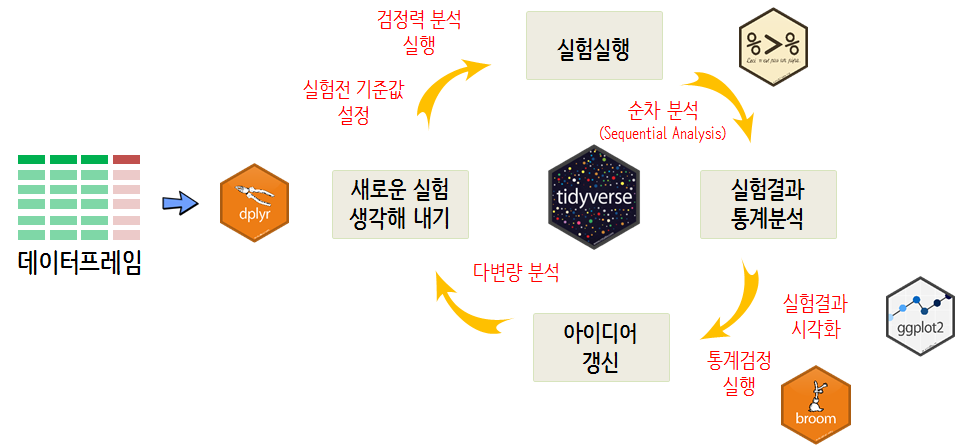
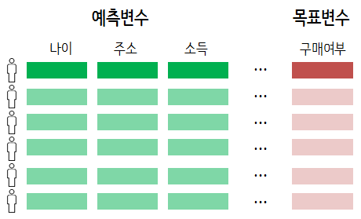
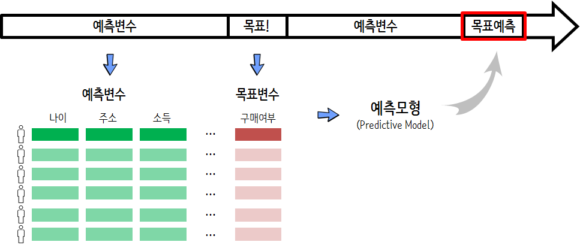

```{r setup, include=FALSE}
options(htmltools.dir.version = FALSE)

knitr::opts_chunk$set(echo = FALSE, warning=FALSE, message=FALSE,
                    comment="", digits = 3, tidy = FALSE, prompt = FALSE, fig.align = 'center')

```


background-image: url("fig/programming_machine_learning_comparison.png")
background-size: 570px

---
# 자동화된 기계학습
<br>
<br>

.center[
 
]

.footnote[
  [xwMOOC 모형: 기계학습 - gapminer + rsample + purrr](https://statkclee.github.io/model/model-ml-purrr.html)
]

---
### Tidyverse와 A/B 검정

.center[
 
]


.footnote[
    - [데이터 과학 - tidyverse 데이터 과학 기본체계](https://statkclee.github.io/data-science/ds-tidyverse.html)
    - [Tidyverse와 함께 하는 A/B 테스팅](https://statkclee.github.io/ds-authoring/ab_testing_tidyverse_20181007.html#1)
]

---
### `Tidyverse Korea` 페북 그룹

- [Tidyverse Korea](https://www.facebook.com/groups/1404219106509417/)

- [통계분석연구회(Statistics Analysis Study)](https://www.facebook.com/groups/statsas/)

- [PRESSer](https://www.facebook.com/groups/1473988286034801/)

- [R Korea - KRUG(Korean R User Group)](https://www.facebook.com/groups/KoreaRUsers/)

---
### `gapminder`

Hans Rosling's 200 Countries, 200 Years, 4 Minutes - The Joy of Stats - BBC Four

<iframe width="560" height="315" src="https://www.youtube.com/embed/jbkSRLYSojo" frameborder="0" allow="autoplay; encrypted-media" allowfullscreen></iframe>

```{r gapminder-dataset-load, echo=TRUE}
# 0. 환경설정 -----
library(tidyverse)
library(dslabs)
```

---
### 회귀모형 - `purrr` + `trelliscopejs`

.footnote[
- [xwMOOC 모형: 회귀모형 - purrr + trelliscopejs](https://statkclee.github.io/model/model_purrr_trelliscopejs.html)
]

---
### `gapminder` 데이터셋

[`dslabs`](https://cran.r-project.org/web/packages/dslabs/index.html) 팩키지 내장 `gapminder` 데이터셋 10% 표본 추출 &rarr; 데이터 랭글링

```{r gapminder-dataset, echo=FALSE}
gapminder %>% sample_frac(0.1) %>% 
  DT::datatable(fillContainer = FALSE,
                rownames = FALSE,
                options = list(pageLength = 5, scrollX = TRUE))

```

---
### `gapminder` 정제작업

결측값(NA)을 바탕으로 패턴을 추출하고, 1960 ~ 2011년까지 데이터를 예측모형 데이터로 활용함.

```{r gapminder-dataset-preprocessing, echo=TRUE}
# 1. 데이터 정제 -----
gapminder_lc <- gapminder %>% 
   group_by(country) %>% 
   nest()

gapminder_lc_df <- gapminder_lc %>% 
   mutate(na_cnt = map_int(data, ~ sum(is.na(.x)))) %>% 
   filter(na_cnt == 8) %>% 
   unnest(data) %>% 
   filter(year <= 2011) %>% 
   select(-na_cnt) %>% 
   select(-continent, -region)
```

---
### 예측모형 데이터프레임

데이터 랭글링(data wrangling)의 목적은 예측모형을 위한 데이터프레임 생성: **Analytic Basetable**

.center[
  
]


---
### 예측모형 데이터프레임 작업흐름

축적된 데이터를 통해서 예측변수와 목표변수를 활용하여 예측모형을 개발하여 예측변수를 입력값으로 하여 
목표예측을 수행.

.center[
  
]

---
### 훈련/검증/시험 데이터셋


```{r gapminder-rsample, echo=TRUE}
library(rsample)

## 훈련/시험 데이터 분할
gapminder_split <- initial_split(gapminder_lc_df, prop = 0.70)

train_df <- training(gapminder_split)
test_df  <- testing(gapminder_split)

## 훈련 데이터를 검증(Cross Validation) 데이터 분할
gapminder_cv_split <- vfold_cv(train_df, v = 5)

cv_df <- gapminder_cv_split %>%
           mutate(train    = map(splits, ~training(.x)),
                  validate = map(splits, ~testing(.x)))

cv_df
```


---
### 회귀모형 적합: 맛보기


```{r gapminder-initial-fit, echo=TRUE}
library(broom); library(Metrics)

# 회귀모형 적합
model_cv_df <- cv_df %>% mutate(lm_model  = map(train,  ~lm(life_expectancy ~ ., data=.x)))

# 회귀모형 성능 평가
model_cv_df <- model_cv_df %>% 
    mutate(valid_actual = map(validate, ~.x$life_expectancy), 
           valid_pred   = map2(lm_model, validate, ~predict(.x, .y))) %>% 
    mutate(valid_mae    = map2_dbl(valid_actual, valid_pred, ~mae(actual = .x, predicted = .y)),
           valid_rmse    = map2_dbl(valid_actual, valid_pred, ~rmse(actual = .x, predicted = .y)))

model_cv_df$valid_mae
# model_cv_df$valid_rmse

mean(model_cv_df$valid_mae)
```

---
### 예측모형 아키텍처


```{r gapminder-pm-architecture, echo=TRUE}
library(broom); library(e1071);library(ranger);library(extrafont); 
loadfonts()

# 회귀모형 적합
model_cv_df <- model_cv_df %>% 
    mutate(lm_model  = map(train,  ~lm(life_expectancy ~ ., data=.x)),
           rf_model  = map(train,  ~ranger(life_expectancy ~ ., data=.x)),
           svm_model = map(train,  ~svm(life_expectancy ~ ., data=.x,  probability = TRUE)))

# 회귀모형 성능평가
model_cv_df <- model_cv_df %>% 
    mutate(valid_actual = map(validate, ~.x$life_expectancy), 
           valid_lm_pred   = map2(lm_model, validate, ~predict(.x, .y)),
           valid_rf_pred   = map2(rf_model, validate, ~predict(.x, .y)$predictions),
           valid_svm_pred  = map2(svm_model, validate, ~predict(.x, .y))) %>% 
    mutate(valid_lm_mae    = map2_dbl(valid_actual, valid_lm_pred,  ~mae(actual = .x, predicted = .y)),
           valid_rf_mae    = map2_dbl(valid_actual, valid_rf_pred,  ~mae(actual = .x, predicted = .y)),
           valid_svm_mae   = map2_dbl(valid_actual, valid_svm_pred, ~mae(actual = .x, predicted = .y)))

```

---
##### 예측모형 아키텍처 성능 비교


```{r gapminder-pm-architecture-comp, echo=TRUE, fig.height=5}
model_df <- data.frame(LM = model_cv_df$valid_lm_mae,
        RF = model_cv_df$valid_rf_mae,  SVM = model_cv_df$valid_svm_mae)

model_df %>% gather(model, MAE) %>% 
    ggplot(aes(x=model, y=MAE, color=model)) + geom_point(size=3) +
       labs(x="예측모형", y="MAE (Mean Absolute Error)", color="예측모형",
            title="GAPMINDER 데이터 - 기대수명 예측모형")
```

---
##### 예측모형 튜닝

```{r gapminder-pm-tuning, echo=TRUE}
# Random Forest 모형적합
model_cv_df <- model_cv_df %>% crossing(mtry = c(2,ceiling(sqrt(ncol(gapminder_lc_df)-2)),5), num.trees = c(500, 1000))  %>% 
    mutate(rf_tune_model  = pmap(list(train, mtry, num.trees),  ~ranger(life_expectancy ~ ., data=.x, mtry=.y)))

# RandomForest 성능평가
model_cv_df <- model_cv_df %>% 
    mutate(valid_actual = map(validate, ~.x$life_expectancy), 
           valid_rf_tune_pred   = map2(rf_tune_model, validate, ~predict(.x, .y)$predictions)) %>% 
    mutate(valid_rf_tune_mae    = map2_dbl(valid_actual, valid_rf_tune_pred,  ~mae(actual = .x, predicted = .y)))

model_cv_df %>% 
    group_by(mtry, num.trees) %>% 
    summarise(mean_mae = mean(valid_rf_tune_mae))
```

---
##### 예측 성능: 시험데이터

```{r gapminder-pm-testing, echo=TRUE}
gapminder_pm <- ranger(life_expectancy ~ ., data = train_df,
                       mtry = 3, num.trees = 500)

test_df$pred <- predict(gapminder_pm, test_df)$predictions

test_df %>% 
    mutate(absolute_err = abs(life_expectancy-pred)) %>% 
    summarise(mae = mean(absolute_err))
```
