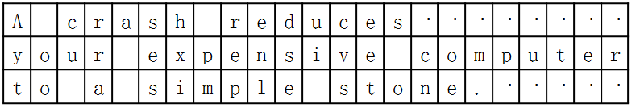

> ## 학습 목표 {.objectives}
>
> * 유니코드, 아스키, 확장 아스키, CP949 등 문자집합 개념을 이해한다.
> * 문자코드를 인코딩/디코딩하는 개념을 잡는다.
> * R에서 봉착하는 인코딩 문제에 대한 해법을 이해한다.

### 1. 사람과 기호 그리고 소통 [^pycon-apac-string]

[^pycon-apac-string]: [문자열? 그런 달달한 것이 남아있긴 한가?](https://www.pycon.kr/2016apac/program/5)

#### 1.1. 유니코드와 인코딩/디코딩으로 `utf-8`을 사용해야 되는 이유 

인코딩에 대한 기본 개념 및 교재는 소프트웨어 카펜트리 버젼 4 파이썬 텍스트에 대한 내용을 번역한 것이며 R에서 자주 봉착하는 인코딩 문제를 윈도우를 많이 사용하는 환경에 맞춰 체계적으로 정리했다.

인코딩(Encoding, 기록)하고 디코딩(decoding, 인식)하는 것은 문자집합을 인식하고 기록하는데 있어 꼭 필요하다. 인코딩과 디코딩에 **UTF-8** 을 사용해야 되는 이유는 2016년 기준 86.4 % 웹사이트가 사용하기 때문이다.

- [Unicode nearing 50% of the web ](https://googleblog.blogspot.kr/2010/01/unicode-nearing-50-of-web.html)
- [UTF-8](https://en.wikipedia.org/wiki/UTF-8)
- [Usage of character encodings for websites](http://w3techs.com/technologies/overview/character_encoding/all)

#### 1.2. 사람과 기호 그리고 컴퓨터 [^pragmatic-unicode] [^korean-encoding]

[^pragmatic-unicode]: [Pragmatic Unicode](http://nedbatchelder.com/text/unipain.html)
[^korean-encoding]: [문자 집합(Character Set)과 인코딩(Encoding)](http://nuli.navercorp.com/sharing/blog/post/1079940)

사람과 사람 사이 의사소통하는데 필요한 것 중 하나가 기호다. 기호는 영어 알파벳, 한국어 한글, 중국 한자 등 무수히 많은 언어가 기호를 사용해서 의사를 소통한다. 이를 컴퓨터를 활용해서 의사소통하는 경우 컴퓨터가 알아먹을 수 있도록 바이트를 사용한다.

* 컴퓨터는 바이트로 만들어 졌고, 바이트를 묶어 파일이 되고, 파일을 네트워크에 전송해서 다른 컴퓨터에 넘겨야 되고, 이를 사람이 읽을 수 있는 형태로 변환하면 의사소통이 완성된다. 이 과정에서 인코딩(부호화)하는 과정과 디코딩(복화화)하는 과정을 거치게 된다.

1. 컴퓨터에서 입출력되는 모든 정보는 **바이트(Byte)**, 즉 `010101` 표시되고 전달되고 전달받는다.
1. `010101` 바이트를 사람이 인식할 수 있는 최초의 약속이 **아스키(ASCII)** 다. 
	* ASCII 256개 기호보다 많은 기호를 전달할 필요가 있다. 특히, CJK 동아시아 한자문화권에서는 더욱 그렇다.
1. 그렇게 해서 **유니코드(Unicode)** 가 탄생했고, 바이트와 유니코드의 공존이 시작되었다.

한글의 경우 한글을 컴퓨터로 표현하기 위해서 2바이트를 사용하는데 80년대 초반 초성, 중성, 종성의 원리를 구현한 조합형 방식과 정부가 주도한 완성형(KS_C_5601_1987) 방식으로 크게 나뉘어 발전하게 됨. 

* **한글 문자집합**
    * KSC5601-1987 표준(완성형)
    * KSC5657 : KSC5601-1987 + 1930자 한글 추가
        * 거의 사용되지 않음
    * KSC5601-92 : 완성형과 조합형 함께 사용
        * 현재까지 사용됨.
    * EUC-KR: 영문은 KSC5636, 한글은 KSC5601-92 사용
        * EUC(Extend Unix Code)는 영어를 제외한 문자를 유닉스에서 사용하기 위한 것        
    * CP949 : 마이크로소프트에서 사용되는 한글 부호표(Code Page). CP949는 KSC5601-92 지원.

한글 문자집합의 경우 `KSC5601-92`로 완성형과 조합형을 모두 표현할 수 있고, `EUC-KR`, `CP949` 모두 `KSC5601-92`을 한글 표준 문자집합으로 받아들여 인코딩이 달라도 서로 호환이 된다. 하지만 유니코드의 경우 `KSC5601-92`이 포함되어 있지만 위치가 달라 인코딩에 따라 깨지는 경우가 있기 때문에 이를 맞춰주어야 한다.

1980년대부터 컴퓨터를 사용하신 분이면 완성형과 조합형의 표준화 전쟁을 지켜봤을 것이고, 그 이면에는 한글 워드프로세서에 대한 주도권 쟁탈전이 있었던 것을 기억할 것이다. 결국 완성형과 조합형을 모두 포용하는 것으로 마무리 되었지만, 여기서 끝난게 끝난 것이 아니다. 유닉스 계열에서 `KSC5601`을 표준으로 받아들인 `EUC-KR`과 90년대와 2000년대를 호령한 마이크로소프트 `CP949` 가 있었다. 결국 대한민국 정부에서 주도한 표준화 전쟁은 유닉스/리눅스, 마이크로소프트에 녹여내는 것으로 마무리 되었고, 웹과 모바일 시대는 유니코드로 넘어가서 `KSC5601`이 유니코드의 원소로 들어가는 것으로 마무리 되었다. 

이제 신경쓸 것은 인코딩 ... `utf-8` 만 신경쓰면 된다. 그리고 남은 레거시 유산을 잘 처리하면 된다.

> ### 유닉스/리눅스(EUC-KR), 윈도우(CP949) {.callout}
> 
> `EUC-KR`, `CP949` 모두 2바이트 한글을 표현하는 방식으로 동일점이 있지만,
> `EUC-KR` 방식은 KSC5601-87 완성형을 초기 사용하였으나, KSC5601-92 조합형도 사용할 수 있게 확장되었다.
> `CP949`는 확장 완성형으로도 불리며 `EUC-KR`에서 표현할 수 없는 한글글자마디 8,822자를 추가한 것으로
> 마이크로소프트 코드페이지(Code Page) 949를 사용하기 시작하면서 일반화되었다.  
>
> 참고: [CP949 to Unicode table](http://www.unicode.org/Public/MAPPINGS/VENDORS/MICSFT/WINDOWS/CP949.TXT)

### 2. 영어권에서 바라본 유니코드와 `utf-8` [^swcarpentry-v4-encoding]

[^swcarpentry-v4-encoding]: [파이썬 - 텍스트](http://v4.software-carpentry.org/python/text.html)

#### 2.1. 아스키(ASCII) 코드

텍스트는 숫자보다 더 단순해야만 된다. 결국 텍스트는 단지 문자다. 하지만, 컴퓨터가 문자 하나를 어떻게 표현할까?

1960년대 미국식 영어에 관해서는 해결책은 간단했다: 알파벳 26개(대문자, 소문자), 숫자 10, 구두점 몇개, 
전신을 보내던 시절에 제어를 위해 사용된 몇개 특수 문자("새줄로 이동", "라인 시작지점으로 이동", "새페이지 시작", "벨소리", 등).
모두 합쳐도 128개보다 적어서, 아스키(ASCII) 위원회가 문자마다 7bit를 사용하는 인코딩으로 표준화했다. 
( $2^7$ = 128). 참고: [아스키 코드 테이블](regex-encoding-ascii.html)

#### 2.2. 텍스트 표현

다음 질문으로 많은 문자를 포함한 텍스트를 어떻게 표현할까?
1940년대, 1950년대 펀치카드 기술로 정의된 첫번째 방식이 ***고정폭 레코드(fixed-width records)*** 를 사용하는 것으로, 줄 각각이 동일한 길이를 갖는다.
예를 들어, 다음 일본 전통 단시 하이쿠(haiku)를 컴퓨터는 아래와 같이 레코드 3개로 배열했다. (점 문자는 "사용되지 않음"을 의미) 이런 방식은 여전히 데이터베이스에도 사용되고 있다. 

> ### 일본 전동 단시 하이쿠 예시 {.callout}
>
> ~~~ {.input}
> A crash reduces
> your expensive computer
> to a simple stone.
> ~~~

이런 표기법은 N번째 행 앞으로 뒤로 건너뛰기 쉽다. 왜냐하면 각 행이 동일한 크기를 갖기 때문이다.
하지만, 공간을 낭비하는 약점이 있고, 얼마나 긴 최대 길이를 행마다 갖느냐에 관계없이,
궁극적으로 더 긴 길이를 갖는 행을 처리해야만 된다.

시간이 흐름에 따라 프로그래머 대부분은 다른 표현법으로 전환했다.
전환된 표현법에 따르면 텍스트는 단지 연속된 바이트(byte)에 불과하고, 
이런 연속된 바이트 일부에 "현재 라인은 여기서 종료" 라는 의미가 담겨진다.
이러한 표현법으로 일본 전통 단시 하이쿠를 다시 표현하면 다음과 같다.

회색칸이 "행의 끝(end of line)"을 의미한다.
이런 표기법이 더 유연하고, 공간을 덜 낭비하지만, N번째 행 앞으로 뒤로 건너뛰는 것은 더 어렵다.
이유는 각각이 다른 길이를 갖기 때문이다. 그리고 물론 행 종료를 표시하는데 무엇을 사용할지 결정해야만 된다.

불행히도, 다른 집단이 다른 방식을 취했다.
유닉스에서는 행의 끝으로 개행 문자(newline) 한개, `\n`으로 표식했다.
윈도우에서는 행의 끝으로 복귀문자(carriage return) 다음에 개행문자, `\r\n` 으로 표식했다.

편집기 대부분에서 이런 차이를 탐지하고 처리할 수 있지만, 유닉스와 윈도우를 모두 다뤄야 되는 프로그래머에게는 
여전히 성가신 일이다.
윈도우에 있는 파일로부터 데이터를 불러읽어올 경우, 파이썬에서 `\r\n` 을 `\n` 으로 전환하고, 
데이터를 써서 저장할 경우 반대 방식으로 전환한다.
이런 방식이 테스트에 대해서 올바른 처리방향이다.
하지만, `\r`, `\n`을 표현하는 숫자를 우연히 갖을 수 있는 이미지, 소리, 기타 이진 파일을 
불러읽어오게 되면, 이런 변환이 발생되는 것을 원치 않는다.

이런 불미스러운 일이 발생하지 않도록, *이진 모드(binary mode)* 로 파일을 열어야만 된다.
이를 위해서, `open` 함수를 호출할 때 `r` 혹은 `w` 다음에 `b` 문자를 넣는다. 

~~~ {.python}
reader = open('mydata.dat', 'rb')
~~~

#### 2.3. 확장 아스키

문자로 다시 돌아가서, ASCII 방식으로 숫자 `2`, 문자 `q`, 혹은 곡절 악센트 `^` 를 표현하는데 충분하다.
하지만, 투르크어족 추바시어 `ĕ`, 그리스 문자 `β`, 러시아 키릴문자 `Я` 는 어떻게 저장하고 표현해야 할까?
7-비트를 사용하면 0 에서 127까지 숫자를 부여할 수 있지만, 8-비트(즉, 1 바이트)를 사용하게 되면 255까지 표현할 수 있다.
그렇다면, ASCII 표준을 확장해서 추가되는 128개 숫자에 대해 추가로 문자를 표현할 수 있게 된다.

- 아스키: 0...127
- 확장된 아스키: 128...255

불행하게도, 세계 여러 곳에서 모든 사람들이 시도를 했지만, 방식이 다르고, 호환이 되지 않는 방식으로 작업을 했다.
결과는 엉망진창이 되었다: 예를 들어, 실제로 텍스트가 불가리아어로 인코딩되었는데 스페인어 규칙을 사용해서 
인코딩한 것으로 프로그램이 간주하게 되면, 결과는 무의미한 횡설수설 값이 나온다.
이와는 별도로 동아시아 국가들을 비롯한 많은 국가들이 256개 이상 기호를 사용한다. 
왜냐하면 8-비트로 특히 동아시아 국가 문자를 표현하는데 한계가 있기 때문이다.

#### 2.4. 유니코드

1990년대 나타나기 시작한 해결책을 ***유니코드(Unicode)*** 라고 부른다.
유니코드는 정수값을 서로 다른 수만개 문자와 기호를 표현하는데 정의한다.
하지만, 파일에 혹은 메모리에 문자열로 정수값을 저장하는 방식을 정의하지는 않는다.

가장 간단한 선택지는 각 문자마다 8-비트를 사용하던 방식에서 32-비트 정수를 사용하는 방식으로 전환하면 되지만,
영어, 에스토니아어, 브라질 포르투칼어 같은 알파벳 언어권에는 상당한 공간 낭비가 발생된다.
접근 속도가 중요한 경우 메모리에 문자당 32 비트를 종종 사용한다.
하지만, 파일에 데이터를 저장하거나 인터넷을 통해 전송하는 경우 대부분의 프로그램과 프로그래머는 이와는 다른 방식을 
사용한다.

이와는 다른 방식이 (거의) 항상 **UTF-8** 으로 불리는 인코딩으로, 문자 마다 가변 바이트를 사용한다.
하위 호환성을 위해, 첫 128개 문자(즉, 구 아스키 문자 집합)는 바이트 1개에 저장된다.
다음 1920개 문자는 바이트 2개를 사용해서 저장된다; 다음 61,000은 바이트 3개를 사용해서 저장해 나간다.

궁금하면, 동작 방식이 다음 표에 나타나 있다.
하지만, 알거나 신경쓸 필요는 없다.
파이썬 2.x 에는 문자열이 두가지 유형이 있다는 것이다.
"전통적" 문자열은 문자마다 1 바이트를 사용한다.
반대로, "유니코드" 문자열은 문자마다 충분한 메모리를 사용해서 어떤 텍스트 유형이든 저장한다.
파이썬 3.x 에서는 모든 문자열이 유니코드다; 엄청난 바이트를 읽어오거나 써서 내보내려고 할때,
인코딩을 지정하는 것은 엄청안 고통이다.

유니코드 문자열은 여는 인용부호 앞에 소문자 `u`를 붙여 표시한다.
유니코드 문자열을 바이트 문자열로 전환하려면, 인코딩을 명세해야만 된다.
항상 UTF-8을 사용해야만 되고, 그밖의 인코딩을 사용하는 경우 매우, 매우 특별히 좋은 사유가 있어야만 된다.
특별한 인코딩을 사용하는 경우 두번 생각해 보라.

### 3. R 유니코드

기본적으로 `readr` 팩키지 `read_csv` 함수는 인코딩이 **UTF-8** 으로 설정되어 있다.
`read.csv` 함수를 사용해서 파일을 불러 읽어오는 경우 다음 명령어를 사용한다.

~~~ {.r}
dat <-read.csv("dat.csv", encoding="UTF-8", stringsAsFactors=FALSE)
~~~

유니코드로 맥이나 리눅스에 작업한 후에 윈도우로 인코딩을 맞춰 내보내는 경우 다음 명령어를 쉘에서 돌린다.

~~~ {.input}
$ iconv -f UTF8 -t EUC-KR sms_db_master.csv > sms_db_master_encoding.csv
~~~

#### 3.1. R 인코딩 확인

`Sys.getlocale()` 명령어를 통해 현재 설정된 인코딩을 확인한다. 윈도우 운영체제를 사용하는 경우 
`CP949`가 기본디폴트 설정으로 떨어진다.

~~~ {.r}
# Sys.getlocale()
unlist(strsplit(Sys.getlocale(), ";"))
~~~

~~~ {.output}
[1] "LC_COLLATE=Korean_Korea.949"  "LC_CTYPE=Korean_Korea.949"    "LC_MONETARY=Korean_Korea.949"
[4] "LC_NUMERIC=C"                 "LC_TIME=Korean_Korea.949"    
~~~

`l10n_info()` 명령어를 통해 현지화(Localization) 설정정보를 확인한다.

~~~ {.r}
l10n_info()
~~~

~~~ {.output}
$MBCS
[1] TRUE

$`UTF-8`
[1] FALSE

$`Latin-1`
[1] FALSE

$codepage
[1] 949
~~~

`.Platform` 명령어를 통해서 현재 R이 실행되는 환경 정보를 확인할 수 있다.

~~~ {.r}
unlist(.Platform)
~~~

~~~ {.output}
  OS.type     file.sep   dynlib.ext          GUI       endian      pkgType     path.sep 
"windows"          "/"       ".dll"    "RStudio"     "little" "win.binary"          ";" 
   r_arch 
    "x64" 
~~~

`CP949`를 유니코드로 설정을 바꾼는 명령어가 `Sys.setlocale` 함수에 
인자값으로 `ko_KR.UTF-8`을 넣어준다.

~~~ {.r}
Sys.setlocale("LC_COLLATE", "ko_KR.UTF-8")
~~~

#### 3.2. `readr` 인코딩 알아내기

데이터 파일(`.csv`, `.txt`)을 R에서 자료분석을 하기 위해서 열었을 때 한번쯤 누구나 깨진 파일을 열어본 경험이 있을 것이다.
사실 데이터 파일을 열어보는 것부터 자료분석이 시작인데 대략 난감해서 덮어버릴 수도 있고, 좀더 진지하게 문제를 해결해 나가고자 할 경우도 있다.

`readr` 팩키지의 `guess_encoding` 함수를 통해 이런 문제를 해결해 보자. 결국 해당 데이터 파일의 인코딩이 무엇이냐의 문제로 귀결되는데, 
데이터 파일을 처음 생성한 원저자에게 물어보는 것이 확실하다. 하지만, 대부분의 경우 인코딩이 무엇인지 이해를 못하는 경우도 많다.

한글 데이터가 생성된 환경은 먼저 문자집합은 `ksc5601`, `euc-kr`, `cp949`, `unicode`를 벗어나지 않는다. 요즘은 텍스트를 데이터로 처리하는 경우도 많기 때문에 인코딩이 꼭 들어간다.
다음에 `readr` 팩키지에 `guess_encoding` 함수에 데이터를 넣어 인코딩을 확인하고 해당 인코딩을 인자로 넣어 파일을 R로 불러와서 작업하면 된다.

#### 3.3. 한글 인코딩 데이터 생성

`readr` 팩키지에 `guess_encoding` 함수로 테스트를 하기 전에 먼저 다양한 형태로 인코딩하여 인코딩된 데이터를 생성할 필요가 있다.
`utf-8`, `cp949`는 윈도우에서 기본적으로 지원되기 때문에 나름 편리하게 파일 인코딩을 변경시킬 수 있지만, `euc-kr` 은 유닉스/리눅스 파일 인코딩에 사용되어 작업하기가 까다로울 수 있다.

**Sublime Text** 같은 편집기를 사용하는 경우 CJK 문자(`EUC-KR`, `EUC-JP`, `BIG5`)로 인코딩하기 위해서는 `EncodingHelper` 혹은 `ConvertToUTF8` 팩키지를 설치해서 작업한다. 
`File` &rarr; `Set File Encoding To` &rarr; `EUC-KR`을 선택하면 `EUC-KR`로 인코딩할 수 있다.

`euc-kr`로 인코딩된 데이터 파일에 대한 인코딩된 값을 알아내는 과정은 다음과 같다.

~~~ {.r}
$ guess_encoding("../../test-euc-kr.csv", n_max = 100)
~~~

~~~ {.output}
    encoding confidence
1     EUC-KR       1.00
2     EUC-JP       0.97
3 ISO-8859-2       0.38
4 ISO-8859-1       0.22
5 ISO-8859-9       0.22
~~~

`utf-8`로 인코딩된 데이터 파일에 대한 인코딩된 값을 알아내는 과정은 다음과 같다.

~~~ {.r}
$ guess_encoding("../../test-utf8.csv", n_max = 10)
~~~

~~~ {.output}
      encoding confidence
1        UTF-8       1.00
2 windows-1250       0.42
3 windows-1252       0.24
4 windows-1254       0.24
~~~

