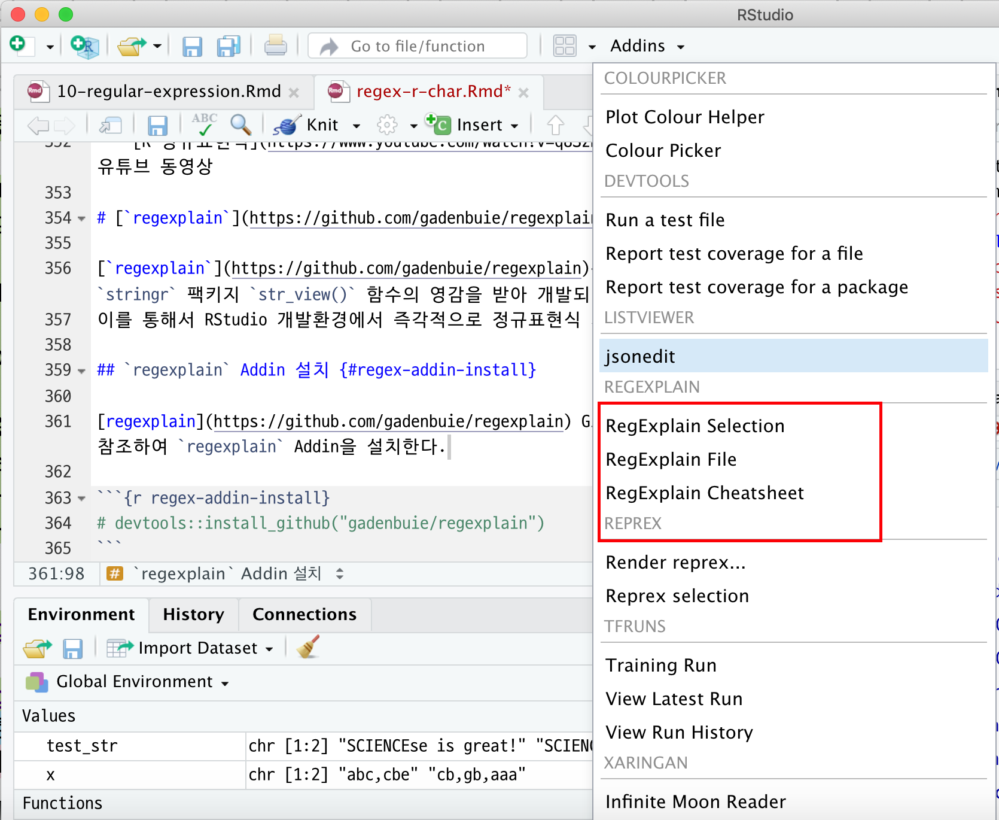
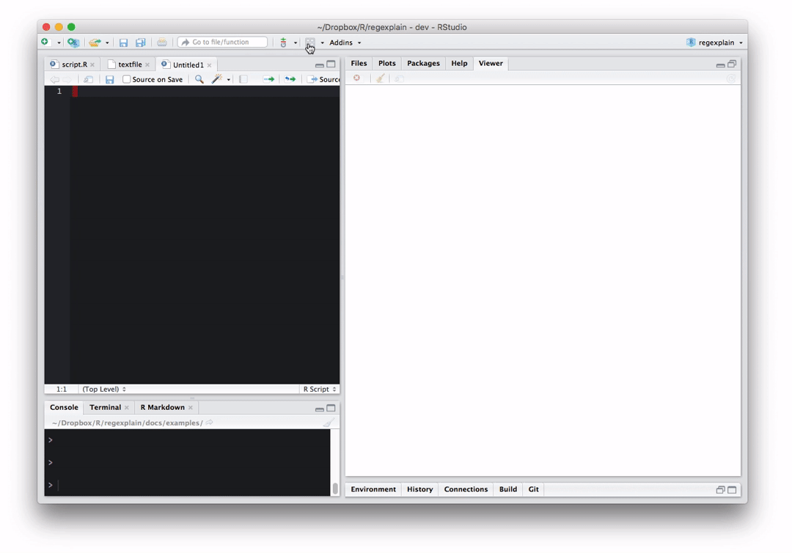

```{r  include = FALSE}
knitr::opts_chunk$set(echo = FALSE, warning=FALSE, message=FALSE,
                    comment="", digits = 3, tidy = FALSE, prompt = TRUE, fig.align = 'center')
```

[R 정규표현식](regex-r.html)에서 정규표현식을 이해했으니, 이를 활용하여 텍스트 데이터를 R에서 처리해본다.

# R Base 문자열 처리 [^regex-intro] [^regex-r] {#regex-intro} 

## 시작환경 설정 {#regex-intro-setup} 

[^regex-intro]: [Regular Expression in R](https://stat545-ubc.github.io/block022_regular-expression.html)
[^regex-r]: [Regular Expressions and Character Data](https://stat545-ubc.github.io/block027_regular-expressions.html)

`stringr` 팩키지를 설치하지 않았다면 설치하고 관련된 팩키지를 불러온다.

```{r regex-setup}
#install.packages("stringr")
library("stringr")
library("dplyr")
library("ggplot2")
```

## `nchar` - 각 문자열 길이를 센다. {#regex-nchar}

```{r regex-nchar}
test_str <- c("Tidyverse is great!", "Wooooo!")
nchar(test_str)
```

## `substr` 문자벡터 부분집합 {#regex-substr}

1번에서 7번째까지 문자열 요소를 뽑아내자.

```{r regex-substr}
substr(test_str, 1, 7)
```

1번에서 7번째까지 문자열 요소를 `SCIENCE`로 바꾼다.

```{r regex-substr-replace}
substr(test_str, 1, 7) <- "SCIENCE"
test_str
```

## `paste` - 문자열을 붙이거나 조합 {#regex-paste}

다소 복잡한 함수라, 일반적인 사용례를 살펴보자. `sep` 매개변수가 구분문자를 정의한다. (기본디폴트 설정으로 한칸 공백).

```{r regex-paste}
paste("abc", "efg")
paste("abc", "efg", sep = "")
```

`paste0` 함수는 `paste(..., sep="")` 을 줄여놓은 함수다.

```{r regex-paste0}
paste0("abc", "efg")
```

다수 값을 갖는 벡터를 조합하려면, `collapse` 매개변수로 명세한다:

```{r regex-paste-collapse}
paste(c("abc", "efg"), c("hij", "klm"), sep = "", collapse = "")
```

## `strsplit` - 문자열을 문자열 리스트로 쪼갬 {#regex-str-split}

예를 들어, 콤마로 구분된 벡터를 다음과 같이 쪼갠다:

```{r regex-string-split}
x <- c("abc,cbe", "cb,gb,aaa")
strsplit(x, split = ",")
```

`strsplit` 함수는 리스트를 반환한다. 그래서 하나처럼 다뤄진다.
만약 두번째 요소를 뽑아낸다면 다음과 같이 코딩한다:

```{r regex-string-lapply}
strsplit(x, split = ",") %>% lapply(function(x) x[2])
```


# R 정규표현식 {#regex-r-way}

앞서 문자데이터 처리 기초를 학습했다. 
강력한 문자데이터 처리를 위해서, R 기초 문자데이터 처리기술을 정규표현식과 함께 사용하는 방법을 살펴보자.

## R 정규표현식 초간단 정리 {#regex-r-summary}

1. POSIX 클래스를 사용해서 **\\w**, **\\d**, **\\s** 문자 클래스를 참조한다.
     이들 문자클래스는 함수에도 동일하지만, 좀더 가독성이 좋다고 일부 개발자는 생각한다.
     `?regex` 도움말을 타이핑해서 전체를 볼수 있다. 다음에 일부 예제가 나와있다.

     * **\\w** = [[:alnum:]]
     * **\\d** = [[:digit:]]
     * **\\s** = [[:space:]]

2. 특수문자를 탈출시키거나 문자클래스를 사용하는 경우, 문자 앞에 **이중** 확장기호를 사용한다.
     예를 들어, **\w** 대신에 **\\w**.

## `news_tweets` 데이터 불러오기 {#regex-twitter}

4개 방송사(CBC, CNN, Al Jazeera, Reuters)에서 나온 지난주 트위터 데이터를 불러 읽어들이는 예제가 준비되었으나, 드롭박스 데이터가 더이상 제공되지 않아서 ...
[Free Twitter Datasets](http://followthehashtag.com/datasets/) 공개된 데이터나 [Tweet Sentiment to CSV](https://twitter-sentiment-csv.herokuapp.com/) 웹사이트에서 다운로드 받아 사용한다. 

몇년전에는 `twitteR` 팩키지를 사용해서 트위터 트윗을 수집했는데, `twitteR`은 트위터 REST API 인터페이스다.


```{r twitter-data}
library(tidyverse)
senti_tweets <- read_csv("data/data.csv")
glimpse(senti_tweets)
```

  * `sentiment` = 감성
  * `text` = 트윗 텍스트 원문
  * `user` = 트위터 사용자명(축약)

## `grep` - 텍스트에서 패턴 찾아내기 {#regex-twitter-grep}

가장 기초적인 작업은 정규표현식으로 문자벡터를 검색하는 것이다.

`grep`은 정규표현식과 문자벡터를 입력값으로 받아 매칭되는 *인덱스*를 반환한다.

정규표현식을 사용해서 `senti_tweets`에 해쉬태그를 포함한 트윗을 찾아보자.
해쉬태그는 `#` 다음에 알파벳숫자가 하나 이상 따라온다. 예를 들어, #rstats, #Canada 등

```{r tweet-grep}
# 정규표현식으로 표현하는 두가지 방법
hastag_pattern <- "#\\w+"
hastag_pattern <- "#[[:alnum:]]+"

grep(hastag_pattern, senti_tweets$text)
```

`value=TRUE`를 설정하면 인덱스에 딸린 벡터 *실제값*을 반환한다.

```{r tweet-grep-value}
grep(hastag_pattern, senti_tweets$text, value = TRUE) %>% head(n = 5)
```

`invert = TRUE`를 설정해서, 해쉬태그가 없는 검색결과로 반전할 수 있다:

```{r tweet-grep-invert}
grep(hastag_pattern, senti_tweets$text, value = TRUE, invert = TRUE) %>% head(n = 5)
```

## `grepl` - 논리 패턴 매칭 {#regex-twitter-grepl}

`grepl` (grep logical)은 `grep`과 유사하지만, 벡터 모든 요소에 대한 `TRUE` 혹은 `FALSE` 값을 반환한다.

```{r tweet-grepl}
hastag_pattern <- "#[[:alnum:]]+"
grepl(hastag_pattern, senti_tweets$text) %>% head(n = 10)
```

`dplyr` 팩키지 `filter`로 `grepl`을 사용해서 정규표현식으로 행을 필터링한다.
url을 포함한 트윗을 필터링해서 뽑아낸다:

```{r tweet-http}
# url 정규표현식
url_pattern <- "http[s]?://[^ ]+"

# grepl을 사용해서 해쉬태그 트윗 추출
hashtag_tweets <- senti_tweets %>%
    filter(grepl(url_pattern, senti_tweets$text))

head(hashtag_tweets)
```

## `gsub` - 찾기와 바꾸기 {#tweet-gsub}

정규표현식으로 매칭하고, 매칭된 것을 미리 지정한 문자열로 바꾼다.

`gsub` 함수는 정규표현식, 바꾸기 문자열과, 대상문자열을 입력 인자로 받는다.
`gsub` 함수는 바꾸기 문자열로 교체된 모든 **모든** 문자열 벡터를 반환한다.

`gsub` 함수의 일반적인 용도는 텍스트 정제다. 예를 들어, 트윗에서 모든 url을 제거하자:

```{r tweet-gsub, highlight=TRUE}
senti_tweets$text[7]

# URL  정규표현식
url_pattern <- "http[s]?://[[:alnum:].\\/]+"

# 상기 정규표현식과 매칭되는 모든 것을 "", 즉 제거
clean_tweets <- gsub(pattern = url_pattern, replacement = "", senti_tweets$text)

clean_tweets[7]
```

`gsub` 함수를 사용해서 부가되거나 끝에 딸려오는 공백문자를 제거한다:

```{r tweet-gsub-remove, highlight=TRUE}
# 공백 2개 혹은 끝에 딸려오는 공백 제거 정규표현식
trailing_space <- "[ ]{2,}|[ ]+$"
clean_tweets <- gsub(pattern = trailing_space, replacement = "", clean_tweets)

clean_tweets[7]
```

마지막으로, `polit`로 시작되는 모든 문자를 `ballons`으로 바꾸기 한다:

먼저 `polit`으로 시작되는 관심 패턴을 포함하는 트윗을 뽑아낸다:

```{r highlight=TRUE}
politics_v <- c("Politics", "politic", "politic", "Political")
poli_pattern <- "[Pp]olit[[:alnum:]]+"
poli_pattern %>% grep(politics_v, value = TRUE)
```

이제 이를 조합해서 `polit`로 시작되는 모든 문자를 `ballons`으로 바꾼다:

```{r highlight=TRUE}
poli_pattern %>% gsub(replacement = "balloons", politics_v) %>% grep("balloons", ., value = TRUE) 
```

# `stringr` 팩키지 {#regex-stringr}

R에 다른 모든 것처럼, Hadley Wickham이 문자열처리도 효과적이고 효율적으로 다루고자 많은 기여를 했다.
문자열에 대한 기여결과가 `stringr` 팩키지로 구현되었다.
기존에 존재하던 많은 함수를 더 멋진 구문으로 구현했다.
문자열 처리 팩키지를 `dplyr`과 함께 사용해서 트윗데이터에 대한 기본적인 어휘분석을 수행한다! 

트윗에서 "단어가 아닌" 모든 텍스트를 정제한다. 정제를 시작해보자:

  * URL: `http[s]?://[[:alnum:]].\\/]+`
  * 트위터 사용자명 (예를 들어, @CNN): `@[\\w]*`
  * 해쉬태그(#rstats): `#[\\w]*`
  * 소유격('s) : `'s`   
  * 이상한 유니코드/html 태그 (예를 들어, <U008+>): `<.*>`  

먼저 제거하고자 하는 각각에 대한 정규표현식을 작성한다.
그리고 나서 `"|"` 연산자로 조합한다. (정규표현식에서 "or", 또는 의미를 갖는다.)

```{r twitter-data-cleaning}
stuff_to_remove <- c("http[s]?://[[:alnum:].\\/]+", "@[\\w]*", "#[\\w]*", "<.*>", "'s")
stuff_to_remove <-  paste(stuff_to_remove, sep = "|", collapse="|")
```

(`gsub` 같은) `str_replace_all` 함수를 사용해서 트윗 텍스트를 정제한다.

```{r tweet-clean-stuff}
clean_tweets <- str_replace_all(senti_tweets$text, stuff_to_remove, "")
clean_tweets[20:25]
```

잘 동작되지만, 꼬리부분에 공백문자가 눈에 띈다! 다행히도, `stringr` 팩키지에는 이런 작업을 위한 전용함수가 존재한다.
`str_trim` 함수는 앞쪽과 뒤쪽 공백문자를 제거한다:

```{r tweet-clean-tweet-string}
clean_tweets <- str_trim(clean_tweets)
clean_tweets[20:25]
```

다음으로, `str_extract_all` 함수를 사용해서 전체 데이터셋에서 모든 단어를 추출한다. 
(`grep(...value=TRUE)`처럼)

```{r tweet-clean-extract-all}
tweet_words <- str_extract_all(clean_tweets, "[A-Za-z]+")
head(tweet_words)
```

오키도키! 상위 15개 단어를 뽑아내자.

```{r tweet-top-n-words}
word_counts <- unlist(tweet_words) %>% table %>% data.frame
names(word_counts) <- c("word", "count")
word_counts %>%
    arrange(count) %>%
    top_n(15) 
```

흠... 정규표현식으로 사용해서 대문자로 시작되는 문자로 적어도 길이가 4자 이상되는 문자만 잡아내자. 

```{r tweet-clean-extract-alls}
tweet_words <- str_extract_all(clean_tweets, "[A-Z][a-z]{4,}")

word_counts <- unlist(tweet_words) %>% table %>% data.frame
names(word_counts) <- c("word", "count")
word_counts %>%
    top_n(25)%>%
    arrange(desc(count))
```

거의 작업을 잘 마무리한 것으로 보인다. 재미로 단어 구름(word cloud)을 만들어보자.

```{r regex-wordcloud-01, warning=FALSE, message=FALSE}
#install.packages("wordcloud")
#install.packages("wesanderson")
library("wordcloud")
library("wesanderson")

pal <- wes_palette(name = "Cavalcanti1", 8, type ="continuous") %>% as.character()

word_counts %>%
    top_n(5) %>%
    with(wordcloud(word, count, ordered.colors = TRUE, color = pal, use.r.layout = TRUE))
```


## 추가 학습교재 {#regex-references}

  * `stringr` [소품문](https://cran.r-project.org/web/packages/stringr/vignettes/stringr.html)
  * CRAN 자연어처리 : [Task View](https://cran.r-project.org/web/views/NaturalLanguageProcessing.html)
  * [R 정규표현식](https://www.youtube.com/watch?v=q8SzNKib5-4) : Roger Peng 유튜브 동영상

# [`regexplain`](https://github.com/gadenbuie/regexplain) Addin {#regex-addin}

[`regexplain`](https://github.com/gadenbuie/regexplain)은 RStudio Addin으로 `stringr` 팩키지 `str_view()` 함수의 영감을 받아 개발되었다.
이를 통해서 RStudio 개발환경에서 즉각적으로 정규표현식 개발이 가능하다.

## `regexplain` Addin 설치 {#regex-addin-install}

[regexplain](https://github.com/gadenbuie/regexplain) GitHub 웹사이트를 참조하여 `regexplain` Addin을 설치한다.

```{r regex-addin-install, eval=FALSE}
devtools::install_github("gadenbuie/regexplain")
```

설치하게 되면 Addins에 추가로 설치된 것이 확인된다.




## `ip` 주소 사례 {#regex-addin-ip-address}

인터넷에 공개된 웹로그 데이터 중 하나를 다운로드 받아 데이터를 준비한다.

- [Publicly available access.log datasets](http://www.almhuette-raith.at/apache-log/access.log)

```{r ip-address}
library(tidyverse)
apache_log <- readLines("data/access_log.txt")

head(apache_log)
```

아파치 웹로그 중에서 IP를 추출하여 가장 접속이 많은 IP주소가 어디인지 찾아보자.
"숫자.숫자.숫자.숫자" 패턴을 갖고 있다보니 `^[0-9]+\\.[0-9]+\\.[0-9]+\\.[0-9]+`
을 사용해서 IP 주소를 추출해본다.

```{r ip-address-find}
apache_log_df <- apache_log %>% tbl_df %>% 
  filter(value != "") %>% 
  rename(log = value)

apache_log_df %>% 
  mutate(ip = str_extract(log, "^[0-9]+\\.[0-9]+\\.[0-9]+\\.[0-9]+")) %>% 
  count(ip, sort=TRUE)
```

다른 방법으로 `regexplain` Addin "Regular Expressions Library" 기능을 사용해서 정규 표현식을 추출해낸다.



