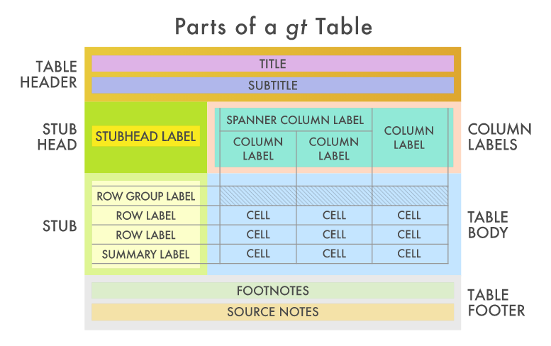

```{r setup, echo = FALSE, cache = FALSE, results = 'hide'}
library(knitr)
options(
  htmltools.dir.version = FALSE, tibble.width = 60, tibble.print_min = 6,
  crayon.enabled = TRUE
)
opts_chunk$set(
  echo = FALSE, warning = FALSE, message = FALSE, comment = "#>",
  fig.path = 'figure/', fig.align = 'center', fig.height = 8.5,
  out.width = '100%', fig.show = 'hold', fig.retina = 3,
  cache = TRUE, cache.path = 'cache/'
)

library(tidyverse)
```

## .left[`r emo::ji("hammer_and_wrench")` &nbsp; &nbsp; 발표 목차]

<br>
.alert[
  .large[
- &nbsp; 범주형 자료
- &nbsp; 표 자료구조
- &nbsp; 시각화
- &nbsp; 모형
- &nbsp; 표 작성
  ]
]


---
class: inverse middle center

.pull-left[
.animate__animated.animate__bounceInDown[

]
]
.pull-right[
<br>
<br>
# 범주형 자료 `r emo::ji("zoom")`
<hr>
### 자료구조
### 요인(Factor)
### forcats
]

```{r xaringan-logo, echo=FALSE}
# 로고 ----
xaringanExtra::use_logo(image_url = "fig/Tidyverse_Korea_logo_transparent.png",
                        link_url = "https://tidyverse-korea.github.io/seoul-R/",
                        position = xaringanExtra::css_position(top = "0.5em", right = "0.5em"))
```

---
class: middle

.left-column[
.center[]
### - 자료구조
]

.right-column[
### Stevens, Stanley Smith. “On the theory of scales of measurement.” (1946)

.center[

]

.footnote[reference: https://statkclee.github.io/data-science/ds-data-structure.html]

]

---
class: middle

.left-column[
.center[]
### - 자료구조
]

.right-column[
### R 자료구조

.center[

]

.footnote[reference: https://statkclee.github.io/data-science/ds-data-structure.html]

]


---
class: middle

.left-column[
.center[]
### - 자료구조
### - Factor
]

.right-column[
### 요인(Factor)

```{r r-factor-code, echo=TRUE}
library(tidyverse)
x1 <- c("Dec", "Apr", "Jan", "Mar")
sort(x1)

month_levels <- c(
  "Jan", "Feb", "Mar", "Apr", "May", "Jun", 
  "Jul", "Aug", "Sep", "Oct", "Nov", "Dec")

y1 <- factor(x1, levels = month_levels)
y1
```

.footnote[reference: https://statkclee.github.io/data-science/ds-factor-cdata.html]

]


---
class: middle

.left-column[
.center[]
### - 자료구조
### - Factor
### - forcats
]

.right-column[
### `forcats`

- 요인 수준(factor level)에 대한 라벨(label) 바꿈 &rarr; `forcats::fct_recode`, `dplyr::recode`
- 요인 수준 순서 바꾸기 &rarr; `fct_relevel()`
- 요인 범주수준을 줄이기 &rarr; `if_else()`
- 파생 요인 변수 생성시킴 &rarr; `case_when()`

.footnote[reference: https://statkclee.github.io/data-science/ds-factor-cdata.html]

]

---
class: inverse middle center

.pull-left[
.animate__animated.animate__bounceInDown[

]
]
.pull-right[
<br>
<br>
# 표 자료구조 `r emo::ji("zoom")`
<hr>
## 큰 그림
### Case-by-Case
### Frequency
### Table
### 변환
]

---
class: middle

.left-column[
.center[]
### 큰 그림

]

.right-column[
### 큰 그림
.center[

]

.footnote[reference: https://cran.r-project.org/web/packages/DescTools/vignettes/TablesInR.pdf]

]

---
class: middle

.left-column[
.center[]
#### Case-by-Case

]

.right-column[
### Case-by-Case

```{r DescTools-case-by-case, echo=TRUE}
library(DescTools)

Untable(UCBAdmissions) %>% head
```


.footnote[reference: https://cran.r-project.org/web/packages/DescTools/vignettes/TablesInR.pdf]

]

---
class: middle

.left-column[
.center[]
#### Case-by-Case
### Frequency

]

.right-column[
### 빈도수 (Frequency)

```{r DescTools-frequency, echo=TRUE}
data.frame(UCBAdmissions) %>% head
```


.footnote[reference: https://cran.r-project.org/web/packages/DescTools/vignettes/TablesInR.pdf]

]

---
class: middle

.left-column[
.center[]
#### Case-by-Case
### Frequency
### Table
]

.right-column[
### 표(Table)

```{r DescTools-table, echo=TRUE}
UCBAdmissions[,,Dept=c("A", "B")]
```

.footnote[reference: https://cran.r-project.org/web/packages/DescTools/vignettes/TablesInR.pdf]
]

---
class: middle

.left-column[
.center[]
#### Case-by-Case
### Frequency
### Table
### 변환
]

.right-column[
### 변환
.center[

]

.footnote[reference: https://cran.r-project.org/web/packages/DescTools/vignettes/TablesInR.pdf]
]


---
class: inverse middle center

.pull-left[
.animate__animated.animate__bounceInDown[

]
]
.pull-right[
<br>
<br>
# 시각화 `r emo::ji("graph")`
<hr>
## 큰 그림
## 깔끔한 데이터
## ggplot
## ggmosaic
]

---
class: middle

.left-column[
.center[]
### 큰 그림
]

.right-column[
### 큰 그림
.center[

]

.footnote[reference: https://statkclee.github.io/data-science/ds-factor-dplyr-mosaic.html]
]

---
class: middle

.left-column[
.center[]
### 큰 그림
]

.right-column[
### 큰 그림
.center[

]

.footnote[reference: https://statkclee.github.io/data-science/ds-factor-dplyr-mosaic.html]
]

---
class: middle

.left-column[
.center[  ]
### 큰 그림
### Tidy 데이터
]

.right-column[
### 깔끔한 데이터

```{r hair-eye-color-tibble, echo = TRUE}
data("HairEyeColor")
hair_df <- as_tibble(HairEyeColor) %>% 
  janitor::clean_names()

hair_df %>% sample_n(3)
```


.footnote[reference: https://statkclee.github.io/data-science/ds-factor-dplyr-mosaic.html]
]


---
class: middle

.left-column[
.center[  ]
### 큰 그림
### Tidy 데이터
### ggplot
]

.right-column[
### 깔끔한 데이터

.pull-left[
```{r hair-ggplot, fig.show = "hide", echo = TRUE}
hair_df %>% 
  unite(appearance, hair:sex, sep="_") %>% 
  filter(n > 10) %>% 
  mutate(appearance = fct_reorder(appearance, n)) %>% 
  ggplot(aes(x=appearance, y=n)) +
    geom_col() +
    coord_flip() +
    theme_bw() +
    labs(x="", y="")
```
]
.pull-right[
```{r ref.label= "hair-ggplot", out.width="100%"}
```
]

.footnote[reference: https://statkclee.github.io/data-science/ds-factor-dplyr-mosaic.html]
]

---
class: middle

.left-column[
.center[  ]
### 큰 그림
### Tidy 데이터
### ggplot
### `ggmosaic`
]

.right-column[
### 모자이크 플롯

.pull-left[
```{r hair-ggmosaic, fig.show = "hide", echo = TRUE}
library(ggmosaic)
ggplot(data = hair_df) +
  geom_mosaic(aes(weight = n, x= product(hair), conds=product(sex), fill=eye)) +
  theme_minimal()
```
]
.pull-right[
```{r ref.label= "hair-ggmosaic", out.width="100%"}
```
]

.footnote[reference: https://statkclee.github.io/data-science/ds-factor-dplyr-mosaic.html]
]

---
class: inverse middle center

.pull-left[
.animate__animated.animate__bounceInDown[

]
]
.pull-right[
<br>
<br>
# 모형 `r emo::ji("personal")`
<hr>
### V2 로켓
### 통계 검정

]

---
class: middle

.left-column[
.center[  ]
### V2 로켓
]

.right-column[
### V2 로켓 `r emo::ji("rocket")`

.pull-left[
```{r model-rocket, fig.show = "hide", echo = TRUE}
library(spatstat)
par(mar = rep(0, 4))

hit <- 537
area <- 576

lambda <- hit/area

south_london <- rpoispp(lambda, win = owin(c(0, 24), c(0, 24)))
plot(south_london, main="", cex=0.5)
abline(h = 0:24, v = 0:24, col = "lightgray", lty = 3)
```
]
.pull-right[
```{r ref.label= "model-rocket", out.width="100%"}
```
]

.footnote[reference: https://statkclee.github.io/statistics/stat-flying-bomb-poisson.html]
]


---
class: middle

.left-column[
.center[  ]
### V2 로켓
### 통계 검정
]

.right-column[
### 통계 검정

```{r model-infer, fig.show = "hide", echo = TRUE, eval = FALSE}
library(infer)

gss_cat_df  <- gss_cat %>% filter(year==2014) %>% 
    mutate(marital = fct_lump(marital, 1),
           race = fct_lump(race, 1)) %>% 
    mutate(marital = fct_recode(marital, 
                                Non_Married = "Other"),
           race    = fct_recode(race, 
                                Non_White = "Other"))

## 교차표 -----
gss_cat_df %>% 
    count(marital, race) %>% 
    spread(marital, n)
```

.footnote[reference: https://statkclee.github.io/statistics/stat-categorical-data-chisquared.html]
]

---
class: inverse middle center

.pull-left[
.animate__animated.animate__bounceInDown[

]
]
.pull-right[
<br>
<br>
# 표 작성 `r emo::ji("book")`
<hr>
### gt
### reactable
]

---
class: middle

.left-column[
.center[  ]
### `gt`
]

.right-column[
### `gt`



.footnote[reference: https://statkclee.github.io/data-science/ds-table-gt-kable.html]
]

---
class: middle

.left-column[
.center[  ]
### `gt`
### `reactable`
]

.right-column[
### `reactable`

```{r oecd-stats}
library(reactable)
library(htmltools)
library(countrycode)

oecd_full_df <- read_rds("data/oecd_full_df.rds")

oecd_df <- oecd_full_df %>% 
  select(country, flags, -ends_with("rank"), everything()) %>% 
  mutate(iso2c = countrycode(iso3c, origin = "iso3c", destination = "iso2c") %>% str_to_lower(.)) %>% 
  mutate(gdp = round(gdp/10^9, 0),
         population = round(population / 10^6, 0))

oecd_df %>% 
  select("country", "flags", "gdp", "area", "gdp_per_capita") %>% 
  top_n(5, wt = gdp) %>% 
  arrange(desc(gdp)) %>% 
  reactable(
    filterable = TRUE,
    searchable = TRUE,
    minRows = 10,
    highlight = TRUE,
    columns = list(
        country = colDef(
          html = TRUE,
          cell = JS("function(cell) {
            return '<a href=\"https://wikipedia.org/wiki/' + cell.value + '\">' + cell.value + '</a>'
          }")
        ),
        # iso2c = colDef(cell = function(value) {
        #   img_src <- sprintf('http://flagpedia.net/data/flags/mini/%s.png', value)
        #   image <- img(src = img_src, height = "24px", alt = "")
        #   tagList(
        #     div(style = list(display = "inline-block", width = "45px"), image)
        #   )
        # }),
        gdp = colDef(
          format = colFormat(separators = TRUE)
        ),
        area = colDef(
          format = colFormat(separators = TRUE)
        ),
        gdp_per_capita = colDef(
          format = colFormat(separators = TRUE)
        )
    )
  )

```

.footnote[reference: https://statkclee.github.io/ds-authoring/krila-digital-new-deal.html]
]


---
class: center middle inverse

# 감사합니다.

--

# 질문?

--

# 끝

---
class: center middle inverse

.animate__animated.animate__hinge[

# 감사합니다.
# 질문?
# 끝
]


