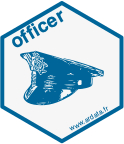

```{r setup, echo = FALSE, cache = FALSE, results = 'hide'}
library(knitr)
options(
  htmltools.dir.version = FALSE, tibble.width = 60, tibble.print_min = 6,
  crayon.enabled = TRUE
)
opts_chunk$set(
  echo = FALSE, warning = FALSE, message = FALSE, comment = "#>",
  fig.path = 'figure/', fig.align = 'center', fig.height = 8.5,
  out.width = '100%', fig.show = 'hold', fig.retina = 3,
  cache = TRUE, cache.path = 'cache/'
)

```


## .left[`r emo::ji("hammer_and_wrench")` &nbsp; &nbsp; 발표 목차]

<br>
.alert[
  .large[
- &nbsp; `xaringan` 기본기
- &nbsp; 피피티스러운 `xaringan`
- &nbsp; AI `xaringan`
  ]
]


---
class: inverse middle center

.pull-left[
.animate__animated.animate__bounceInDown[

]
]
.pull-right[
<br>
<br>
# xaringan 기본 `r emo::ji("zoom")`
<hr>
### 기본기능
### 데놀 2018
]

---
class: middle

.left-column[
.center[]
### 기본기능
]

.right-column[
### `xaringan` 기본기능

.center[

]

.footnote[reference: https://statkclee.github.io/comp_document/cd-xaringan-basics.html]

]

---
class: middle

.left-column[
.center[]
### 기본기능
]

.right-column[
### 데놀 2018

.center[

```{r embed-dataya-nolja}
knitr::include_url('https://statkclee.github.io/ds-authoring/ds_data_scientist_visualization.html#1')
```

]

.footnote[reference: https://statkclee.github.io/ds-authoring/ds_data_scientist_visualization.html]

]

---
class: inverse middle center

.pull-left[
.animate__animated.animate__bounceInDown[

]
]
.pull-right[
<br>
<br>
# 피피티스러운 xaringan `r emo::ji("document")`
<hr>
### Seoul R Meetup
### KCD 2020
]

---
class: middle

.left-column[
.center[]
### Seoul R Meetup
]

.right-column[
###  Weather Report Automation - GitHub Actions

```{r embed-seoul-r-meetup}
knitr::include_url('https://statkclee.github.io/ds-authoring/ds-weather-github-actions.html')
```


.footnote[reference: https://statkclee.github.io/ds-authoring/ds-weather-github-actions.html]
]


---
class: middle

.left-column[
.center[]
### Seoul R Meetup
### KCD 2020
]

.right-column[
### PPT &rarr; xaringan 슬라이드


.footnote[reference: https://statkclee.github.io/comp_document/ds-presn.html#5_PPT_%E2%86%92_xaringan_%EC%8A%AC%EB%9D%BC%EC%9D%B4%EB%93%9C]

]

---
class: inverse middle center

.pull-left[
.animate__animated.animate__bounceInDown[

]
]
.pull-right[
<br>
<br>
# AI xaringan `r emo::ji("screen")`
<hr>
### TTS
### PPT 동영상
### xaringan 동영상
]


---
class: middle

.left-column[
.center[]
### TTS
]

.right-column[
### 문자 음성 변환 프로그램


.footnote[reference: https://statkclee.github.io/deep-learning/r-tts.html]

]

---
class: middle

.left-column[
.center[]
### TTS
### PPT 동영상
]

.right-column[
### 파워포인트 발표자료 유튜브 동영상 자동 제작

<br>

<center>
<iframe width="560" height="315" src="https://www.youtube.com/embed/6qpWDi30L7k" frameborder="0" allow="accelerometer; autoplay; clipboard-write; encrypted-media; gyroscope; picture-in-picture" allowfullscreen></iframe>
</center>

.footnote[reference: https://statkclee.github.io/deep-learning/r-ari.html]

]

---
class: middle

.left-column[
.center[]
### TTS
### PPT 동영상
### xaringan
]

.right-column[
### xaringan 발표자료 유튜브 동영상 자동 제작

<br>


.footnote[reference: https://statkclee.github.io/deep-learning/r-xaringan-ari.html]

]


---
class: center middle inverse

# 감사합니다.

--

# 질문?

--

# 끝

---
class: center middle inverse

.animate__animated.animate__hinge[

# 감사합니다.
# 질문?
# 끝
]


