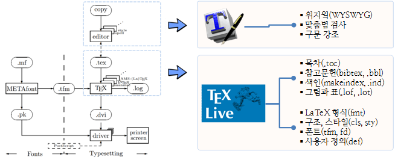

데이터과학을 위한 저작도구
========================================================
autosize: true
font-import: http://fonts.googleapis.com/css?family=jejugothic
font-family: 'jejugothic'

<a href="http://www.webzen.com/">웹젠 데이터 과학자</a> 2016년 10월

관련 정보
========================================================

## 강서양천일보('15.08월)
- [글을 쓰는 것은 소프트웨어 개발이다!](https://goo.gl/RiXTIb)
- [컴퓨터 사고력과 소프트웨어 교육](https://goo.gl/IXIW4n)

## 데이터과학자를 위한 저작 툴체인
- [데이터 과학을 위한 저작도구](https://statkclee.github.io/ds-authoring/)
- [Modern Scientific Authoring](http://swcarpentry.github.io/modern-scientific-authoring/)

## [R Presentation](https://support.rstudio.com/hc/en-us/articles/200486468-Authoring-R-Presentations)
- [beamer_presentation, PDF](http://rmarkdown.rstudio.com/beamer_presentation_format.html)
- [ioslides_presentation, HTML](http://rmarkdown.rstudio.com/ioslides_presentation_format.html)
- [slidy_presentation, HTML](http://rmarkdown.rstudio.com/slidy_presentation_format.html)
- [revealjs::revealjs_presentation, HTML](http://rmarkdown.rstudio.com/revealjs_presentation_format.html)

세가지 다른 언어 패러다임
========================================================

현재 상황 요약
========================================================

- **아래한글, 리브레오피스, 마이크로소프트 워드 같은 데스크톱 위지윅 도구** :지금까지 편지같은 단순한 저작물을 생성하는 가장 쉬운 방식이지만, 융통성이 없고, 불명확하고 수식을 배치하는 기능이 상대적으로 미약하고, 버젼제어 시스템과 궁합이 맞지 않는다.
- **구글 독스 같은 웹기반 위지윅 도구**:  워드나 한글, 리브레오피스의 신속성을 갖추고, 더불어 협업을 수월(왜냐하면 모든이가 문서 사본 하나만 공유하기 때문)하게 한다. 하지만, 웹기반 위지윅 도구는 여전히 융통성이 없고 불명확하며, 책임을 질 수 없는 개인회사 바구니에 모든 달걀을 놓는 것에 많은 사람들이 불편해하고 있다.
- **데스크톱 LaTeX**: 강력한 조판언어로 수식과 참고문헌관리에 정말 훌륭한 기능을 제공한다. 버젼제어 시스템과 조화가 잘 되는데, 일반 텍스트로 문서를 저작하기 때문이다. 하지만, 지금까지 학습하기 가장 복잡하고, 텍스트와 그림을 원하는 곳에 배치시키는 작업이 고생스럽게도 수시간 소요될 수 있다.
- **Authorea, Overleaf 같은 웹기반 도구** : 위지윅 편집 인터페이스를 저자에게 제공하지만 문서는 LaTeX으로 저장되고, 변경사항을 타이핑해서 넣을 때마다 실시간으로 화면에 다시 출력해서 보여준다.
- **HTML** :  웹의 네이티브 언어로 LaTeX 보다 훨씬 (훨씬) 더 단순하지만, 훨씬 더 적은 기능을 제공한다: 주석, 참고문헌관리, 절마다 번호매기기 같은 단순한 기능도 직접적으로 지원되지 않는다. 상당히 버보스하게 상세할 수도 있고, CSS2는 변덕스러운 것으로도 유명하다.
- **마크다운** : HTML에 대한 단순화 대안으로 개발되었다. 마크다운은 일반-텍스트 전자우편 관례를 사용한다: 빈줄은 문단을 구분하고, 이탤릭체로 만드는데 `*별표*`로 감싸는 등등. HTML보다 더 적은 작업을 수행하지만, 타이핑 양은 훨씬 더 적다. 하지만, 불행하게도 거의 모든 마크다운 구현결과물이 자체적인 기능이 추가되어서 “마크다운 표준”은 모순어법에 해당된다.

데이터 과학을 위한 마크다운과 LaTeX
======================================================
 
### GUI 저작 시스템
- 데스크톱 위지윅 저작시스템: 아래한글, MS 워드
- 클라우드 위지윅 저작시스템: 구글독스

### 마크다운 : 웹사이트와 블로그
- 장점: 대부분 사람이 HTML로 원하는 모든 것을 그다지 많이 타이핑하지 않고도 수행
- 단점: 
    - 저널 대부분이 제출형식으로 받아주지 않기 때문이다.
    - 고위 연구협력자가 이를 받아줄 가능성은 없다. (물론, 고위 연구협력자가 LaTeX을 사용하지 않았다면, LaTeX으로 전환하지도 않을 것이다…).
    - 과학연구원이 원하는 기능 상당수를 마크다운이 지원하는 않는다. (예를 들어, 참고문헌 서지관리)

### LaTeX : 원고저작 및 출판
- 장점
    - PDF와 다른 표준형식으로 컴파일 작업을 수행한다.
    - 그림과 표를 배치하는데 탁월한 성능을 보여준다.
    - 버젼제어와 잘 묶어 작업할 수 있다.
    - 서지관리 소프트웨어 상당수와 호환된다.
    - 많은 저널에서 받아주는 형식이다. (하지만, 학문 분야마다 상당한 다양성이 존재한다.)
- 단점 

한국인이기 때문에 알아야 되는 것
=======================================================

참고자료: [R 유니코드, 인코딩](https://statkclee.github.io/ds-authoring/regex-encoding.html)

텍스트 데이터 처리 시작 : 인코딩 
=======================================================
 

전통적 작업 흐름 
=======================================================
 

- 저작자와 독자 사이에 다수 중간단계 존재
    - 편집 및 디자인
    - 출판
    - 배송
    - 서점 : 전통 책방, 온라인 서점, 전자책 등
- 각 단계별 인력, 소프트웨어, 기계장비 등 필요

데이터 과학 저작 작업흐름 
=======================================================
 

저작 흐름 비교 
=======================================================
 

***
   

도구가 자동화하는 저작 업무
=======================================================
 

파이썬 스핑크스(Python Sphinx)
=======================================================
 

- [Welcome to Reeborg's world!](http://reeborg.ca/index_en.html)
- [리보그 한국어 버젼](http://reeborg.ca/docs/ko/index.html)
- [프로그래밍과 문제해결: 파이썬, 리보그, 러플](http://reeborg.xwmooc.org/)

북다운(Bookdown)
=======================================================
 
## 설치방법

1. <https://github.com/rstudio/bookdown-demo> GitHub에서 포크를 뜨고, git clone 하여 로컬 컴퓨터에 저장한다.
2. RStudio 사전출시 버젼을 다운로드 해서 설치한다.
3. 클론한 bookdown-demo 저장소에서 bookdown-demo.Rproj 파일을 클릭해서 연다.
4. bookdown 팩키지를 설치한다. `devtools::install_github("rstudio/bookdown")`
5. index.Rmd R 마크다운 파일을 열고, RStudio build 탭에 Build Book을 클릭한다.

 
## [공개 기초 통계학(OpenIntro Statistics)](https://statkclee.github.io/openIntro-statistics-bookdown/)

모두를 위한 파이썬
=======================================================
 

[모두를 위한 파이썬(Programming for Everybody)](https://statkclee.github.io/pythonlearn-kr/)

R 노트북(Notebook)
=======================================================
 
## 설치방법

1. [일별 최신 RStudio 다운로드](https://www.rstudio.org/download/daily/desktop/)
2. 최신 Rmarkdown 팩키지 설치: devtools::install_github("rstudio/rmarkdown")
3. RStudio 환경설정: Tools & Global Options > Rmarkdown > R Notebook
4. File > New File > R Notebook
5.YAML 헤더에 output: html_notebook 설정 확인.

참고: [R Notebooks from RStudio](http://rmarkdown.rstudio.com/r_notebooks.html)

사례: 데이터캠프(DataCamp)
=======================================================

<iframe src="https://player.vimeo.com/video/153250442?title=0&byline=0&portrait=0" width="640" height="375" frameborder="0" webkitallowfullscreen mozallowfullscreen allowfullscreen></iframe>

[DataCamp 콘텐츠 제작](https://www.datacamp.com/teach/documentation)

<a href="https://vimeo.com/153250442">DataCamp 콘텐츠 개발 동영상</a>, <a href="https://vimeo.com">Vimeo</a>.

## [한국어 R 입문](https://www.datacamp.com/courses/1709)

본 발표자료 작성
=======================================================
 
## R Presentations
 
[Authoring R Presentations](https://support.rstudio.com/hc/en-us/articles/200486468-Authoring-R-Presentations)

그리고, 데이터 카펜트리
=======================================================
 

## A Data Carpentry Workshop
 
### 장소: 서강대학교
### 일시: Nov 06-07, 2016, 9:30 am - 5:30 pm
### 강사: Kari Jordan, 이광춘
 
<https://statkclee.github.io/2016-11-06-sogang/>

참고자료
========================================================

* [Top Five CSS Customizations for R Presentations, Andy Lyons, September, 2014](http://rstudio-pubs-static.s3.amazonaws.com/27777_55697c3a476640caa0ad2099fe914ae5.html#/)
* [Geospatial Data Processing and Analysis in R, Andy Lyons, Stanford University](https://github.com/ajlyons/rspatialdata/blob/master/Spatial-data-in-R.Rpres)
