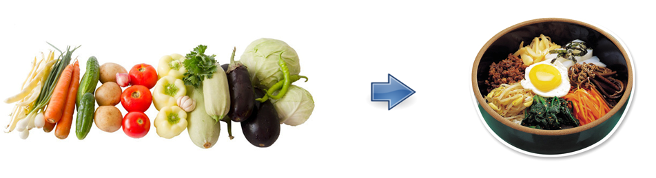
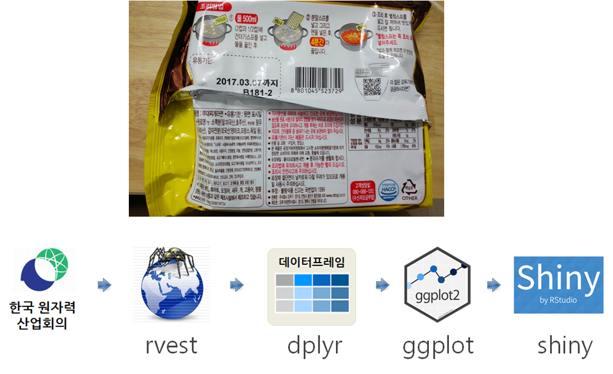
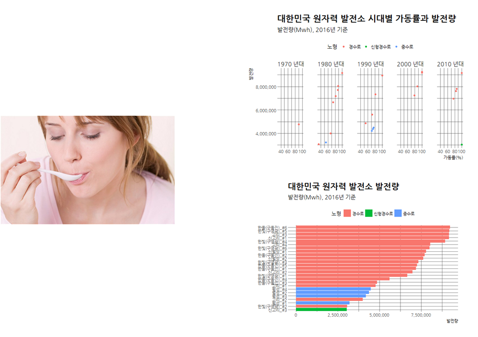
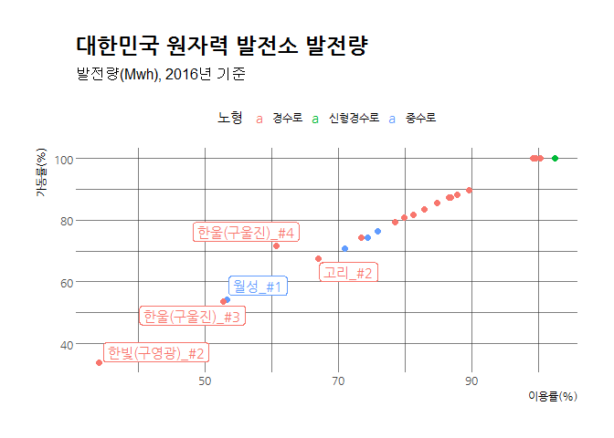
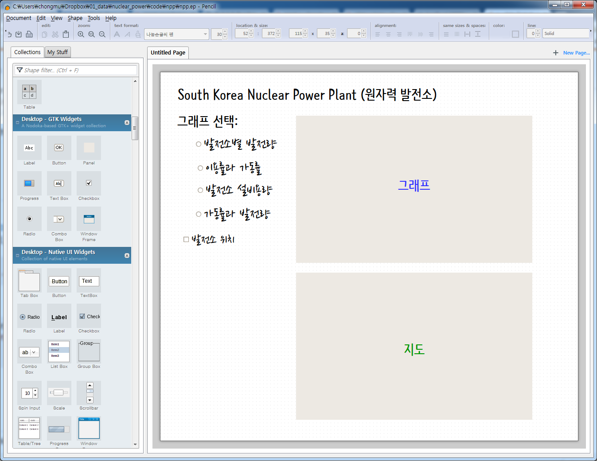

싱싱한 재료를 제품으로, 데이터를 데이터 제품으로
========================================================
autosize: true
font-import: http://fonts.googleapis.com/css?family=jejugothic
font-family: 'jejugothic'

<a href="http://www.webzen.com/">웹젠 데이터 과학자</a> 2017년 10월

식자재을 음식으로...
========================================================

고럼, 데이터를 제품으로...
========================================================

요리법(Recipe)
========================================================

원재료 살펴보기
========================================================

- 한국원자력산업협회 - 국내 원전 현황
- <http://www.kaif.or.kr/?c=dat&s=6>

조리법 상세
========================================================

<https://statkclee.github.io/data-product/shiny-nucelar-powerplant.html>

맛보기
========================================================

구성 제품 준비 - 커뮤니케이션
========================================================

구성 제품 준비 - 인터랙티브 지도
========================================================

<https://statkclee.github.io/data-product/shiny-nucelar-powerplant.html#---map-messagefalse-warningfalse>

포장
========================================================

제품출시
========================================================

- 영문: <https://dl-dashboard.shinyapps.io/npp_server_eng/>
- 국문: <https://dl-dashboard.shinyapps.io/npp_server/>

참고자료
========================================================

* [xwMOOC - 대한민국 원자력 발전소 현황 (2016)](https://statkclee.github.io/data-product/shiny-nucelar-powerplant.html)
