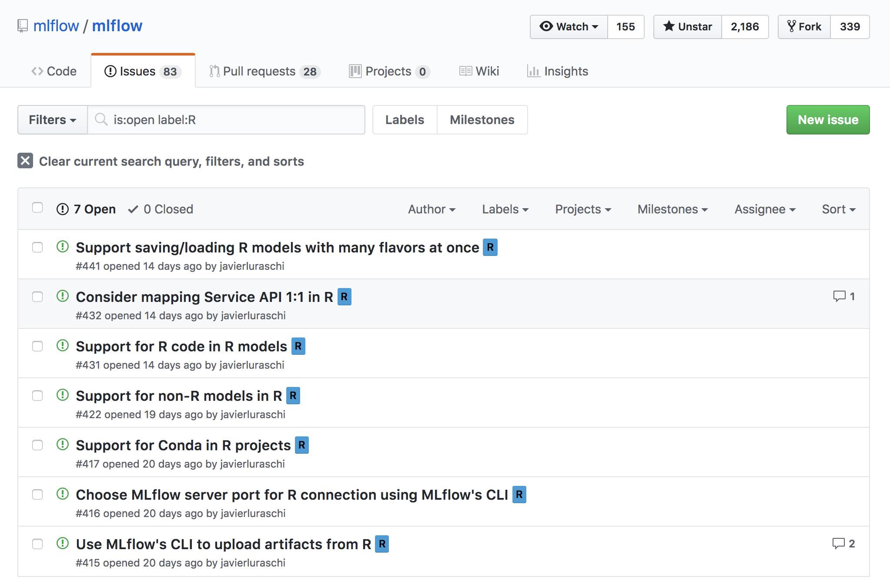

```{r setup, include = FALSE}
knitr::opts_chunk$set(eval = FALSE)
knitr::opts_chunk$set(warning = FALSE)

library(ggplot2)
library(dplyr)
```

## Overview

- What is MLflow?
- What is R?
- MLflow with R

# What is MLflow?

## MLflow

> "Helps teams manage their machine learning lifecycle."

> - <div class="highlight">**Tracking**</div>: Track experiments to record and compare params and results.
> - <div class="highlight">**Projects**</div>: Reuse and reproduce code to share or transfer to production.
> - <div class="highlight">**Models**</div>: Manage and deploy models from across libraries and platforms.

# What is R?

## R Language


## Future Work

Currently merged, various github issues pending:



## Thanks!

> github.com/mlflow/mlflow

> @javierluraschi

> javier@rstudio.com

