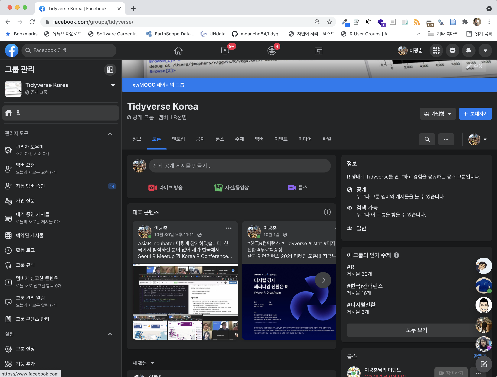
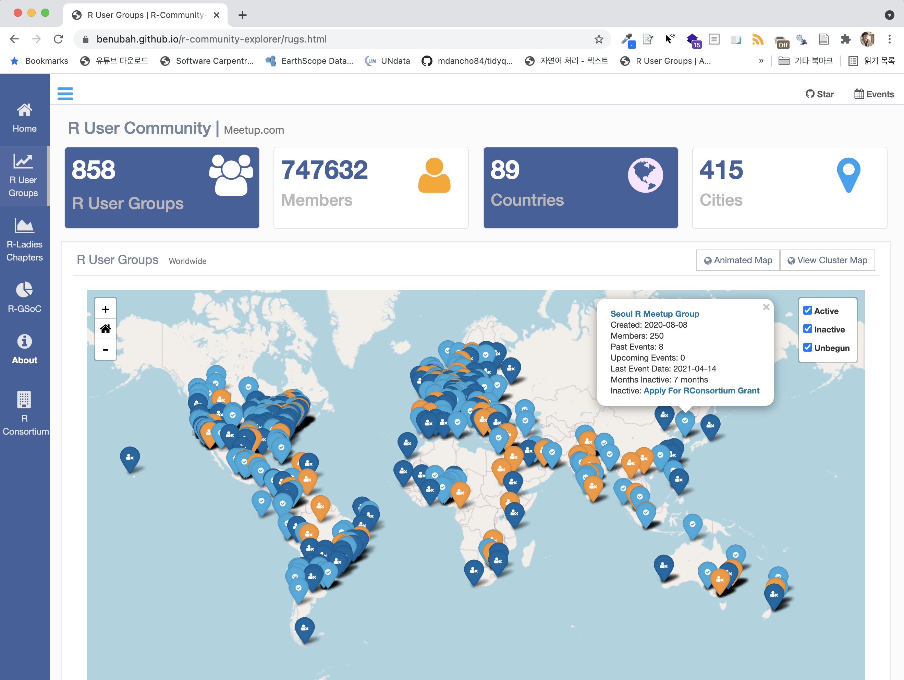
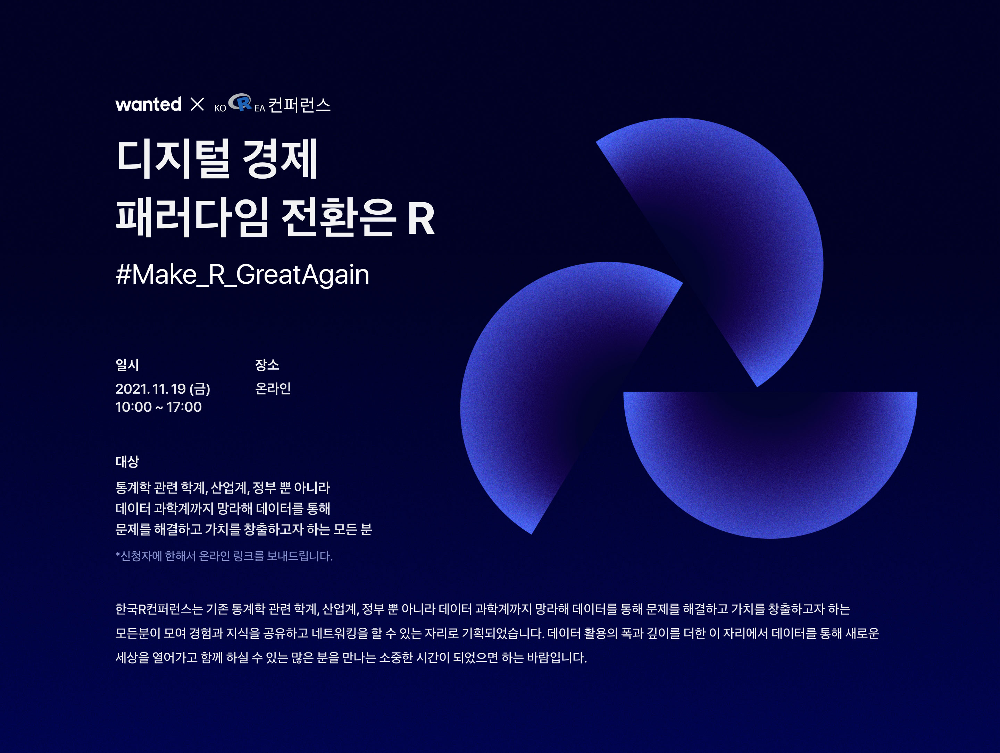
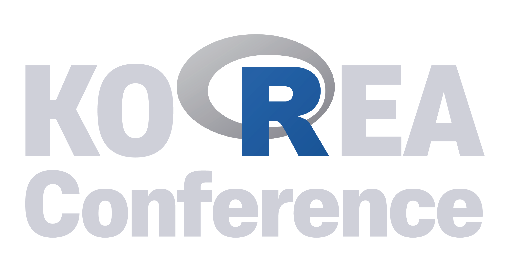
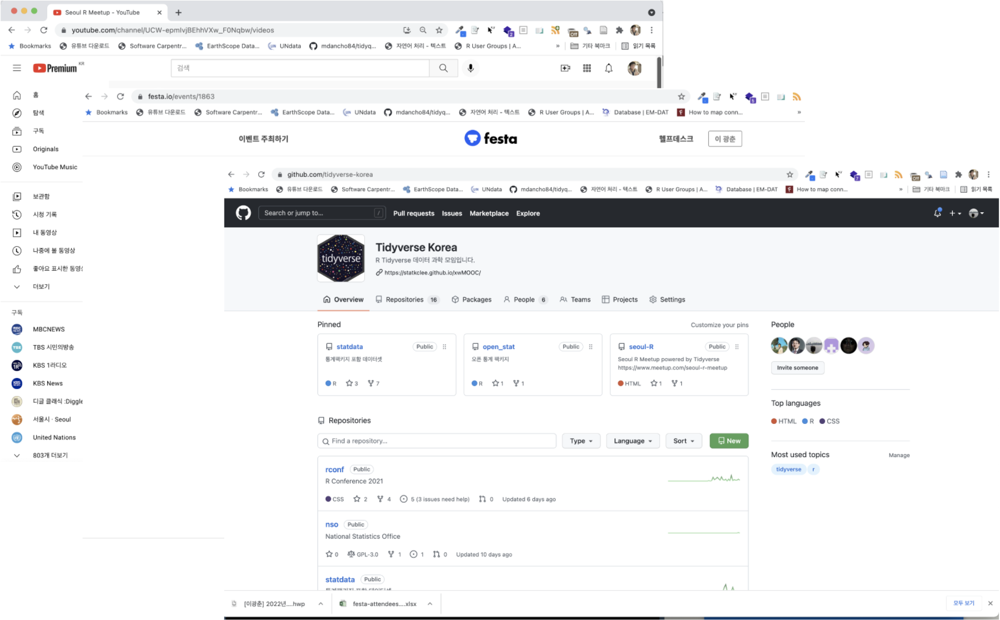
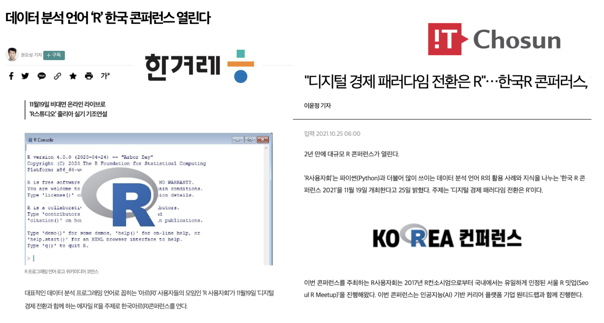
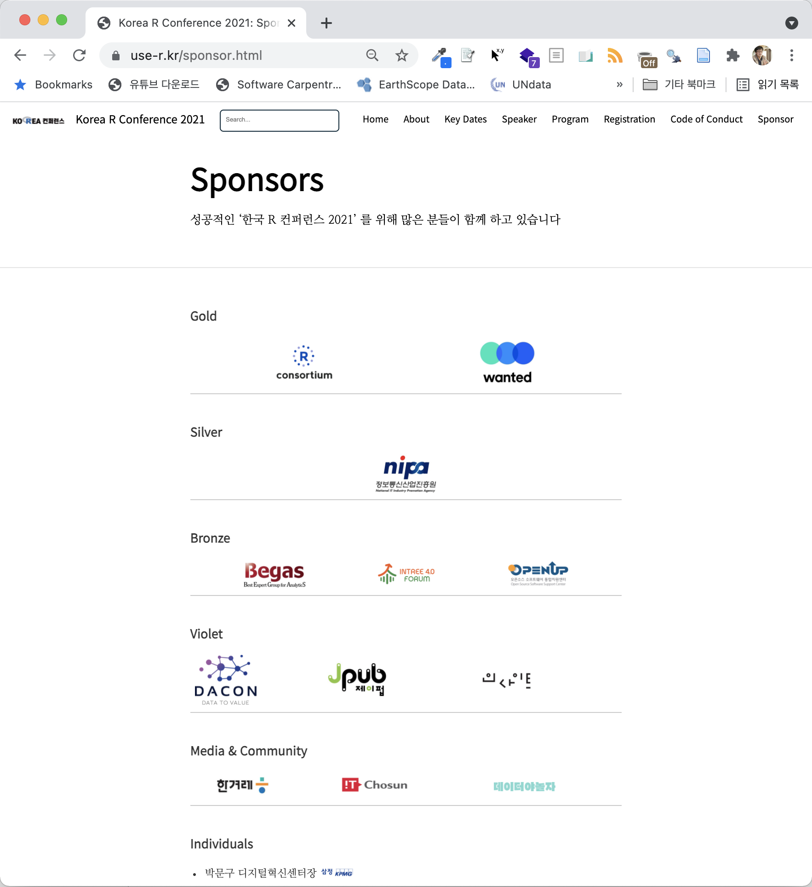
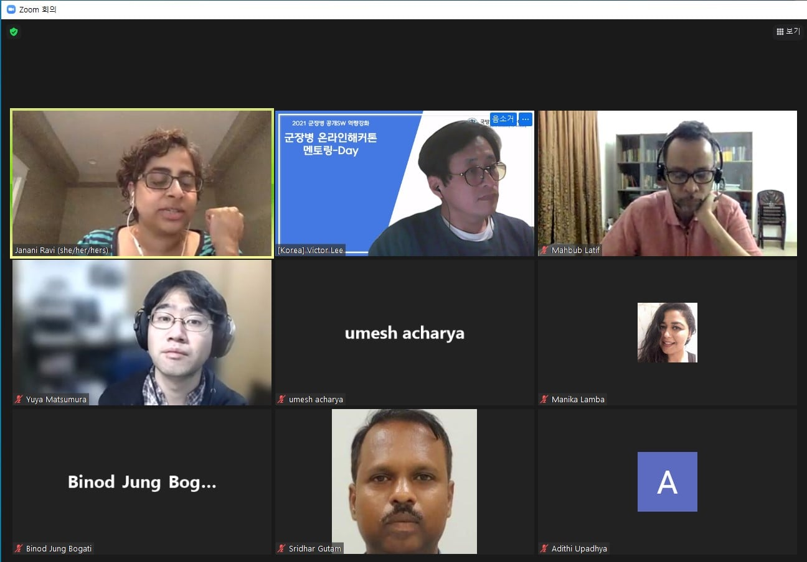

```{r setup, include = FALSE}
library(tidyverse)
# library(nhsrtheme)
# library(NHSRdatasets)
# set default options

options(
  htmltools.dir.version = FALSE, 
  htmltools.preserve.raw = FALSE,
  tibble.width = 60, tibble.print_min = 6,
  crayon.enabled = TRUE
)

knitr::opts_chunk$set(echo = FALSE, message=FALSE, warning=FALSE,
                      comment="", digits = 3, tidy = FALSE, prompt = FALSE, fig.align = 'center',
                      fig.width = 7.252,
                      fig.height = 4,
                      dpi = 300)

# uncomment the following lines if you want to use the NHS-R theme colours by default
# scale_fill_continuous <- partial(scale_fill_nhs, discrete = FALSE)
# scale_fill_discrete <- partial(scale_fill_nhs, discrete = TRUE)
# scale_colour_continuous <- partial(scale_colour_nhs, discrete = FALSE)
# scale_colour_discrete <- partial(scale_colour_nhs, discrete = TRUE)

xaringanExtra::use_panelset()
```


class: title-slide, left, bottom

# `r rmarkdown::metadata$title`
----
## **`r rmarkdown::metadata$subtitle`**
### `r rmarkdown::metadata$author`
### `r rmarkdown::metadata$date`

 
---
class: inverse, middle
name: data-science-case

# 발표 개요 

----

.pull-left[

.black[디지털 불평등(Digital Divide)]과 .black[디지털 경제전환(Digital Transformation)의 가속화]가 코로나19로 보다 명확해진 시대다. 이러한 변화의 중심에 빅데이터, 기계학습, 인공지능 등 데이터 기반 기술이 자리 잡고 있으며 또 집중 관심을 받고 있다. 데이터 시대를 맞아 R은 통계에 기반한 프로그래밍 언어임에도 불구하고 다른 범용 프로그래밍 언어와 같은 큰 인기를 얻고 있다.

금번 .warmyellow['한국 R 컨퍼런스 2021']은 기존 통계학 관련 학계, 산업계, 정부 뿐 아니라 데이터 과학계까지 망라해 데이터를 통해 문제를 해결하고 가치를 창출하고자 하는 모든 분이 모여 .green[경험과 지식을 공유하고 네트워킹]을 할 수 있는 자리로 기획하였다. 데이터 활용의 폭과 깊이를 더한 이 자리에서 데이터를 통해 새로운 세상을 열어가고 함께 하실 수 있는 많은 분을 만나는 소중한 시간이 되었으면 하는 바람이다.

]
 
.pull-right[   
.left[

1\. Tidyverse Korea 페이스북 그룹

2\. Seoul R Meetup

.warmyellow[**3\. 한국 R 컨퍼런스**]

&nbsp;&nbsp;&nbsp; 3\.1\. R 사용자회 / R 컨퍼런스 로고

&nbsp;&nbsp;&nbsp; 3\.2\. R 핸즈온

&nbsp;&nbsp;&nbsp; 3\.3\. 유튜브(Youtube) / 언론 뉴스

&nbsp;&nbsp;&nbsp; 3\.4\. 오픈 통계 패키지

.green[**4\. Global Network**]

&nbsp;&nbsp;&nbsp; 4\.1\. R Consortium

&nbsp;&nbsp;&nbsp; 4\.2\. R-Ladies Korea Chapter

&nbsp;&nbsp;&nbsp; 4\.3\. **AsiaR Meetup / Conference**

]
] <!--end of right-column--> 


---
name: rconf-tidyverse
# 1. 페이스북 그룹

.center[
  
]

.caption[
링크: [Tidyverse Korea 페이스북 그룹](https://www.facebook.com/groups/tidyverse)
]

---
name: rconf-seoul-meetup
# 2. Seoul R Meetup

.center[
  
]

.caption[
링크: [Seoul R Meetup](https://tidyverse-korea.github.io/seoul-R/)
]

---
name: rconf-conference
# 3. 한국 R 컨퍼런스

.pull-left[
.center[
  
  
  
]
- [한국 R 컨퍼런스](https://use-r.kr/)
]

.pull-right[


- [유튜브](https://www.youtube.com/channel/UCW-epmIvjBEhhVXw_F0Nqbw) / [R 핸즈온](https://festa.io/events/1839) / [오픈통계 패키지](https://github.com/tidyverse-korea)



- [한겨레](https://www.hani.co.kr/arti/science/science_general/1012214.html) / [IT조선](http://it.chosun.com/site/data/html_dir/2021/10/24/2021102401022.html)

]


---
name: rconf-global
# 4. Global Network

.pull-left[
.center[
  
  <br>
  
  [R Consortium](https://www.r-consortium.org/)
]
]

.pull-right[


- [R-Ladies](https://rladies.org/)



[Incubator: Strategies to build a strong AsiaR Community](https://www.conftool.org/user2021/index.php?page=browseSessions&form_session=42&presentations=show)

]

---
name: digital-goodbye
class: middle, inverse

.pull-left[
# **Make R Great Again!!!**
<br/>
## 한국 R 사용자회

]

.pull-right[
.right[

<!--  -->


 
]
]
