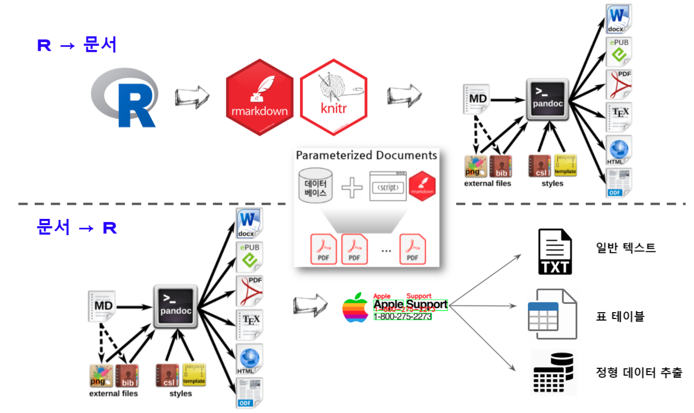

```{r setup, include = FALSE}
library(tidyverse)
# library(nhsrtheme)
# library(NHSRdatasets)
# set default options

options(
  htmltools.dir.version = FALSE, 
  htmltools.preserve.raw = FALSE,
  tibble.width = 60, tibble.print_min = 6,
  crayon.enabled = TRUE
)

knitr::opts_chunk$set(echo = FALSE, message=FALSE, warning=FALSE,
                      comment="", digits = 3, tidy = FALSE, prompt = FALSE, fig.align = 'center',
                      fig.width = 7.252,
                      fig.height = 4,
                      dpi = 300)

# uncomment the following lines if you want to use the NHS-R theme colours by default
# scale_fill_continuous <- partial(scale_fill_nhs, discrete = FALSE)
# scale_fill_discrete <- partial(scale_fill_nhs, discrete = TRUE)
# scale_colour_continuous <- partial(scale_colour_nhs, discrete = FALSE)
# scale_colour_discrete <- partial(scale_colour_nhs, discrete = TRUE)
```


class: title-slide, left, bottom

# `r rmarkdown::metadata$title`
----
## **`r rmarkdown::metadata$subtitle`**
### `r rmarkdown::metadata$author`
### `r rmarkdown::metadata$date`

 
---
class: inverse, middle
name: data-science-case

# 발표 개요

----

.pull-left[

증거기반 행정이 부상하고 디지털 경제전환 사회로 바뀌면서 문서를 다양한 형태로
빠른 시간내에 고품질로 제작하는 것이 필요함과 동시에 기계판독도 되지 않는 
다양한 문서에서 정형 데이터를 추출하는 것도 기계가 더 잘하는 세상이 되었다.


]
 
.pull-right[   
.left[

1\. 개요

2\. [R 마크다운](#digital-ai)

&nbsp;&nbsp;&nbsp; 2\.1\. Literate Programming

&nbsp;&nbsp;&nbsp; 2\.2\. 커뮤니케이션

&nbsp;&nbsp;&nbsp; 3\.3\. 문서 대량생산

3\. Digitization과 기계독해

&nbsp;&nbsp;&nbsp; 2\.1\. OCR

&nbsp;&nbsp;&nbsp; 2\.2\. 기계독해

4\. [마무리](#digital-goodbye)

]
] <!--end of right-column--> 

---
name: healthcare-data
# 개인정보

.center[

]

.footnote[
- [데이터 과학 문서](https://statkclee.github.io/comp_document/)
- [PDF를 데이터로 보는 올바른 자세](https://statkclee.github.io/pdf/)
]


<!--------------------------  마무리 ----------------------------------------->

```{r child='slideshows/useR/useR-goodbye.Rmd'} 
```

 
   
