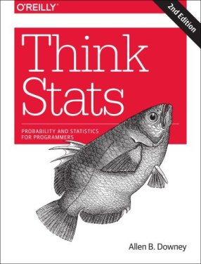

```{r, include=FALSE}
source("tools/chunk-options.R") 
```

> ## 통계청, 통계의 창 {.callout}
>
> 본고는 [`통계의 창`](http://www.stat.or.kr/sub04_08_list.jsp)에 기고 준비중인 글입니다. 
> [한국통계진흥원](http://www.stat.or.kr/)은 기존 통계자료에 대한 가공·분석 뿐만 아니라 통계조사 기획컨설팅, 통계품질관리, 통계교육 등의 업무를 수행하기 위해 설립된 재단법인으로, 
> 통계의 창은 통계에 대한 올바른 이해를 제고하고 홍보하기 위해 지식과 정보가 넘쳐나는 세상에서 지식정보 서비스 활성화를 통해 매년 2번 한국통계진흥원 홈페이지를 통해서 누구나 구독할 수 있습니다.

> ## 목차 {.prereq}
>
> 1. 세가지 사고체계  
> 2. 21세기 통계학  
>     2.1. 통계적으로 생각하기 (Think Stats)  
>     2.2. 공개기초 통계학 (OpenIntro Statistics)  
> 3. 데이터 과학과 소프트웨어 
>     3.1. 컴퓨터 과학 언플러그드  
>     3.2. 정보교육을 위한 파이썬: 데이터 과학자로의 여정  
>     3.3. 소프트웨어 카펜트리  
> 4. 온라인 공개수업 (Massive Open Online Course, MOOC)  
>     4.1. 온라인 공개수업 3대 업체  
> 5. 맺음말  

## 세가지 사고체계

정부는 '14년 7월 전세계 경제, 사회를 비롯한 제반  환경이 컴퓨터 소프트웨어 중심사회로 급격히 변화하고 있다고 진단하고, 소프트웨어가 혁신과 성장, 가치창출의 중심이 되고, 개인•기업•국가의 경쟁력을 좌우하는 중요한 역할을 하고 있음에도 불구하고, 우리나라는 범정부적, 국민적 관심이 미흡한 상황이라고 진단하고, 미국, 영국, 이스라엘 등 선진국과 마찬가지로, 초•중•고에서 정보교육을 의무화하는 [2015 문이과 통합형 교육과정](http://www.moe.go.kr/web/100026/ko/board/view.do?bbsId=294&pageSize=10&currentPage=0&encodeYn=N&boardSeq=56874&mode=view) 확정고시를 하였다.

'13년 [창조경제의 개념과 성공조건](https://www.google.co.kr/url?sa=t&rct=j&q=&esrc=s&source=web&cd=2&cad=rja&uact=8&ved=0CCkQtwIwAQ&url=http%3A%2F%2Fwww.youtube.com%2Fwatch%3Fv%3DZaEihnQwR9s&ei=XOFZVc_BBM_t8gXmk4CgAg&usg=AFQjCNEPhxQUXfrG3zcSlfp2pCwoq_Y5Yw&sig2=XGEFY2yD0ja7w-Whkz8EKQ&bvm=bv.93564037,d.dGc)에서 김광두 국가미래연구원장이 농업사회에서 산업사회를 넘어가고 산업사회에서 지식사회를 넘어가고 있으며 지금은 융합, 지식 창조산업이 중추 산업이 되며, 소프트웨어, 콘텐츠, 과학기술이 핵심 기반이 되며 창조경제를 견인할 것으로 내다봤다.

외국에서는 카네기멜론 대학 쟈넷 윙(Wing) 교수가 이론적 사고(Theoretical Thinking), 실험적 사고(Experimental Thinking)와 더불어 [컴퓨터적 사고(Computational Thinking)](http://www.cs.cmu.edu/~CompThink/)가 향후 인간의 사고 체제를 지배하는 중추적인 역할을 할 것이라고 주장했다. 산업혁명 이후로 산업, 즉 공장에서 필요한 인력을 육성하고 공급하기 위해서 수학과 공학을 초중등 과정에서 집중적으로 교육하였으며 이러한 전통이 지금까지 이어져 국내 및 전세계 누구나 이론적 사고체계는 익숙하고 친숙하다. 통계가 근간을 이루는 실험적 사고는 스몰 데이터(Small Data)를 일부 초중등 과정에서 접목하고 있지만, 학교를 졸업하고 현실에서 많이 접하게 되고 필수적인 것임에도 통계에 대한 충분한 교육 및 훈련을 받지 못하고 사회에 진출하고 있는 것도 사실이다. 이러는 와중에 빅데이터(Big Data)가 10년도 되지 않는 짧은 시간에 성급 우리곁에 다가왔고, [추상화(Abstraction)와 자동화(Automation)](http://www.cs.cmu.edu/afs/cs/usr/wing/www/publications/Wing06.pdf)가 근간을 이루는 컴퓨터적 사고도 새로운 사고체계로 함께 받아들일 시점이 되었다.


컴퓨터적 사고 체계가 갖는 산업적인 영향력과 범위가 매우 커서, 미국, 영국, 이스라엘, 일본을 포함한 선진국 뿐만 아니라 중국, 인도, 에스토니아 등 많은 나라들이 컴퓨터적 사고 체계를 갖춘 인력 확보가 미래 국가 경쟁력과 밀접한 연관이 있다고 내다보고 집중적으로 인력양성에 나서고 있다. 거시적인 측면 뿐만 아니라, 개인적인 측면에서도 컴퓨터적 사고와 통계적 사고를 갖춘 사람과 그렇지 못한 사람과의 차이는 산업경제 체제에서 빈부격차보다 더 큰 정보 불평등(Digital Divide)을 디지털 경제 시대에 야기할 것으로 예측되고 있으며, 변화된 환경에 준비되고 잘 적응한 사람은 과거보다 훨씬 더 큰 혜택과 권한을 갖을 것이다. 

지금 초중등과정을 다니는 학생뿐만 아니라 대학/대학원생도 누구나 컴퓨터적 사고 및 통계적 사고를 함양해야 하고, 학교를 졸업한 사람도 컴퓨터적 사고와 통계적 사고를 다시 갖출 수 있도록 준비를 해야 한다. 이를 통해 정보 불평등을 줄여 디지털 경제 공정한 기회가 누구에게나 주어지고, 설사 학교를 졸업한 사람도 재교육과 평생교육을 받아 다시 시작하는데 도움될 수 있도록 세계최고 수준의 품질을 갖춘 교육과정이 무료로 다양한 방식으로 제공되고 있다. 본고에서는 21세기 통계학 중심으로 컴퓨터적 사고도 함께 함양할 수 있는 다양한 교육과정 및 방법을 소개하고자 한다.

## 21세기 통계학 

현재도 그렇지만, 향후 통계학은 컴퓨터 과학과 밀접한 관계를 갖고 지속적으로 발전해 나갈 것으로 예상된다. 사실 통계학 뿐만 아니라 다른 모든 학문 분야가 `Computation-X` 라는 이름으로 진화되고 있다. 예를 들면, 컴퓨터 생명공학(Computational Biology), 계산 통계학(Computational Statistics), 계산 물리학(Computational Physics), 컴퓨터 화학(Computational Chemistry) 등 수많은 사례를 들 수 있다. 2010년 쟈넷 윙 교수의 조사에 따르면 거의 모든 학문 분야가 컴퓨터와 연관이 되고 있으며 컴퓨터를 적극 활용하여 과학기술, 인문, 사회, 법과 제도 등에서 광범위한 융합이 나타나고 있다고 주장했다.


통계학도 기존 수학 및 이론 통계를 중심에 두고 컴퓨터를 접목하려는 시도도 있지만, 컴퓨터 과학  중심에서 통계학을 접근하는 움직임도 확연히 나타나고 있다. 동일한 통계학을 서로 다른 방식으로 살펴보고 학습할 수 있는 수많은 사례 중 하나를 소개한다. 구글 데이터 과학자, David Diez가 중심이 된 무료 통계 교육 [OpenIntro](https://www.openintro.org/) 접근방법과, 컴퓨터 과학에 뿌리를 두고 있는 올린공대 Allen B. Downey 교수의 [Think Stats](https://www.openintro.org/) 접근법이 좋은 사례가. 하지만, 두가지 접근 방법 모두 무료로 원본 저작파일을 비롯하여 다양한 형태의 온라인 교재(PDF 등)를 저작권 걱정없이 다운로드 받을 수 있고 실생활과 밀접한 데이터를 가지고 R, SAS, 파이썬 등 소프트웨어를 가지고 직접 실행도 해볼 수 있으며, 저자가 해석한 결과를 독자가 해석한 결과와 비교하여 감상할 수도 있고, 모두 공개된 통계교육 방법을 취하고 있다는 점에서는 지향점도 유사하고, 공통점도 많다.

### 통계적으로 생각하기 (Think Stats)

생각하기 시리즈로 유명한 Allen B. Downey 교수님의 저서 중에 `통계적으로 생각하기 (Think Stats)`는 통계만을 집중적으로 다루고 있으며, 부제는 '프로그래머를 위한 확률과 통계'로 되어있다. "Think Python"으로 `컴퓨터 과학자처럼 컴퓨터적 생각하기`를 배웠다면, `통계적으로 생각하기`를 통해서 통계적 사고를 배울 수 있다. `통계적으로 생각하기`는 컴퓨터 언어 파이썬으로 작성되었다. 파이썬은 역사가 길지 않은 신생 컴퓨터 언어지만, 교육용 언어로 출발해서 높은 생산성을 강점으로, 강력한 과학과 공학 라이브러리를 지원받아 최근에는 빅데이터, 데이터 시각화, 대용량 자료 분석 등 프로그래밍에서 출발한 사람들이 통계를 다루는 강력한 도구로 부상하고, 파이썬 창시자 [Guido van Rossum](https://www.python.org/~guido/)은 구글에 재직하면서 구글에서 많은 서비스가 파이썬 언어로 작성하여 활성화하는데 많은 기여를 하였다.

초판은 한글로 번역되어 시중에서 구할 수 있으며, 개정판은 한글 번역이 [xwMOOC](http://www.xwmooc.net)에서 진행중에 있으며 [https://github.com/statkclee/ThinkStats2](https://github.com/statkclee/ThinkStats2) 웹사이트에서 번역에 참여할 수 있으며, 번역된 출판물을 무료로 다운로드 받을 수도 있다. `통계적으로 생각하기 (Think Stats)` 책 초판은 통계를 기반으로 이론을 설명하고 실제 데이터를 가지고 파이썬으로 통계 프로그램을 작성하는 방향으로 저작다면, 개정판에서는 실제 데이터를 부츠트래핑(Bootstrapping) 기법으로 분포, 기술통계량, 시각화 및 추론, 다양한 고급 통계기법 적용 및 해석을 보여주고 나서 마지막에 이론적인 부분을 별도 한장에서 간략히 다루는 방향으로 바꾸었다. 이유는 올린공대에서 전통적인 방식보다 전산중심 교수방법이 학생들에게 통계학 핵심개념, p-값, 가설검정 등을 쉽게 전달하고 이해를 높이기 때문이라고 한다. 저자가 통계를 생각하는 변화된 모습을 [초판](http://greenteapress.com/thinkstats/)과 [개정판](http://greenteapress.com/thinkstats2/index.html)에서 확인하는 것도 흥미로울 수 있다.




### 공개기초 통계학 (OpenIntro Statistics)

[공개기초 통계학(OpenIntro)](https://www.openintro.org/) 프로젝트는 통계학을 무료로 투명하게 진입장벽을 낮춘 교육제품을 만들어 공유하는 것을 미션으로 하고 있다. `통계학 개론`, `대학 진학을 위한 고급 고등학교 교과서` 및 `실험계획법과 모의시험 개론서` 총 3권을 온라인 PDF 전자책 형태는 무료로 공개하고 있으며, 만약 종이책을 원하면 아마존에서 거의 원가에 구매할 수 있다. 무료고 책값이 저렴하다고 해서 품질이나 서비스가 좋지 않은 것은 아니다. 만약 그렇게 느낀다면 직접 [오픈인트로(OpenIntro) GitHub](https://github.com/OpenIntroOrg) 웹페이지에 R 팩키지 개발 및 원고 저작, 예제 개발에 직접 참여하는 것도 추천한다.   

`공개기초 통계학(OpenIntro)`에서는 통계학에서 최근 중요하게 다루는 두가지 프로그래밍 언어 SAS와 R을 모두 지원한다. 핵심적인 개념을 교과서를 통해서 익히고 난 후 SAS 코드와 R 코드를 통해서 실제 다양한 데이터를 가지고 실습을 할 수 있다. 특히, R 팩키지 `library(devtools)`를 개발하여 지원하고 있어 R만 설치되어 있으면 관련된 데이터 및 R 코드를 별다른 수고 없이 직접 편하게 학습을 할 수 있다. 한글번역이 이제 시작되어 관심있는 분들의 많은 참여가 필요하다. [OpenIntro](https://www.openintro.org/)는 초판이 나온 얼마 되지 않아 조만간 두번째 개정판 작업이 진행 중에 있다. `통계적으로 생각하기` 책에는 제공하고 있지 않는 기능을 `공개기초 통계학`에서 제공하는 것이 있다. 모든 책의 단원을 동영상으로 제공하고 있어 영어가 부담되지 않는다면 혼자서도 충분히 학습할 수 있으며, 영어를 공부해보려고 한다면 `공개기초 통계학`을 통해 실력을 키워보는 것도 추진해볼만 하다.


## 데이터 과학과 소프트웨어

최근 통계학은 컴퓨터를 따로 떼어놓고 생각하거나, 독립적인 통계 프로젝트를 진행하는 것을 상상할 수 없다. 하다못해 워드 프로세서나 엑셀 같은 사무자동화 소프트웨어가 없는 사무실, 혹은 구글이나 네이버 검색서비스 없는 대한민국을 상상하기는 어렵다.

콘웨이는 수학/통계학 지식, 프로그래밍 기술, 특정분야 전문 지식을 총괄한 것이 **데이터과학(Data Science)**이라고 정의했다. 과거 특정분야 전문지식에 수학/통계학 지식을 접목한 것이 전통적 연구 영역이라면 이제 프로그래밍 기술을 더한 기계학습 영역도 함께 접목해 나가야 진정한 데이터과학이라고 할 수 있다. 

하지만 지금까지 현실은 통계학을 배우고 학습하는 경우 대부분 통계이론을 배우고 바로 엑셀, 미니탭/SAS/SPSS/R/파이썬/자바 같은 통계 팩키지나 프로그래밍 언어로 바로 실습에 들어간다. 그러다 보니 준비운동을 충분히 않고 수영, 축구, 농구, 볼링같은 본 운동에 바로 들어가는 것과 같은 부작용이 나타난다. 통계학도 쉽지 않은 개념인데 컴퓨터를 활용하여 실습을 하게 되니 학생들의 뇌는 너무나 많은 부하를 견뎌야 하는 상황에 직면하여 고생은 많이 하지만 실제 학습 성과는 좋지 못한 경우를 종종 볼 수 있다.


가르치는 사람도 컴퓨터 소프트웨어를 제대로 배워본 적이 없고, 배우는 학생도 마찬가지니 정말 심각한 문제가 아닐 수 없다. 하지만, 이런 문제는 선진국에서 수십년 전부터 목도하고 준비하여 최근에는 다양한 콘텐츠와, 교수법, 교사가 양성되어 저변에 많은 준비가 되어 있다. 전산학 전공자를 제외한 일반 사용자 통계학이나 데이터과학에 기반한 누구나 컴퓨터과학 언플러그드, 정보교육을 위한 파이썬, 소프트웨어 카펜트리에서 제시하고 있는 무료 컴퓨터 교육 과정을 따라 학습해보는 것도 시작하기에 부담이 없다.


최근 가장 영향력있는 통계 소프트웨어 분야 스타인 Hadley Wickham은 데이터 과학을 인지단계(Cognitive)와 계산단계(Computational)로 구분하고, 인지단계에서 문제를 파악하고, 문제를 기술하고, 접근법을 정리하고 나서 계산단계에서 소프트웨어 아키텍처와 알고리즘을 설계하고 실제 구현 코딩을 하는 과정을 제시하고 있다.

특정분야의 전문지식을 배경으로 왜(Why)하는가 하는 동기를 부여받고, 이를 실제 소프트웨어 코드를 통해서 구현하고, 피드백을 받는 일련의 과정은 단속적이며 서로 독립적으로 구분되는 과정이 아니라, 추상적 사고와 자동화를 근간으로 하고 있는 컴퓨터적 사고와 밀접한 관련이 있으며 데이터를 다루는 통계학과 데이터 과학도 필히 내재화 해야하는 필수 요소다.

데이터 과학을 위한 컴퓨터 소프트웨어 교육을 단계별로, 초등과정은 컴퓨터과학 언플러그드, 중등과정은 정보 교육 중심 파이썬, 대학/대학원 소프트웨어/데이터 카펜트리 교육과정으로 나누어 살펴보자.

### 컴퓨터 과학 언플러그드

수십년 전부터 수많은 사람들이 컴퓨터적 사고를 어떻게 하면 신장하고 활용할 수 있을지에 대해 전세계적으로 공론화 되었다. 그중 뉴질랜드에서 시작한 [컴퓨터과학 언플러그드](http://csunplugged.org)를 가장 일반적인 출발점으로 삼고 있다. 뉴질랜드에서 시작한 [컴퓨터과학 언플러그드](http://csunplugged.org)는 마우스와 키보드도 다루지 못하는 어린이가 컴퓨터없이 컴퓨터 과학을 배울 수 있도록 교육과정이 준비되었다. 

어떻게 컴퓨터 본체, 모니터, 마우스, 키보드 없이 컴퓨터를 배우는데 그것도 대학교 전산학과에서 배우는 핵심적인 개념을 잘 녹였는지 살펴보는 것도 흥미로운 점이다. 거의 매일 컴퓨터에 둘러싸여 살고 있지만, 시간이 없이 핵심 개념을 놓치신 분이라면 몇시간 내어 읽도하는 것도 추천한다. 

`컴퓨터과학 언플로그드`에서는 컴퓨터 과학의 핵심적인 개념을 총 6 부로 나누고 직접 실습활동을 통해서 익힐 수 있도록 설계되었다. 전산통계의 출발점인 정보를 컴퓨터가 나타내는 원리 및 방식부터 시작해서 알고리즘, 프로그래밍, NP, 암호화, 인터페이스까지 전산통계의 근간을 체계적이며 쉽게 실습중심으로 전개해 나가고 있다.

- 제1부 정보를 나타내는 원재료—데이터
    - 점의 개수를 세다—이진수
    - 숫자로 색깔 표현하기—이미지 표현
    - 다시 말할 수 있어요!—텍스트 압축
    - 카드 뒤집기 마술—오류 탐지 및 수정
    - 질문 20개—정보 이론
- 제2부 컴퓨터를 동작시키기—알고리즘
    - 전함 (battleship)—검색 알고리즘
    - 가장 가벼운 것과 가장 무것운 것—정렬 알고리즘
    - 시간내 일을 마치기—정렬 네트워크(Sorting Network)
    - 진흙도시 프로젝트—최소생성나무(Minimal Spanning Trees)
    - 오렌지 게임—네트워크 라우팅(Routing)과 교착상태(Deadlock)
    - 돌명판(Tablets of Stone) — 네트워크 통신 프로토콜
- 제3부 컴퓨터에 무엇을 수행할지 지시하기—절차의 표현
    - 보물 찾기—유한상태 오토마타
    - 진군 명령—프로그래밍 언어(Programming Languages)
- 제4부 정말 어려운 문제 — 난해성(Intractability)
    - 가난한 지도 제작자 — 그래프 색칠하기
    - 관광 마을 — 지배 집합 (Dominating Sets)
    - 얼음길 — 스타이너 트리(Steiner trees)
- 제5부 비밀 공유와 범죄와 전쟁 —암호화(Cryptography)
    - 비밀공유 — 정보 은닉 프로토콜
    - 페루 동전 던지기 — 암호화 프로토콜
    - 키드 크립토(Kid Krypto) — 공개키 암호화
제6부 사람 냄새나는 컴퓨터—컴퓨터와 상호 작용
    - 쵸코릿 공장 — 휴먼 인터페이스 설계
    - 컴퓨터와 대화 — 튜링 테스트

컴퓨터과 과학 언플러그드는 가장 최신 버젼 3.1에 맞춰 [한글번역](http://www.xwmooc.net/computational-thinking/)이 완료되어 다양한 전자책 형태 뿐만 아니라 원본 문서 파일도 GitHub에 공개되어 인터넷에서 활용이 가능한다. `컴퓨터 과학 언플러그드`를 학습하고 나면 컴퓨터 언어를 선택하여 직접 컴퓨터와 대화를 시작한다. 

컴퓨터 언어로 과거에는 베이직, C, Java 같은 언어로 시작을 했으나 최근에는 MIT 미디어랩에서 개발한 [스크래치](https://scratch.mit.edu/) 같은 교육용 블록 프로그래밍 언어(Educational Block Programing Language)를 사용한다. 특히, 창의성과 재미, 협업 등을 시나브로 블록놀이 프로그램을 통해서 익히게 된다.

블록 프로그래밍 언어 다음으로 실제 텍스트 프로그래밍 언어를 한가지 선택해야 한다. 이스라엘의 경우 패러다임이 다른 두가지 이상의 프로그래밍 언어를 선택하여 가르치게 교육과정에 반영되어 있다. 우리나라에서는 프로그래밍을 시스템통합(System Integration, SI)와 동일시하여 부정적인 면이 존재하는 만큼, 자바나 자바스크립트, C 대신에 파이썬을 고려해보는 것도 좋은 대안이 된다. 


### 정보교육을 위한 파이썬: 데이터 과학자로의 여정

처음에 교육용으로 개발되어 과학과 공학 커뮤니티에서 활발하게 이용되고 있으며, 생산성과 편리함으로 구글을 비롯한 많은 글로벌 기업이 핵심 프로그램 언어로 사용하는 파이썬(Python)을 전세계적으로 중등 과정에 있는 선생님과 학생들이 많이 선택한다. 특히, 파이썬을 바로 학습하기 전에 [러플(Rur-ple)](http://rur-ple.xwmooc.net/), [거북이(Turtle)](http://swcarpentry.github.io/python-novice-turtles/index-kr.html) 같은 프로그래밍 맛보기 과정을 거쳐 블록 프로그래밍 언어에서 텍스트 프로그래밍 언어로 넘어가는 초기 학습부담도 줄일 수 있다. 

컴퓨터과학 언플러그드, 러플, 파이썬, 통계학으로 준비를 맞췄으면 데이터 과학자로의 여정을 떠나봅시다. 먼저 [사카이(Sakai)](https://sakaiproject.org/) 프로젝트를 주도한 미시건 대학 [찰스 세브란스](http://www.dr-chuck.com/) 교수가 준비한 [Python Informatics](http://www.py4inf.com/)를 살펴보자. Allen B. Downey 교수의 [Think Python](http://www.greenteapress.com/thinkpython/)에서 프로그래밍 기초 과정을 가져오고 자료구조 및 정보학(Informatics)에 대한 학습과정을 생성하여, 전자책, 파이썬 코드, 및 코세라 무크 동영상 교육으로도 제공한다. 

`데이터 과학자로의 여정`이라는 부제가 붙은 [`정보교육을 위한 파이썬`](http://python.xwmooc.net/) 책은 한국어로 번역되어 인터넷에 공개되어 있고 [코세라](https://www.coursera.org/)에 [`모두를 위한 프로그래밍(Python)`](https://www.coursera.org/course/pythonlearn) 과정으로 무료 인터넷 교육과정이 운영중에 있어, 정보학(Informatics)에 초점을 두고 준비를 하는 분들에게 도움이 많이 될 수 있다. 인터넷 네트워크, 웹스크래핑, 구글 트위터 API 뿐만 아니라 자료구조 및 데이터베이스, 시스템 프로그래밍까지 다뤄 두껍지 않은 책이지만 교육자로서 프로그래머로서 평생을 살아오신 노교수님의 진정성이 느껴지는 책이다. 


### 소프트웨어 카펜트리

[소프트웨어 카펜트리(Software Carpentry)](http://software-carpentry.org/)는 그렉 윌슨(Greg Wilson) 박사 주도로 1998년부터 시작된 무료 소프트웨어 교육 프로그램이다. 특히, 가설검증이나 모형 개발을 위한 대부분의 통계 프로젝트에서 데이터 처리 작업이 대략 10%정도 크지 않은 부분을 차지하지만 80% 이상 시간이 엑셀, SQL, 유닉스 쉘 스크립트 작성 등으로 쓰여지고 있는 것이 사실이다. 과학과 공학 연구자들이 대부분의 시간을 컴퓨터로 시뮬레이션하고 데이터를 분석하며 귀중한 시간을 보내지만 제대로 된 소프트웨어 교육을 받은 사람도 드물고, 가르칠 수 있는 사람도 부족한 현실에서 소프트웨어 카펜트리 프로젝트는 과학 및 기술 종사자가 본연의 업무에 집중하는데 큰 도움을 주고 있다.

통계가 폭넓게 쓰이고 있는 과학과 기술분야 뿐만 아니라 총성없는 전쟁을 하는 사업 및 산업분야에 소프트웨어 카펜트리가 필요한 이유는 뭘까. 꿈과 현실에 괴리가 너무나 크기 때문이다.

- **[꿈]** 컴퓨터가 연구를 혁명적으로 바꾸었고, 혁명은 지금 시작단계다. 매일 전세계 과학자와 공학자들이 너무 크거가, 너무 작거나, 너무 빠르거나, 너무 비싸거나, 너무 위험하거나, 혹은 너무 어려워서 어느 방식이든지 어려운 문제들을 연구하기 위해서 컴퓨터를 사용한다.
- **[현실]** 매일 전세계 과학자들과 공학자들이 컴퓨터와 씨름하면서 시간을 낭비하고 있다. 얼마 걸리지 않을 작업을 몇시간, 몇일이 걸려 작업하지만, 많은 것들은 결코 동작하지 않는다. 그리고 심지어 동작을 해도, 결과가 얼마의 신뢰성을 갖는지에 대해 많은 과학자들이 확신을 하지 못한다.

#### 좀더 자세히 살펴볼까요.

연구자들이 느끼는 대부분의 고통은 체계적으로 소프트웨어를 어떻게 개발하는지, 만약 프로그램이 잘 동작한다면 어떻게 작업결과를 전자우편을 통해서 전달하는 것을 제외하고 동료와 공유하는지, 혹은 지금까지 연구한 것을 어떻게 기록하는지 잘 모른다는 사실에 기인하다. 이러한 유감스러운 문제가 지속되는 이유는 다음 4가지에 기인한다고 추정한다.

- **시간과 공간이 없고(No room, no time), 이미 모든 사람의 교육과정은 꽉 차 있다.** – 단순하게 다른 교육과정을 빼지 않고 컴퓨팅에 대해서 추가할 공간이 없다.
- **표준이 없다(No standards)** – 검수자와 연구기금을 관리하는 기관에서 소프트웨어를 제대로 작성한 것인지 확인하지 않고 있으며, 프로그램을 작성하는데 얼마나 걸리는지 혹은 임기까지 계산하지도 않는다. 그래서 과학자들이 더 잘 할 아무런 동기가 없다.
- **장님이 장님을 인도한다(The blind leading the blind)** – 선임 연구자는 본인 스스로 어떻게 하는지도 모르는 것을 다음 세대 연구자에게 어떻게 하라고 가르칠 수는 없다.
- **대형 메인프레임 컴퓨터 숭배(The cult of big iron)** – 거의 모든 사람들이 사용하는 기본적인 기술보다는 정치가와 대학 총장이 첫 날 자랑하는 것에 관심과 자금 대부분이 들어간다.

통계가 폭넓게 과학과 기술분야에서 소프트웨어를 잘 활용하여 과학자들이 본연의 업무에 집중하고는데 도움이 되고자 시작하였고, 한국에서는 [xwMOOC](http://www.xwmooc.net)에서 ’14년부터 번역작업을 시작해서 올해 완역을 해서 HTML, PDF, ePUB 등 다양한 형식으로 교육 콘텐츠를 제공하여 스마트폰, 태블릿, PC 에서도 무료로 자유로이 활용가능하다.


소프트웨어 카펜트리에서는 유닉스 쉘을 이용한 작업자동화, 버젼관리와 협업을 위한 Git/GitHub, 추상화 모듈방식 프로그래밍으로 파이썬과 R, 데이터 관리를 위한 SQL을 핵심 교육내용으로 이틀동안 실습 중심으로 워크샵으로 진행한다. '14년에만 전세계적으로 130개 워크샵에 4,500명이 참석하여 활발하게 진행되고 있으며, 한국에서도 올해부터 [한국전파진흥협회](http://statkclee.github.io/2015-02-25-seoul/)와 [판교 경기콘텐츠코리아랩](http://statkclee.github.io/2015-04-29-pangyo/)에서 본격적으로 시작하고 있다. [연세대학교](http://statkclee.github.io/2015-06-29-yonsei/)에서도 여름방학시작과 더불어 워크샵을 개최한다. 마지막으로, 소프트웨어 카펜트리에 영감을 받아 통계 중심 [데이터 카펜트리](http://datacarpentry.org/) 프로젝트도 '15년부터 시작되고 있다.


## 온라인 공개수업 (Massive Open Online Course, MOOC)

집체교육에 반대되는 혹은 보완되는 교육 개념으로 알려진 온라인 교육(On-line Education)은 과거 라디오, TV, 인터넷 교육 등 기술발전과 더불어 빠른 진화를 거듭해왔다. 2000년대 초반 미국 MIT 대학이 OCW (OpenCourseWare)로 모든 강의를 인터넷에 공개한지 얼마 지나지 않아 스탠포드 대학에서 Andrew Ng 교수의 기계학습(Machine Learning)과 Sebastian Thrun 교수의 인공지능(Artificial Intelligence) 과목이 인터넷 무료강의로 전환 공개됐는데 수강생 수가 수십 수백만이 되었다. 기존 학습관리시스템(LMS, Learning Management System)에서 기껏해야 수백 수천명을 교육했다면 이러한 신개념 온라인 공개수업은 기본 수강생 숫자가 수십에서 수백만이 되는 엄청난 규모로 기존 온라인 교육과 다른 명칭을 부여받게 되었는데 이것이 **온라인 공개수업 (Massive Open Online Course, MOOC)**이다. 하지만, 전통적인 개념에서 비추어 봤을 때 수강생이 많다고, 교육의 질이 떨어지거나 수강생 만족도가 결코 낮지는 않다.

울산과학기술대에서 정리한 온라인 공개수업(MOOC) 계보에 따르면, MIC OCW, OER(Open Education Resource), Open University 를 1세대 MOOC로 봤을 때, 2000년대 중후반 2세대 MOOC를 거쳐서 2012년부터 edX, Udacity, Coursera, Future Learn으로 대표되는 3세대 MOOC 시대로 접어 들었다.


[Udemy](https://www.udemy.com/), [Open Learning](https://www.openlearning.com/), [Alison](https://alison.com/), [Iversity](https://iversity.org/), [Canvas Networks](https://www.canvas.net/) 등 다양한 온라인 공개수업 업체 및 단체가 있지만, 가장 큰 그리고 영향력 있는 3개 업체로 [코세라(Coursera)](https://www.coursera.org/), [Edx](https://www.edx.org/), [Udacity](https://www.udacity.com/)를 꼽을 수 있다. 

|      구분       | 코세라(Coursera)     | Edx          |   유데서티(Udacity)       |
| :------------: |:------------------:| :----------:| :---------------------: |
| 설립년도         | 2012년 4월           | 2012년 5월    | 2012년 2월               |
| 출발            | 스탠포드 (Andrew Ng)  | 하바드, MIT   | 스탠포드 (Sebastian Thrun) |
| 학생수          | 5백만+               | 1.65백만      | 1.8백만                  |
| 참여학교         | 107                 | 30          | 16                      |
| 개설과목         | 532                 | 125         | 33                      |
| 학생참여국적      | 190개국              | 225개국       | 190개국                  |

출처: 온라인 공개수업 인포그래픽스 '14년 1월 기준, [http://moocs.com/index.php/mooc-infographic/](http://moocs.com/index.php/mooc-infographic/)

### 온라인 공개수업 3대 업체 

[코세라 (Coursera)](https://www.coursera.org/)는 스탠포드 대학교의 컴퓨터 공학 교수 Andrew NG와 Daphone Koller가 설립하였으며, 2012년 2월 시험운영을 거쳐서, 그해 4월 공식적으로 운영시작 하였다. 스탠포드 대학에서 Widom가 데이터베이스(Database)과목, Andrew Ng이 기계학습(Machine Learning) 온라인 강의를 시작한 것에 뿌리를 두고 있다. [edX](https://www.edx.org/)는 2014년 1월 125개 과목을 제공하였으며, 2014년 10월에는 300개가 넘은 과정과 3백만명의 수강생을 기록하고 있으며, 2012년 5월 MIT와 하바드 대학이 주측이 되어 설립되었다. [유대서티(Udacity)](https://www.udacity.com/)는 Sebastian Thrun, David Stavens, Mike Sokolsky가 설립한 비영리 교육기관으로 Sebastian Thrun 교수가 스탠포드 대학에서 개설한 2011년 인공지능(Artificial Intelligence) 과목을 인터넷 강의로 공개 것에 기원을 두고 있다.

3대 온라인 공개수업 제공업체는 모두 영어를 기반으로 하여 초급부터 고급과정 기초 통계, 빅데이터, 데이터 과학 이름으로 다양한 교육과정을 무료로 제공하고 있으며, 만약 미화 50 달러만 지불하고 Coursera, edX, Udacity에서 제공하는 특정 교육과정을 이수하게 된다면 영미권 명문대학 자격증을 받게 되고 이를 [링크드인](https://www.linkedin.com/) 같은 구인 구직 사이트의 경력/학력 증명으로 연계하여 취업에 적극 활용하고 있다. 직원을 구하는 회사입장에서는 꼭 필요한 기술을 습득한 사람을 정확히 확인할 수 있고, 구직을 하고 있는 사람 입장에서는 미화 50 달러라는 저렴한 비용으로 영미권 명문대학의 자격증과 질높은 교육을 받을 수 있어 상호 도움이 되는 구조로 되어 있다.

3대 온라인 공개수업 제공업체는 기존 단품 한개 교과과정을 제공하는 것에서 유관된 교육과정을 묶어 전문 자격증을 신설해서 매출도 높이고 전문성도 함께 높여가고 있다. 코세라에서 제공하는 `전문가 자격증(Specialization Certificate)` 과정을 예로 들어보자. 존스 홉킨스 대학 `데이터 과학` 전문가 과정은 내부에는 9개 교육과정(The Data Scientist’s Toolbox, R Programming, Getting and Cleaning Data, Exploratory Data Analysis, Reproducible Research, Statistical Inference, Regression Models, Practical Machine Learning, Developing Data Products, Data Science Capstone)이 있고 이를 모두 이수해야 자격증이 부여된다.  유데서티의 경우 나노학위(Nanodegree)이름으로 데이터 전문가 나노학위 과정을 개설하였으며, Intro to Data Science, Data Wrangling with MongoDB, Data Analysis with R, Intro to Machine Learning, Data Visualization, A/B Testing 과목을 이수해야 자격증이 부여된다. edX는 XSeries 이름으로 자격증을 부여하고 있는데, BerkelyX 빅데이터가 대표적이고 Introduction to Big Data with Apache Spark, Scalable Machine Learning이 포함되어 있다. 

## 맺음말

지금 초중등 및 고등 교육을 받는 사람 뿐만 아니라 이미 학교를 졸업한 분들도 모두 `통계적 사고`와 `컴퓨터적 사고` 체계를 학습하고 체득하는 것이 필요한 시점이 되었다. 특히 과거는 사람 동료와의 경쟁이었다면, 이제는 전혀 다른 유형의 기계, *컴퓨터*와 경쟁을 준비할 시점이 되었다. 

SXSW 2010년에 이미 [Douglas Rushkoff](http://www.youtube.com/watch?v=imV3pPIUy1k)는 `프로그래밍하느냐 프로그래밍되느냐(Program or be Programmed)`하는 세상으로 변해왔고 앞으로 그렇게 될 것이라고 확신에 찬 주장을 했다. 통계와 컴퓨터를 이해하지 않고 현재와 미래를 살아가는 것은 마치 산업화 시대에 글과 숫자를 이해하지 못하고 산업화시대를 살아간 것에 비견될 수 있다.

21세기 통계적 사고 및 컴퓨터적 사고 체제를 채득할 수 있는 다양한 무료이며 전달방식에 있어 획기적이고, 하지만 전혀 품질이 떨어지지 않은 다양한 교육과정과 채널이 열려있으니 하계 휴가 기간에 시간을 내서 자녀와 혹은 부모님과 알찬 휴가를 보내는 것도 좋을 듯 합니다. 