```{r setup, include=FALSE}
options(htmltools.dir.version = FALSE)
```


class: inverse, middle, center

# xwMOOC

---
## xwMOOC 엔터프레너쉽

.pull-left[
- 문제(Problem)

    - 정보격차
    
    - Digital Divide
]

.pull-right[
- 해법(Solution)

    - 컴퓨팅 사고력 
    
    - Computational Thinking)
]


---
## 문제 상세 정의


- 우리나라 과학기술이 선진국 수준이 아니다.

- 상당량의 가치(Value)는 과학기술에서 나온다.

- 과학공학자 및 일반 영리 및 비영리 단체가 소프트웨어를 얼마나 잘 하고있는지 측정하기는 어렵다.

- 하지만, 주변을 둘어봐도 마이크로소프트, 한글, 인터넷 검색을 잘하면 잘한다고 한다.


---
## xwMOOC 해법


- 한국인을 위한 컴퓨팅 사고력 교육 서비스를 제공

- 전국민이 컴퓨터 공학, 통계학, 전자공학 학사가 필요

    - 초등(K6) &rArr; [컴퓨터 과학 언플러그드](http://statkclee.github.io/unplugged)  

    - 리보그와 러플	&rArr; 	[리보그 - 프로그래밍과 문제해결](https://statkclee.github.io/code-perspectives/)  

    - 파이썬 &rArr; [정보과학을 위한 파이썬](https://statkclee.github.io/pythonlearn-kr/)  

    - 소프트웨어 공학 &rArr; [소프트웨어 카펜트리 5.3](http://statkclee.github.io/swcarpentry-version-5-3-new/)

---
## xwMOOC 해법


- 한국인을 위한 컴퓨팅 사고력 교육 서비스를 제공

- 전국민이 컴퓨터 공학, 통계학, 전자공학 학사가 필요

    - 초등(K6) &rArr; [컴퓨터 과학 언플러그드](http://statkclee.github.io/unplugged)  

    - 리보그와 러플	&rArr; 	[리보그 - 프로그래밍과 문제해결](https://statkclee.github.io/code-perspectives/)  

    - 파이썬 &rArr; [정보과학을 위한 파이썬](https://statkclee.github.io/pythonlearn-kr/)  

    - 소프트웨어 공학 &rArr; [소프트웨어 카펜트리 5.3](http://statkclee.github.io/swcarpentry-version-5-3-new/)
    
    - 통계(데이터과학) &rArr; [데이터 과학](https://statkclee.github.io/data-science/)

---
## 가치 제안(Value Proposition)

- 전국민 생산성 10-20% 평균적으로 향상

- 생산성 10배 이상 향상된 사례발굴

- 작업을 더 빠르게 처리하여 저녁이 있는 삶

- 새로운 문제를 해결에 매진

- HPC, 클라우드, 빅데이터에 대한 준비 ...

---
## 기계와 경쟁을 준비하는 한국인

.center[
    <iframe width="560" height="315" src="https://www.youtube.com/embed/PcXLYOMnhd0" frameborder="0" allow="autoplay;     encrypted-media" allowfullscreen></iframe>
]


---
class: inverse, middle, center

# 패러다임 전환

---

## 가치(Value) 원천

.center[
  
]

세계은행(World Bank)과 한국개발연구원(KDI)은 약 2년여 기간의 공동연구를 통해 1960-2005 년간 한국 경제발전 과정에 관한 보고서를 출간했다. 경제성장이 지속되기 위해서는 생산성 증가가 대단히 중요하고, 1960년 이후 한국경제의 성공은 광의의 지식축적에 기인한 것으로 1960-2005년 사이 한국의 실질 1인당GDP의 75%가 광의의 지식축적에 기인한 것으로 분석했다.


---
## 사고체계의 진화

.center[
  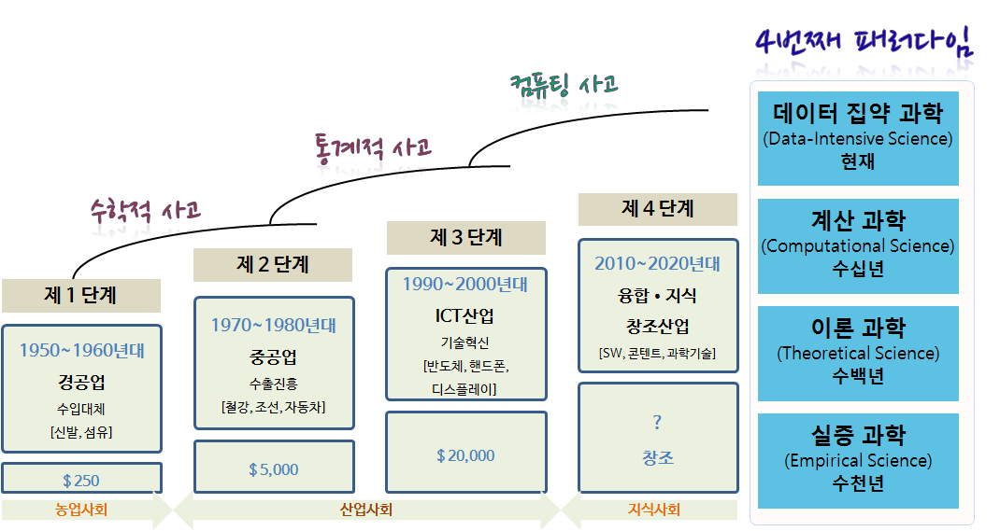
]

- 수학적 사고(Mathematical Thinking)

- 통계적 사고(Experimental Thinking) 

- 컴퓨팅 사고(Computational Thinking)

.footnote[
    [Wing, Jeannette M. "Computational thinking." Communications of the ACM 49.3 (2006): 33-35.](https://www.cs.cmu.edu/~15110-s13/Wing06-ct.pdf)
]


---

## 4번째 패러다임

.center[
  
]

---

## 자동차 클러스터 사례

.center[
  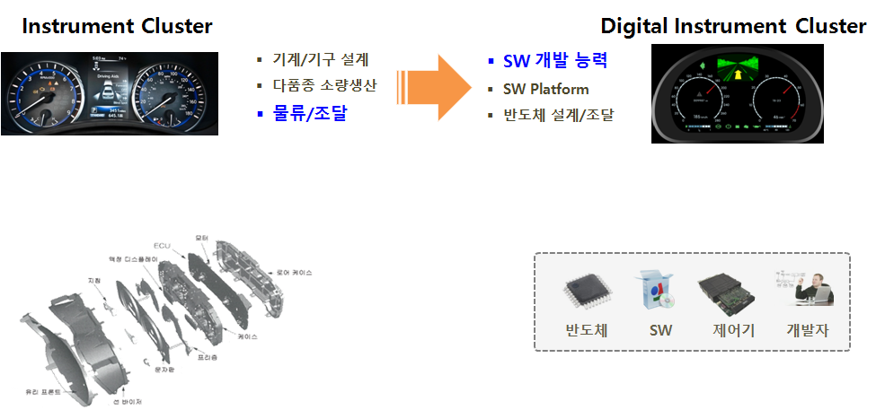
]

---
class: inverse, middle, center

# 시장의 변화


---
## 수직적 시장 &rarr; 인공지능 시장

.center[
  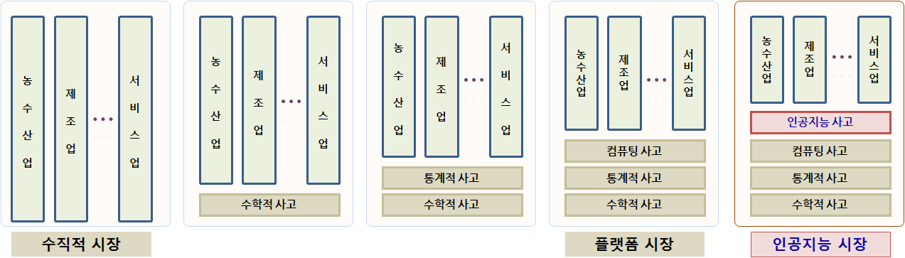
]
- 수직적(Vertical) 시장 &rarr; 플랫폼(Platform) 시장 &rarr; 인공지능(AI) 마켓으로

---
## 한국 기업(?) vs. AI기반 기업

.center[
  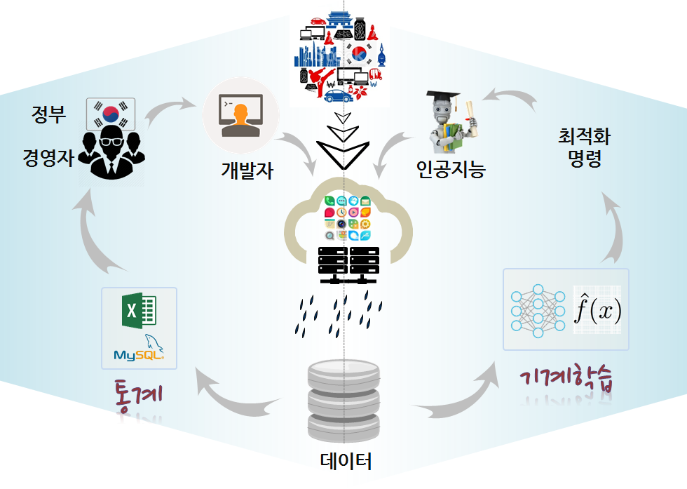
]

---
## 산업역군(?)

.center[
  <iframe width="400" height="270" src="https://www.youtube.com/embed/t346si4gy_M" frameborder="0" allowfullscreen></iframe>

  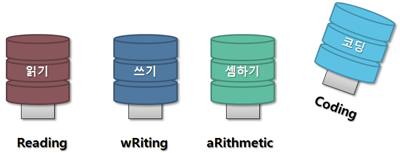
]

.footnote[
  [MATT RICHTEL, "Reading, Writing, Arithmetic, and Lately, Coding"", The New York Time,  MAY 10, 2014](http://www.nytimes.com/2014/05/11/us/reading-writing-arithmetic-and-lately-coding.html)
]


---
class: inverse, middle, center

# 인공지능 = 데이터 + 슈퍼컴퓨터

---
## 인공지능과 데이터

.center[
  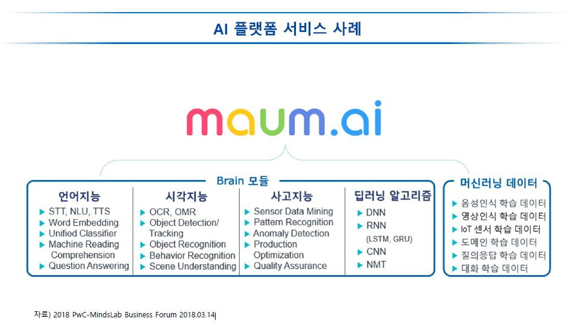
]

---
## 왜 슈퍼컴퓨터를 알아야 하나?

.center[
  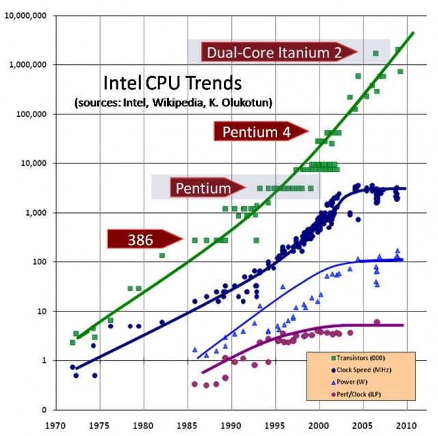
]

.footnote[
   [xwMOOC 고성능 R 아키텍처](http://statkclee.github.io/parallel-r/r-perf-arch.html)
]


---
## 고성능 컴퓨팅 기초

- 병렬 컴퓨팅 
    - 동시 실행과 병렬 실행
    - 동기실행과 비동기 실행
    - 분산 메모리과 공유 메모리
    - 프로세스 vs. 쓰레드
- 실무에 병렬처리 적용 방법
    - 비동기 프로그래밍
    - 공유 메모리 프로그래밍
    - 분산 메모리 프로그래밍
    - 연쇄 작업(serial farming)

.footnote[
   [고성능 컴퓨팅(HPC) - 고성능 컴퓨팅 기초](http://statkclee.github.io/hpc/hpc-basic.html)
]

---
## 딥러닝(Deep Learning)

.center[
  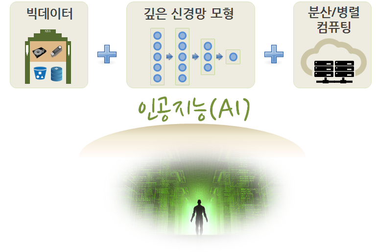
]

.footnote[
   [xwMOOC 딥러닝과 $H_2 O$](http://statkclee.github.io/deep-learning/)
]


---
## 통계와 인공지능

.center[
  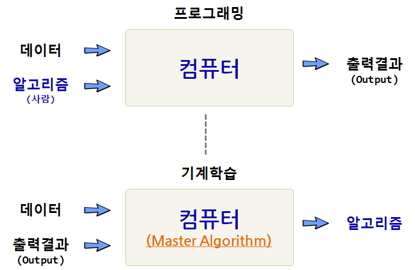
]

.footnote[
   [궁극의 주인이 될 알고리즘(Master Algorithm)](https://statkclee.github.io/ai-lab/master-algorithm.html)
]


---
class: inverse, middle, center

# 인공지능 제품 

---
## 소프트웨어/데이터 진화

.center[
  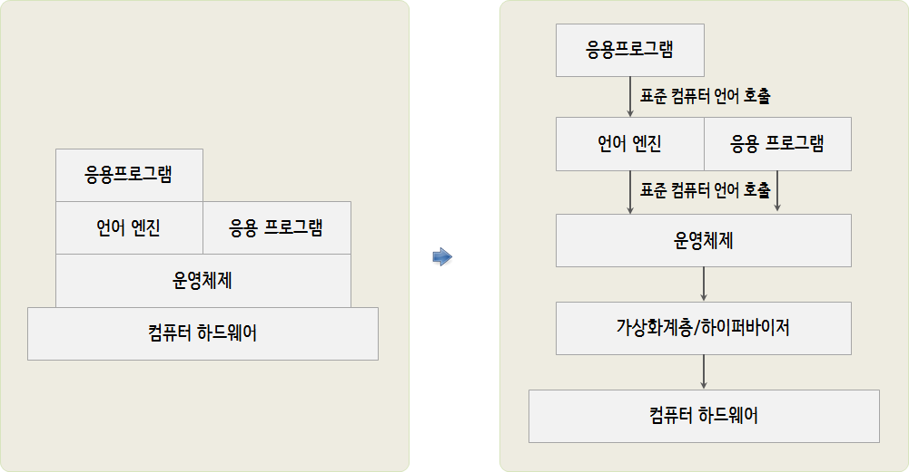
]

.footnote[
   [xwMOOC 고성능 컴퓨팅(HPC) - 컴파일, 설치, 호출](https://statkclee.github.io/hpc/compile-install-call.html)
]

---
class: middle, center

[데이터 저널리즘](https://statkclee.github.io/data-product/data-journalism-working-pop.html)

.footnote[
    [데이터 과학을 위한 저작도구](https://statkclee.github.io/ds-authoring/)
]

---
class: middle, center

[데이터를 제품으로](https://statkclee.github.io/ds-authoring/slides/ds_data_product.html#/)

---
class: middle, center

[이미지 분류 - 케라스(딥러닝)](https://statkclee.github.io/data-product/shiny-image-classification.html)

---
class: middle, center

[xwMOOC 딥러닝: 동영상 감정 분석](https://statkclee.github.io/deep-learning/ms-oxford-video.html)

.footnote[
  [KBS, 인공지능으로 분석한 대통령의 마음 슬픔은 어디에(2016.12.07)](http://news.kbs.co.kr/news/view.do?ncd=3390429)
]

---
class: middle, center

[xwMOOC R Meetup](https://github.com/KaggleBreak/xwmooc_Rmeetup)

.footnote[
- [키워드 추출: http://sgcslab.com:4500/](http://sgcslab.com:4500/)
- [문장요약: http://sgcslab.com:3000/](http://sgcslab.com:3000/)
- [카테고리 분류: http://52.78.25.65:7777/](http://52.78.25.65:7777/)
- [긍부정: http://moya.ai/sentiment](http://moya.ai/sentiment)
]

---
## [얼굴 분석 - Face Analysis](https://itunes.apple.com/kr/app/%EC%96%BC%EA%B5%B4-%EB%B6%84%EC%84%9D-face-analysis/id1290130969?mt=8)


.pull-left[
  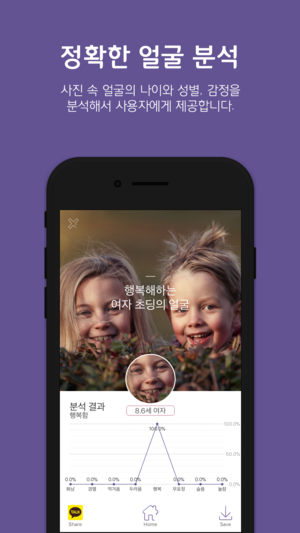
]

.pull-right[
  - **클라우드 APIs**
    - [나이(Age): MS Face API](http://statkclee.github.io/deep-learning/ms-oxford-age.html)
        - [정보과학교육연합회-R을 이용한 인공지능 튜토리얼](http://statkclee.github.io/deep-learning/ms-oxford-kcode-tutorial.html)
        
    - [감정분석: MS Emotion API](http://statkclee.github.io/deep-learning/ms-oxford-video.html)
    
    - [Azure Computer Vision API: Generate image captions with the Computer Vision API](http://blog.revolutionanalytics.com/2018/03/computer-vision-api.html)
]

.footnote[
  창업은 중요합니다.
]
